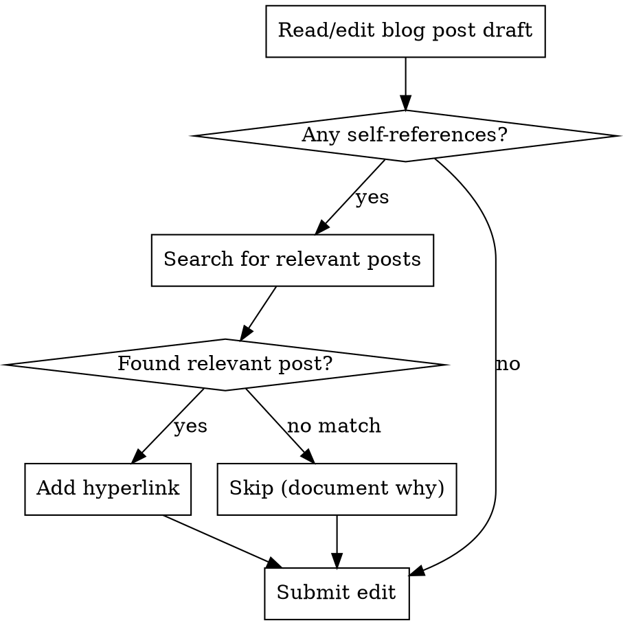

# Blog Post Self-Linking

## Overview

When editing blog posts for nickang.com, **always search for and add hyperlinks** to relevant past posts when the content references the author's own writing or topics.

**Core principle:** Self-references without links waste the author's existing content library and reduce reader navigation.

## When to Use

Use this skill when editing any blog post that contains:
- Explicit self-references: "I wrote about...", "I've discussed...", "As I mentioned before..."
- Implicit topic references that the author has likely covered: burnout, career changes, tech industry, parenting, etc.
- Experience references: "When I worked at X...", "During my time doing Y..."

## The Linking Workflow

**CRITICAL: This is a required step BEFORE submitting your edit. Not optional.**



### Step-by-Step Process

1. **Identify self-references** - Look for any text that references the author's own writing, past experiences, or topics
2. **Extract keywords** - Pull 2-4 key terms from the reference (e.g., "burnout prevention", "Shopify layoff")
3. **Search the codebase** - Use Grep to search `content/blog/**/*.md` for those keywords
4. **Find the most relevant post** - Review search results and pick the best match
5. **Add the hyperlink** using format: `[link text](/subfolder-name/)`
6. **Verify format** - Ensure trailing slash: `/2018-09-20-company-rejoin-after-quitting/`

## Link Format

**All internal blog links MUST use relative paths with trailing slash:**

```markdown
[link text](/blog-post-subfolder/)
```

**Where `blog-post-subfolder` is the directory name from `content/blog/`**

**NEVER use:**
- ❌ Full URLs: `https://nickang.com/slug/`
- ❌ Without trailing slash: `/slug`
- ❌ With domain: `nickang.com/slug/`

**Always use:**
- ✅ Relative path: `/slug/`

### Examples

```markdown
<!-- Post directory: content/blog/2018-09-20-company-rejoin-after-quitting/ -->
I wrote about [people rejoining companies](/2018-09-20-company-rejoin-after-quitting/) before.

<!-- Post directory: content/blog/reflecting-on-my-career-in-tech-5-years-in/ -->
When I first [started at Shopify](/reflecting-on-my-career-in-tech-5-years-in/), I had many preconceptions.

<!-- Post directory: content/blog/2018-02-01-sleep-is-sacred/ -->
My [burnout prevention strategies](/2018-02-01-sleep-is-sacred/) still apply today.
```

## Finding the Right Post

Use Grep to search blog content:

```bash
# Search for keywords in blog posts
Grep: pattern="burnout prevention", path="content/blog", glob="**/*.md", output_mode="files_with_matches"

# Review results and read the most promising matches
Read: file_path="/content/blog/[most-relevant-match]/index.md"
```

**Select the MOST relevant post - not just any match. Only link if there's genuine topical overlap.**

Consider:
- **Topical overlap** (REQUIRED): Does it actually discuss what you're referencing? Contextual fit matters more than keyword matches.
- **Recency**: Prefer newer posts if multiple strong matches
- **Depth**: Prefer substantive posts over brief mentions

**If no post has genuine topical overlap, skip linking.** Don't force tenuous connections.

## Red Flags - You're About to Violate This Skill

**Skipping search (DON'T SKIP):**
- "This reference is too vague to link" → Search anyway, might find exact match
- "I don't have time to search" → Takes 30 seconds, always worth it
- "The reader probably won't click" → Links still provide context and SEO value
- "I'll add links in a second pass" → You won't. Do it now.
- "The reference is implicit, not explicit" → Implicit references often make the best links

**Using wrong format (ALWAYS USE RELATIVE PATHS):**
- Using full URLs under time pressure → Always `/slug/` never `https://nickang.com/slug/`
- "Full URL is clearer" → No. Relative paths required for proper routing.
- "I'll fix format later" → Fix it now. Wrong format breaks site navigation.

**Forcing tenuous links (DON'T LINK):**
- "This keyword appears somewhere" → Only link if topically relevant
- "Close enough" → Not close enough. Needs genuine overlap.
- "Better to have some link" → No. No link better than wrong link.

**All red flags mean: Follow the skill workflow exactly.**

## Common Mistakes

| Mistake | Fix |
|---------|-----|
| Using full URLs under time pressure | ALWAYS `/slug/` NEVER `https://nickang.com/slug/` |
| Forgetting trailing slash | Always `/post-slug/` not `/post-slug` |
| Linking to first search result | Review multiple results, pick MOST relevant |
| Forcing tenuous keyword matches | Only link if genuine topical overlap exists |
| Skipping implicit references | "When I worked at Shopify" → link to Shopify posts |
| Adding links in imagined "second pass" | Do it now during editing, not later |
| Using full file paths | Use `/subfolder/` not `/content/blog/subfolder/` |

## When NOT to Link

Skip linking only when:
- **No relevant post exists** after thorough search
- **Reference is to external content** (books, other blogs, etc.)
- **Already have 3+ links in same paragraph** (avoid link overload)

Document your reasoning if skipping.
