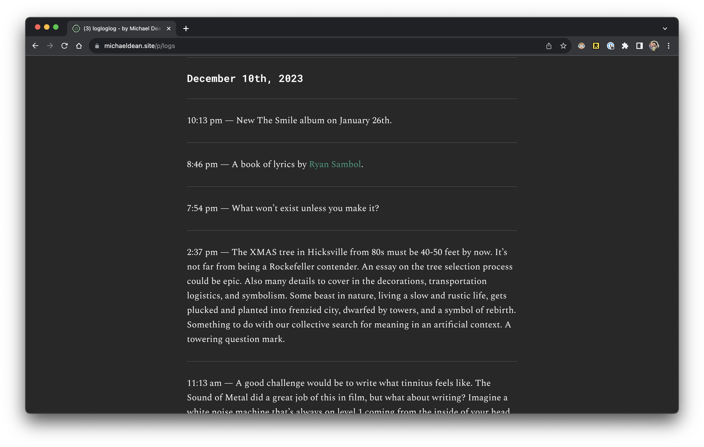
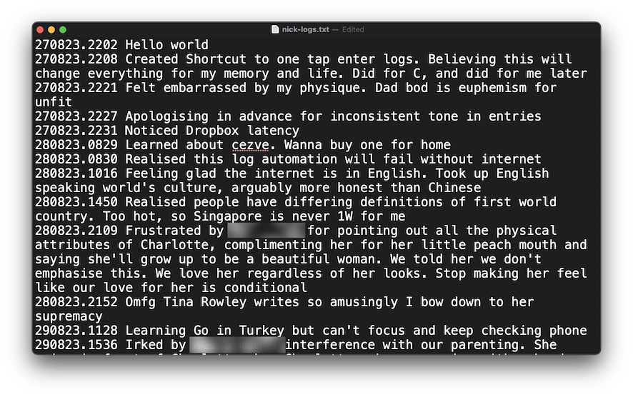
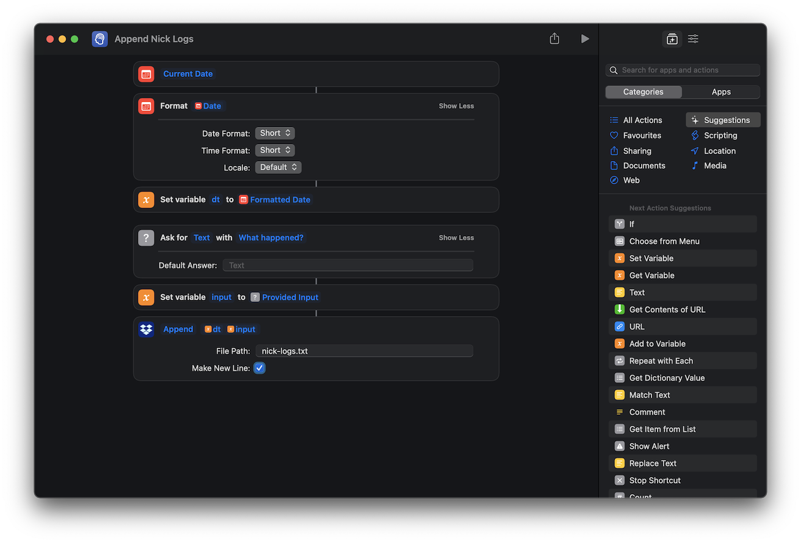

One of the more impactful discoveries for me in terms of organising my messy head is something Michael Dean calls *logloglog*. In this post, I'll talk about how I've adapted his workflow and made it my own, and what impact it has had.

(This post is going to be a bit dry and straight to the point, rather than the usual essay-ish exposition on the blog. I was under a spell to finish documenting this and to move on.)

## What's logloglog?

[logloglog](https://www.michaeldean.site/p/introducing-logloglog) is the name that Michael Dean gives his public stream-of-consciousness notes. Each log entry is a simple line of text that is prefixed with a timestamp like so. He quietly updates them on his site like so:

*Source: [michaeldean.site](https://www.michaeldean.site/p/logs)*

## My improved logging workflow

For context, I've been microjournaling for a while on my notetaking app. I'd create a new note, then use a keyboard shortcut to insert a timestamp and write. This style of microjournaling is largely [inspired by the artist Struthless](https://www.youtube.com/watch?app=desktop&v=mFvdHfhVIsQ).

I didn't have problems with microjournaling until I found out about Michael's workflow, which strips down the process further. It seems to be *micro*-microjournaling, which I suppose is better referred to as logging rather than journaling?

Whereas in the past I would write anything from a sentence to several paragraphs of prose as my logs, now I write everything in a single line. It can be a whole paragraph but it's still just a single line.

A screenshot of a note written with my old workflow:

And of the updated workflow:

My updated workflow now looks like this:

1. Tap on logging Shortcut icon on iPhone homepage
2. Write stream-of-consciousness log entry
3. Hit submit. Done!
4. (Shortcut sends HTTP request to append entry to my nick-logs.txt file, hosted on Dropbox)

Here's what that workflow looks like visually:

<video controls width="100%">
    <source src="/images/logging-shortcut.mp4"
            type="video/mp4">
    Sorry, your browser doesn't support embedded videos.
</video>

## Is it better than writing in a note?

It's been 110 days (3.5 months) since I've adopted this workflow. Here are some numbers:

- 340 log entries in my logs
- 90 log entries in my daughter's logs
- Average: 3.9 entries per day

And I can report the following advantages over my previous workflow:

- Shortened time to start typing an entry. The notes way took 5-10 seconds; the Shortcuts way takes 1 second
- Reviewing and searching is easier because everything is centralised in a single file
- Scanning entries is easier because everything is just separated by line breaks

So I'd say it's really an improvement in all aspects when it comes to handling the task of capturing thoughts down fast.

I still use my notetaking app for longer expositions. Sometimes I bypass that and write directly in my code editor (VS Code) because this blog's source code is hosted on a GitHub repo and published via Netlify. It cuts out another small step of copy-pasting from one app to the other.

## The Shortcut (iOS and macOS)

Since I couldn't figure a way to share the shortcut as an exported file without having it tied to my account, here's a screenshot of the Shortcut:

It's really quite straightforward in terms of programming logic, but I have to admit, it's a little finnicky to set up through the Shortcuts app's user interface. Maybe you'll have more luck.
