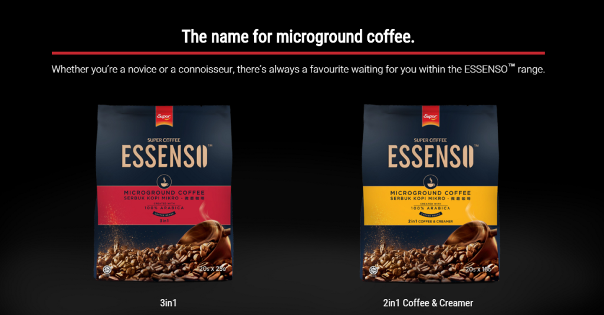

_Microground...?_

I was sure I hated this brand of coffee.

It had a splashy entrance with free samples at the local movie theatres and ads on television. On its packaging it touts: "The Name for Microground Coffee."

I was a barista for 8 months once but I had never once heard of “microground coffee”. But the packaging was enticing, so I gave it a shot (pun accidental). Since I recently became too lazy to make espresso-based coffee at home, I’d been wanting to find the perfect 3-in-1 coffee. Maybe this would be it?

It turned out to be mediocre. Sure, it had an interesting taste that’s unlike other 3-in-1 coffee sachets (probably because it’s “100% arabica” beans), but it wasn’t good enough to be _the_ coffee.

At the supermarket, however, I was once again attracted to this brand of coffee because its packaging stood out, and its ads stuck in my mind. So I grabbed a bag of 20 sachets and went home. “It isn’t so bad… I’ll just make do with it for now," I told myself on my way home.

Over the next few weeks I drank one sachet every few days and didn’t think much about it. Today, however, I made a cup that tasted like magic.

How? I made it thicker.

 Our material should look good and deliver a punch at the same time

For some reason I told myself to add a lot less water this time. I think it’s my mind subconsciously deciding that it'd be a good idea to get caffeine into my body in the least amount of time and reduce the yucky-ness - like I always do with medicine.

Instead, it tasted _wonderful_.

As I was enjoying my new cuppa (and quickly finished it), I realised there might be a metaphor in this experience: **things in concentrate tend to be better**.

### Thicker Material on Blogs

**Blogging** was the first thing I thought of. Of the 3 or 4 blogs that I regularly read, all of the authors write articles that **homed in** on specific topics:

- [Seth Godin](http://sethgodin.typepad.com/) on marketing, business and leadership
- [Tim Ferriss](http://fourhourworkweek.com/blog/) (Four Hour Workweek) on life hacks, lifestyle design and learning
- Andrew [bunnie](http://www.bunniestudios.com/blog/) Huang on electronics, hardware and tech business
- [Maria Popova](https://www.brainpickings.org/) (Brain Pickings) on books, writing and the arts

Entering their online space is like entering a temple for business, sociology, travelling, or any other fields. Within those grounds only ideas that fall under to their chosen niche are entertained. Each subtopic in their niche is then attended to with thoughtfulness arising from an artist’s detail and a surgeon’s precision.

(I'm sure these authors _ponder_ other things, but each of them, by chance or design, have decided to focus on niche areas.)

This led me to realise that for a person to lead what Seth Godin calls a tribe, she needs to make her material thicker. By thicker I don’t mean more estoeric, but more… concentrated. Focused on delivering useful material to people.

Articles with titles designed to get people to click still make their rounds on the internet (especially on Facebook). But when platforms like Medium--where (mostly) higher quality articles circulate--combine with the general awakening and maturing of internet readers, this group of people who would succumb to click-baits is fast shrinking.

Readers, like coffee drinkers, now want something that is not just palatable, but strong. We were kids before, and now we're adults, and watered-down coffee made by dreadful one-click coffee machines just won't do anymore.

Also because thick is usually better. Anyone who’s consistently blogging should take a moment to ask: is my material thick or thin, and if it seems thin, where are the spots that are already thicker?

Oh, and good packaging doesn’t hurt. I bought another bag of 20 coffee sachets this week.
