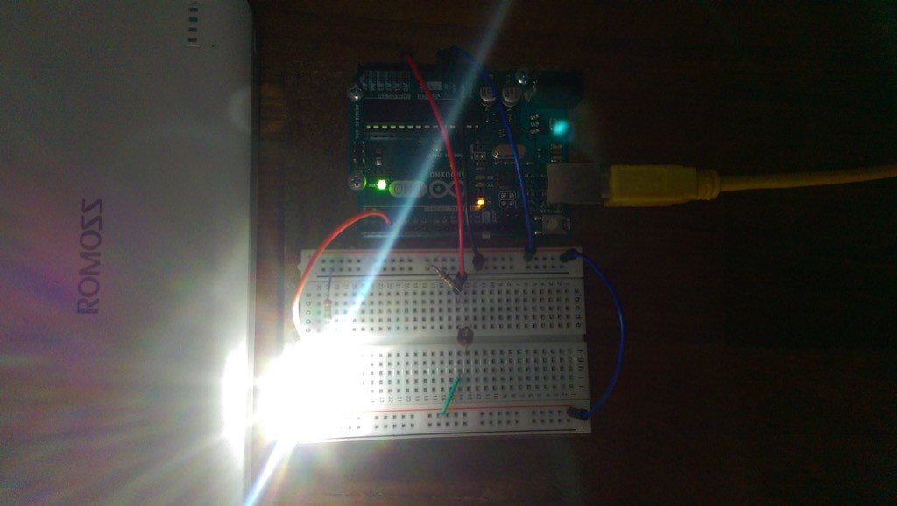

There are at least two kinds of home automation:

1. Internet of Things
2. Mecha-tronic Things

### 1\. IOT! IOT! IOT!

Can you hear the crowd of geeks chanting? (In my mind I sometimes imagine a group of geeks cheering a geek supreme leader to the tune of “USA! USA!” that we all find silly \[just me?\] but hear all the time.)

This is what the internet is going head over heels about. The Internet of Things (IoT) is a geek’s wet dream come true, because it opens up a completely different realm of connected electronics.

At the current point in its nascent history, IoT devices are mostly connected to a master control that lives in our pockets: the smartphone. It’s the enabler at this point due to its ubiquity and tremendous computing power.

But IoT is at a really early stage in my opinion. As a result, a whole bunch of things that do not require connectivity are now connected. Worse still, their creators hardly ever admit that they’re making these things _just because they can_. Many of time, I observe, see connected things as a logical step forward. You be the judge:

Eggminder (link broken, removed). Egg tray + reminder. Sent to your smartphone.

 
_"Eggminder" smart eggtray that reminds you when you're low on... eggs_

Then, the HAPIfork (link broken, removed). Don’t eat too fast or you’ll… get fat. But please don’t worry, we’ll take care of that for you with a smart fork and an app to track your every mouth.

 
_"HAPIfork", a smart fork that teaches you the pace to eat_

Of course, to be sure, I picked the most horrible of the lot. The senseless use of technology in making products that _nobody_ _ever_ said they wished existed.

I don’t doubt the potential of IoT. For now, for me, we’re just playing around. If you think about the Nest smart thermostat, which is just about the biggest IoT device (and the closest thing to actually being “smart”), it’s really not _that_ game-changing.

Besides connecting everything together and slapping “smart” labels on everything, home automation is also possible without internet connectivity. How did self-stop kettles work before people started embedding internet chips into them?

### 2. Mechanical Electronic (Mecha-tronic) Things

My kettle has an electrical switch…

_Whoa, you have an IoT kettle?!_

Nope, just a regular electric kettle. You know, the kind you can find in pretty much every hotel room in the world? Remember those?

Ok, enough jeering. IoT has its place in our lives, and increasingly so. But it has a long way to go before the technology frameworks and protocols mature, and before the user interface for making these devices melt into the background and enable an average person to understand and use IoT stuff intuitively.

In other words when it comes to IoT, we’re still years away from the level of acceptance and intuition we’ve developed for multi-touchscreens (yes, we used to call the first iPhone’s screen a true multi-touch screen, remember?).

Back to my electric kettle. It’s a simple device that (god forbids) involves me putting water into it, plugging it into the electrical socket, and pressing a ‘boil' on-off button. It’s a simple device with a huge benefit: I don’t have to manually turn it off when it boils.

That, to me, is the most crucial part of the whole water-boiling process. I don’t want hot water spilling all over my kitchen counter top, overflowing onto the floor and accidentally scalding my feet (or my little Brownie), or short an electrical socket and cause a fire.

I can handle the rest with my limbs and a minute of time.

An electric kettle works because of a few simple but key components:

- On/off switch
- Heating element
- Bi-metallic strip (two pieces of metals with different thermal expansion coefficients bound together)

Generally speaking this is how an electric kettle works:

1. User pushes on/off switch to ‘on’ position
2. Switch closes circuit, and heating element heats up
3. Water starts to boil, and converts to steam (100 degree celsius water)
4. Enough steam transfers heat to the bi-metallic strip that it expands, and because of different thermal expansion of the two metals, bends until just enough to mechanically push the on/off switch to ‘off’ position (from inside, ie. not visible to the user)

That’s it. Very simple, right?

Mecha-tronic devices occupy a lower position in the technology-sophistication scale, but they can be tremendously helpful to us in our daily struggles in life.

Washing machines take 95 percent of the effort off laundry, electric thermoflasks virtually eliminates the need to re-boil a pot of water for tea and, most recently, with electronic door locks, getting in and out of the home is at least 5 times faster and arguably more secure.

What’s important to realise here is the fact that none of these devices require the internet to work. They are made with mechanical parts and electronic components. And even though that may still be daunting, learning mecha-tronics has become a lot more accessible with the advent of cheap computer platforms like the open-source [Arduino](http://arduino.cc).

I’m an environmental scientist by training. That’s as different from mechanical and electrical engineering as it gets. But the Arduino platform has given me a chance to play around with electronics (and through motors and servos, mecha-tronics) and make interesting stuff.

A recent project was a small LED light that turns on automatically when I switch off my bedroom lights, which I wanted badly because it eliminates the chance of me stumbling over stuff on the floor (including my toy poodle, Brownie) when walking from the main light switch to my bed by illuminating the way.

 
_My auto-on LED light project activates for 2 mins when my bedroom is dark_

I’ve got many more (logical) projects I’d like to work on to make life a little easier at home, and have already begun working on a few.

In fact, I’m thinking this might be useful to a number of people and am toying with the idea of compiling my projects in an easy to understand compendium. (If this sounds interesting to you, let me know in the comments.)

In any case, I hope more people (you) will take to learning skills that can be used to make life a little easier for yourself, and in the process, begin to see the till-then invisible middleworld of bytes and atoms.

This is part of a bigger movement, called _hacking_, and it's one that comprises more and more of electronics as we once saw it did with software. I'm feeling it. Are you?
