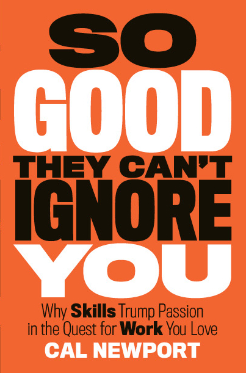

### 

### Key points made:

- Things can go really wrong (a lot of the time) if you let passion guide you in finding a good job to do great work
    - example: Thomas the zen monk
    - “believing… that the key to happiness is identifying your true calling and then chasing after it with all the courage you can muster \[...\] is frighteningly naive.”
- This book is about answering one main question: **How do people end up loving what they do?**
- **Ability is important.** What makes a great job great is having rare and valuable abilities.
- Steve Jobs has either been widely misinterpreted or is a bit of a hypocrite for advising fresh graduates at Stanford to “find what you live… \[T\]he only way to do great work is to love what you do. If you haven’t found it yet, keep looking, and don’t settle.” Newport dug into Jobs’ history to find that he did not get to where he was by following that advice. If he did, **Calport reckons Jobs would just be one of the most popular teachers in the Los Altos Zen Center**.
- Roadtrip Nation is an interesting non-profit that maintains a video library of interviews of people who live lives centred around what is meaningful to them, and is basically a treasure trove of insights to refute the “passion hypothesis”.
- Most compelling careers, when traced to their origin, did not begin with people following their passion. A 2002 study shows that out of 539 Canadian university students surveyed, 84 percent said they have a passion but 96 percent of these are hobby-style interests in sports and art. Only 4 percent had passions that relate to work or education.
- **If you are good at what you do, you’re more likely to love your job**. Research by Amy Wrzesniewski revealed that the type of work one does doesn’t necessarily predict whether she would enjoy it. She did this by pointing out that college administrative assistants are equally split when asked whether they see their jobs as a job, career, or a calling, and the biggest predictor for viewing such a job as a calling was the **number of years on the job**.
- It’s highly possible that jobs that require time on the job to become **competent** and have **autonomy** (as reward for consistently doing the job well) are great precisely because it takes time to generate this enjoyment. Related to the **Self-Determination Theory on motivation**, popularised by author Daniel Pink.
- Passion hypothesis might have entered mainstream consciousness since the publication of the self-help book, _What Color Is Your Parachute?_ by Richard Bolles. \[Nick: Terrible book. I have one because someone boldly recommended it to me and my university classmates. But it’s full of fluff and gimmicks, in my opinion, and I couldn’t get past the second chapter.\]
- **The more we focus on loving what we do, the higher the chances that we end up loving it less.** An argument backed by the trend of job (dis)satisfaction. 64 percent of young Americans surveyed by the 2010 Conference Board say that they’re actively unhappy in their jobs, the highest level for any age group over two decades.
    - interesting companion read: _Quarterlife Crisis: The Unique Challenges of Life in Your Twenties_ by Abby Wilner
- Following your passion works for some. Mostly it works for professional athletes and musicians. But Newport points out that using this to disprove his argument is faulty logic, because these are but a few instances of the strategy working.
- A “**craftsman mindset**” is key to creating work you love. It’s an “output-centric approach to work”, where the focus is on “becoming better” at what you choose to do. This is summed up nicely by Steve Martin, “**If somebody’s thinking, ‘How can I be really good?’ people are going to come to you**.”
    - bear in mind that adopting the craftsman mindset is a long-term strategy to enjoying your work
    - Steve Martin estimated that it took him about ten years for his unorthodox comedy sets to cohere and stand out
- The **“passion mindset” is dangerous** because of two reasons:
    - focusing only on what your work offers you makes you **hyper-aware of what you don’t like about the job**, leading to chronic unhappiness \[Nick: I really like this point. It’s the thing I’ve felt strongly about but couldn’t articulate\]
    - the questions that form the basis of the passion mindset--like “who am I?” and “what do I truly love?”--are **impossible to confirm**
- In hindsight it’s easy to attribute a particular person’s career success to his/her passion, but it’s actually almost never the case that a person found their true calling and quickly became amazing. Newport reckons the logic is backwards. He raised the example of Steve Martin again, revealing his insecurities and self-doubt that regularly led to crippling anxiety attacks. The difference is in his goal, which is to get good at what works, and become “so good they can’t ignore you”.
- “**Career capital**” is a repository of how much rare and valuable skills you have and how much noticeable work you’ve done.
    - public radio host, Ira Glass, says that “the key thing is to force yourself through the work, force the skills to come; that’s the hardest phase.”
- Traits that define great work are: creativity, impact, control
- Getting to a point where you love your job is not about mustering courage to quit your job and “be your own boss”.
- To accelerate your accumulation of career capital, the best way is to **cultivate the habit of “deliberate practice”** in your field. That means to force yourself to work on new things that you can’t do without hard thinking. Combine this with **getting** **instant feedback** by showing your work to people in your field whom you respect, or those whose opinion you value, and you’ll amass career capital fast.
    - musicians like Jordan Tice, screenwriters like Alex Berger, and venture capitalists like Mike Jackson have the habit of deliberate practice
- **Control** over what we do and how we do it plays a surprisingly big role in determining whether a job is a dream job or a dreadful one. It’s the driver behind a new work philosophy called Results-Only Work Environment (or ROWE) that Best Buy and Gap, among other companies, have adopted.
    - note to self: ROWE has its detractors and own set of problems, since not every goal can clearly be defined as met/unmet. But the argument is sound, because employees at these ROWE companies have lots of great things to say about taking control of their own destiny
- Two “**control traps**” to avoid:
    - **don’t try to (lifestyle) design your way into a job with more control before you’re ready**, and instead only do it when you have amassed some career capital. “A distressingly large fraction of these contrarians, like Jane, skipped over the part where they build a stable means to support their unconventional lifestyle. They assume that generating the courage to pursue control is what matters…”
    - when you’ve amassed enough career capital, your employer will start to value you and prevent you from jumping to a job that you truly desire (like more time away from office, or to start an entirely different adventure)
- When unsure whether to jump to a new gig / work arrangement, consult the “**Law of Financial Viability**”. This is a rule of thumb more than a law, but it says that you should “seek evidence of **whether people are willing to pay for \[your pursuit\]**. If you find this evidence, continue. If not, move on.”
- It’s important to have a **mission** for your career, but randomly deciding on a mission is a bad idea. Instead, Newport suggests building up significant career capital until you reach the cutting edge of a narrow field (“**think small**”), at which point you’ll understand the “**adjacent possible**” of your field (the space just beyond the cutting edge), which he reckons is the best place to find great lifelong missions that you can then commit your career on (“**act big**”).
    - use the strategy of **“little bets**” (credited to Peter Sims’ _Little Bets_) to systematically find out what might be a good direction and learn from “lots of little failures and from small but significant wins.” This is similar to Lean Startup methodology (Eric Ries) of rapid Build-Measure-Learn cycles.
- Ultimately, your mission must satisfy the **Law of Remarkability**. The ‘law’ consists of two conditions that should be met for your mission to be marketable and thus, successful. (1) It should be an idea that inspires people to remark about it, (2) it should be launched in a venue where such remarking is possible and natural.

### Other thoughts

Phew. My first public book notes published. I didn’t enjoy writing this as much as I first imagined… it’s a little dry to summarise a book with a lot of interesting ideas because they are all interconnected. At one point I felt like I’d need to rewrite the book to do Cal Newport justice! (I'll probably do it differently the next time round, probably with Chris Guillebeau's _The $100 Startup_.)

But that’s precisely the point that Cal made that struck a chord with me: you’re not going to like every part of your job, and that’s especially true at the beginning when you have no “career capital”. Writing book notes is me taking a “little bet” that it’ll pay off in the future. I’d be able to refer to this to reacquaint myself with the insights of the book. In the process of writing them, I’m also forcing myself into “deliberate practice” of writing, which is something I loosely want to be a part of my career.

### **Final note about the book (and its title)**

Don't be deceived by the sales-pitch book title. I put this up there in the douchey category, maybe just one or two positions below _How to Win Friends and Influence People_ (I've heard this is actually another good book). That's why the book has been sitting on my shelf for half a year before I opened it the first time.

But this isn't a gimmicky self-help book. It's instead an author's sincere quest to finding an answer to an increasingly relevant question: Why do some people end up loving what they do? And I think he did a fine job with the answers he's arrived at.

_You can get Cal Newport's book from [Amazon](http://amzn.to/1TN6FJY), [bookdepository.com](http://www.bookdepository.com/So-Good-They-Can-t-Ignore-You/9781455509126), or a standing physical bookstore. I got mine from bookdepository._
