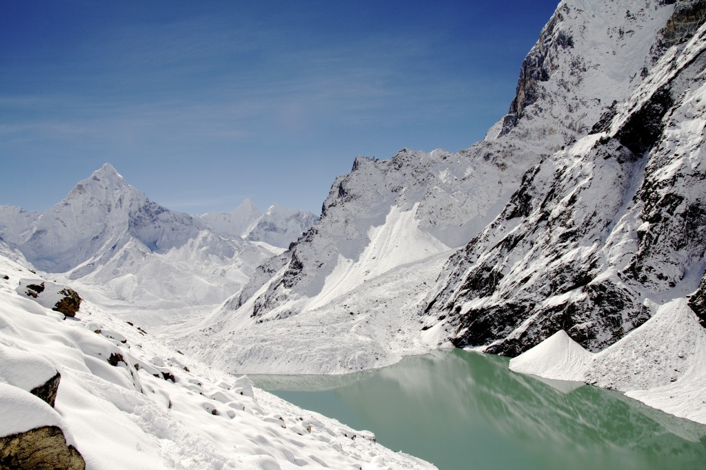

"Welcome, Flo, to Everest. Well, sort of. This is Everest Base Camp", I said in Zee.

"Beeeeeei plisssh grrraw breep?", sputtered Flo.

Let me translate that for you. Flo was asking, "What is this?"

\*\*\*

My name is Nick, and I'm the only person on Earth who can understand Flo, my literally little alien friend. One day I woke up to find a green... thing the size of a big toy poodle standing outside my window staring at me.

A (tiny) squirt of pee on my pyjamas and the loudest "What the fuck!!" later, I got my shit together and approached the window, seeing that the creepy bugger doesn't seem to mean any harm. For one, its three fingered hands were holding on to my window ledge in the same way that little children do when peering into a candy shop.

At that point,. of course, I prayed that I didn't actually look like candy to it.

\*\*\*

We got along right away. I know, it's crazy to be able to relate to a literal alien, but it just happened. Oh, and for some unexplainable reason, I speak Zee, the lingua franca of the planet Zeek where Flo was from.

He tried speaking to me in a dumbed down language that he thought I--humans--would understand that first time we met in my bedroom. It resembled the way we speak to six-month old human babies. All I heard was, "Flooooooo." It was hopeless and I couldn't understand a word, not until he gave up and said "What an idiot. All his species stupid like this one?" in Zee.

Since that day three months ago, we became good friends.

Today, we're at Everest together because Flo wanted to see something else besides traffic lights and shopping malls in Singapore. I'm here because I'd always wanted to hike to base camp and be awestruck by the majesty of the largest landform in the world.

All of a sudden the floor began to tremble. I could feel my feet sinking into the snow and my head vibrating like a smartphone. Then, as soon as my feeble mind began to register what was going on, it was gone. I turn my head to see if Flo felt it, but he was gone, too.

Afraid an avalanche was imminent, I looked up to survey the face of Everest while fumbling for the binoculars in my bagpack on the ground.

No signs of dislodged rocks or snow. But I did see a speck of green in the sea of white and grey. With my binoculars finally in hand, I set sight on the spot and brought it in front of my eyes.

"Son of a... !"

Apparently Flo can teleport.

Over the next minute, I walked towards the start of the trial up Everest while keeping peeled on Flo. He'd just teleported himself up the mountain. Up, up, up, till he got really high.

Then, Flo was at the peak of Everest. In the span of seconds, Flo had reached the peak of Mount fucking Everest.

"Fu..", before I could finish the first word of my rant, my feet sunk and head vibrated and poof! Flo was next to me again, looking up at me with his tiny slit eyes that look like those you'd find on attractive Asian women.

I'd made it up to Everest Base Camp, and despite Flo having scaled the whole freaking mountain, I thought I deserved a break and a treat.

We pitched a tent and before long, found ourselves lying inside with a warm cup of Milo each. Not one to let a mindfuck go unquestioned, I asked Flo a series of questions.

"Why don't you just teleport home?"

"Do you have to recharge to teleport?"

"What will happen if you bring me the next time you teleport?"

After the sci-fi question-and-answer, I asked, "So, what was it like up there?"

"Was very cold. I saw a lot of fluffy things—clouds, you call them?—and a few flappy things attached to sticks that were stuck into the snow. Colourful flappy things!", Flo chirped. I nodded with a smile, acknowledging his faux accomplishment and his funny way of describing flags.

And then I began to wonder... if he had a flag of Zeek or the country he lived in on Zeek, did Flo deserve to plant a flag on the peak of Mount Everest? Teleporting amounted to nothing less than cheating in my books, like sitting in a helicopter and being dropped off at the peak. (Of course, the air at the cruising altitude of a Boeing 747 is too thin for a helicopter to fly in, but for the sake of argument...)

What's the point of climbing Everest? To see the top of clouds and put a stick in the ground? "Of course not!", I thought to myself, finding it ridiculous that I'd even think that for second. It's a number of things, all of which would be meaningless if one had not climbed, using one's own limbs, from the base to the peak. It's the journey that is the reward; not the view, not the placement of a symbolic rag at the top. Not even the permission to brag, I don't think.

I told Flo all that, and he seemed to understand my humanly logic that it didn't matter, at least in the eyes of any human being, that he had gotten to the peak of the world. He had gotten there easy, so somehow, it didn't count.

The next day as we trekked down from base camp, with a nagging feeling of pettiness at the back of my mind, I recalled something Derek Sivers said: When you sign up for a marathon, you don't just jump in a car and go to the finish line. How true.

I turn to look at Flo, who walking beside me with legs half the length of mine, and can't help but wonder, is he or are _we_ weird?
