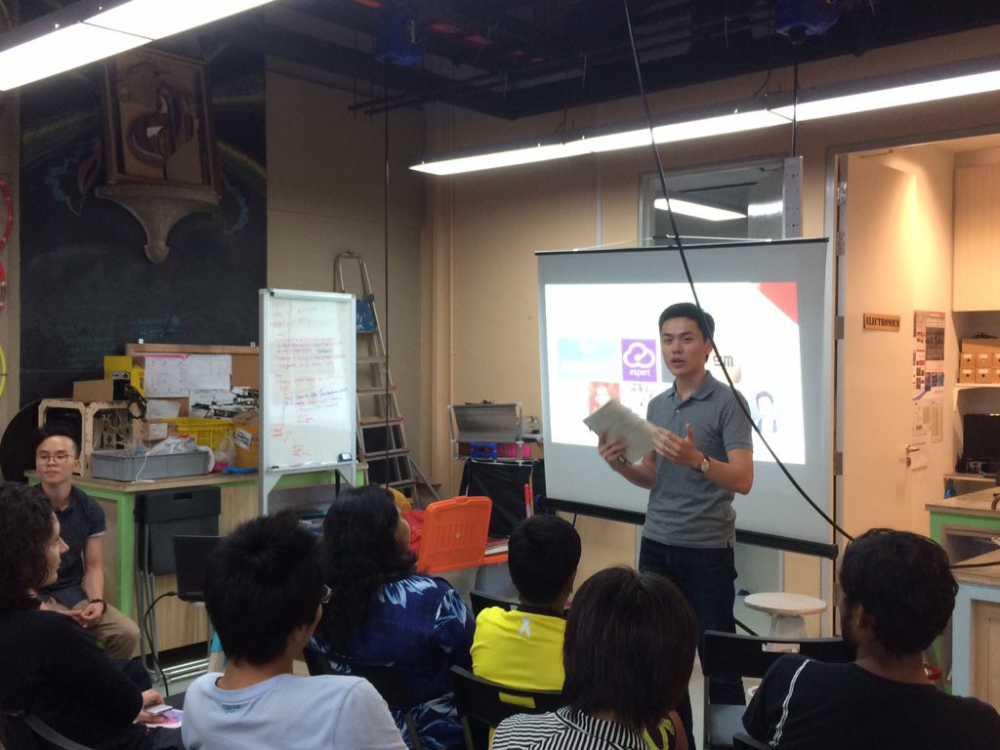

_Talking to aspiring makers at a local Apprenticeship Programme_

It was another day with an important meeting that might help push my startup forward. At the lobby I took a deep breath and stepped into the lift. “Hey, I’m Nick…”, I said to myself in the lift as I extended my hand for a rehearsal handshake.

I was about to meet a guy who was in a position to fast-track my application for a government grant, and it felt like a big deal. With the money I’d be able to hire an engineer to fly past the prototype build that I so clumsily put together. I’d finally be able to show my potential customers a proper minimum viable product!

As soon as the meeting started, however, I had a bad feeling that this guy won’t put my startup in the green lane.

We, two guys in a small meeting room, had very little chemistry to begin with, but even that dissipated about 8 minutes into our meeting when he asked with a straight, lifeless face, “So, how big is your total addressable market?”

I swear I spaced out for at least five seconds before uttering a pathetic “Umm…”, to his (and my) dismay.

At this point not only did I know that I blew my chance at getting government funding, I knew I’d also blew my chance at ever convincing an engineer to join me on my quest to build the perfect writer’s laptop. Not in this shape.

I left the meeting feeling angry with the guy who met me for being such a straight-laced business minded, un-entrepreurial dude. But at the back of my mind I also knew that that isn’t entirely fair, and that I was really just angry with myself. I was upset, too.

But the preceding 5 months had taught me to handle these situations gracefully. I’d learned to channel all that energy into finding a concise answer, a clear direction forward, because that’s the only constructive thing to do, and I have to do what is needed to keep the company going forward. If not me, who?

And so that’s what I did. I drove home after the meeting, cut up two large sheets of architect’s sketching paper, put them up in the wall of my study and promised myself to not leave my room until I arrive at clarity.

My wife must have thought I was depressed. However she really felt I wouldn’t know, but she played it cool and I’m glad for it.

I toiled for hours, googled “business model canvas” and printed and filled it out, as if doing that guarantees a solution to all my problems. I listed exhaustively the types of writers that exist in this world, the biggest problems each group faced and the flaws with current solutions.

Soon, the fog lifted and I was able to see clearly.

I realised that the market for my product was too small.

_Too small_. I wondered out loud whether that’s true. Could there really be such a thing, that an idea can be too small to pursue? I remember asking myself, “What do artists pursue?”

But it was true. Too few will buy my product to sustain the operational costs of the company. Even with a 50 percent profit margin, there wouldn’t be enough cash to pay two full-time engineers to build, maintain and improve the product. This is after all a business venture, not an artistic pursuit. A business has to be self-sustainable.

With a heavy heart I set my Starbucks California coffee mug on the table and opened the door. I had to pee. Right after I excreted the coffee fluid, I threw myself in bed and stared at the ceiling wondering: Is this a conclusion?

### The Market Is Too Small

What I’d realised was that the total number of people in the world who’d consider buying the product I’m trying to build is too small to make enough profits to sustain a company. That means a number of things. Among them, crucially, was the fact that venture capitalists wouldn’t invest a cent.

Putting these facts together meant one thing: if I were to proceed, I’d have to fund this animal from my own pocket (as I’d already done so far). This would be okay if it was a high stakes adventure, but alas, it isn’t.

The market is too small. Too small to sustain a business, and too small for me to risk my savings.

In light of this clarity, which I actually found refreshing, I went deeper into thought as my body sunk further into the safety of my bed.

### Technically Not  Ready

One of the biggest problems I faced in the previous 6 months running my startup was a technical one. _The_ technical one.

Having received no formal training in software programming and electrical engineering, I essentially started my hardware startup with one eye blind. I had not much of an idea how an Arduino worked and could hardly explain the difference between a microcontroller and a microprocessor. (Yes they are quite different.)

Some of the people I’d met along the way have counselled me to try to not think of this as much of a disadvantage. They’d say, “You should work on the market validation and prototype at best you can. You could outsource the development for the prototype. And when you think you’ve validated the idea, you can raise funds \[from VCs and angel investors\] and hire engineers to your team.”

Whenever someone tells me this I’d reconsider my doubt - am I worried for no good reason? Perhaps he’s right. I should focus on being the non-technical business guy finding customers and raising funds, and “let the experts do their thing” when the time comes…

But that logic just didn’t click. Not with me. How would I be able to lead a team of engineers if I can’t tell the difference between the equivalent of an apple and an orange in electronics?

I had a similar experience in my conscription Army days. I led a platoon of fine young men who operated a sophisticated piece of military tech. The problem was that I was—as I would be with my startup if I carry on—leading with one eye blind. I never did receive training to operate the machine - I’d only learned its capabilities so I can plan on that knowledge.

Now that may be just fine for some people but it made me very uncomfortable. And now I’m foreseeing the same thing happening at my startup and I’m not happy about it.

I now know that I’m uncomfortable with being the only non-technical leader in a team working on a technical problem. I think it boils down to two characteristics I have:

- I dislike not being involved in any side of a project I work on, because it makes me insecure
- I actually _like_ the technical side of making things

The Army made me realise point 1, and working on my hardware startup alone helped me realise point 2. Being able to understand code and how circuits work is, to me, something desirable, and I now know I want to have it.

I’m sick of nodding to engineer-talk as if I understood what’s _really_ being discussed. Raspberry Pi? Oh yeah, I know that one! Overclocking to achieve high-wha…? /smiles and nods

Never again. My new goal is to be able to tune in to 80 percent of technical conversations at any event. Yes… I can see myself liking that new me more.

Realising I was getting carried away with envisioning a better me, I pulled myself back to the task at hand and began to think about why I’d been having so much difficulty over the past few months trying to run my startup.

### Not Ready to Commit to a Startup

Rewind 7 months and you’ll find me fresh and green sitting in a small room on a small bleachers-like seating deck attending an info session for an upcoming early-stage startup accelerator programme. There, just 2 months after graduation and 1 month after my wedding, I was hoping to break into the Singaporean startup scene.

We went around the room to introduce ourselves to everyone at the end of the formal session for the Founder Institute programme. When it was my turn I briefly mentioned that I’d just graduated.

“Fresh, fresh?” asked Jeffrey Paine, the programme director in Singapore.

“Fresh, fresh, _fresh_”, I quipped, unaware that it wasn’t witty until I sat back down.

That should have been a sign.

I should’ve realised there and then that I wasn’t ready to commit to a startup.

It’s not that I’m too young. Indeed you don’t need to look around much to realise that most entrepreneurs _are_ young and fresh out of university. Mainstream consciousness seems to be filled with the-younger-the-better entrepreneurs.

Nope, it’s nothing to do with my age _per se_. It’s to do with my current situation. I’m a 26 year old fresh graduate who is married and have a mortgage, and both my wife and I lust for, among other things, travel.

I knew this before but I somehow let it slip;

**Startups are not wanderlust-friendly**.

Well, most of them aren’t anyway. And hardware startups definitely aren’t. There’s just too many things to coordinate, people to liaise with, products to build and debug and test with customers, etc. You get the picture. I saw it again recently.

_Me with the incredibly helpful CAD/CNC wizard, Wilfred, and my first prototype_

A startup is a long game. For one to be successful, its founder(s) must be willing to commit years of not just time but mental and all the other energies to build a great team and deliver a mind-blowing product.

The funny and perhaps tragic thing is that this was exactly what we were told in that Founder Institute info session. Adeo Ressi, the founder of the Founder Institute, said this to us in his video recording:

“_If you don’t see yourself working on the same idea in 5, 10, 30 years time, then don’t start a startup around that idea_” (paraphrased).

I don’t think he was really saying that founders have work on an idea for that many years. I interpret this as him saying something about the fortitude needed to build a startup into a great company. To build a startup into a real company, you need to persevere even if it looks like the end is far, far away.

But the point here is that he’d said it. That was a big enough “Do Not Proceed” sign in my face. Instead of turning back, I was determined to proceed with caution. I told myself I’d go through the programme as a lifestyle business person, even if I’d have to be the only one in the cohort. “These guys look like they know so much, I bet I could learn a ton from them!” was probably how it sounded in my head.

Startup culture, however, is intoxicating. I was soon spellbound to take on a business, startup style. Full fledged lean startup that will look to fundraising as rocket fuel to blast us into ridiculous success!

Okay, I never did think like that but some of it is true. I believe it was less than halfway through the 3 and a half month programme that I caught the startup-fever. At one point I reasoned that this is the only way to meaningfully be in business!

Business debates aside, I need to admit to myself that _I screwed up and lost sight of my mission_. The mission was to build a simple product that I could understand and build by myself that aligns well with and can pay for our travels for a year. (Wow, if only I could write such pithy one-liner missions all the time.)

It was never my mission to build a startup that would do an Initial Public Offering or be acquired. I knew—at least for me—that it was too early (for me) to do that. I believe it still is. But by some means it had crept into my mission and totally messed it up without raising an internal red flag. Totally screwed it up.

I’ve been a log adrift in the ocean, going with the strongest current in these 6 months. I’d been a log: the problem was that I thought I was a motorboat.

\*\*\*
