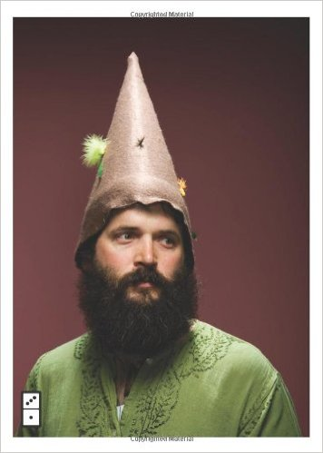

I’m trying to understand something…

I get very excited when I read certain books. Recently it’s been Seth Godin’s series of books on marketing and other interesting ideas. I just finished _We Are All Weird_.

 Seth Godin's interesting book We Are All Weird

Getting through the book was a breeze despite his unorthodox way of organising his thoughts (I imagine it’s a lot more haphazard than most people can accept). It’s a book that got me excited many times, with his repeated (successful, in my eyes) strikes against mass marketing and the call towards tribal marketing.

His books are not the only ones that elicit (imbue?) excitement from me. Reading Cal Newport’s _So Good They Can’t Ignore You_ and Adam Grant’s _Give and Take_, among other books with interesting ideas, is like going through an inspiration rollercoaster.

But that’s the thing I’m trying to understand… I’d get excited and before I know it, it’s gone. I can’t remember what exactly it was that got me excited.

It always originates from an interesting idea that is put forward by the author(s), but the excitement comes from a _synthesis_ of that idea along with the multitudes of knowledge and at-the-moment thoughts I have in my mind.

It’s a little like travelling. You get a sudden rush of inspiration when you visit some place you’ve never been before, smell things you’ve never had a whiff of before, talk to new types of people you’ve never met before.

I think these moments are interesting and inspiring precisely because of the other sporadic ideas we have in our heads at any point in time. Without their messy mixing we’d not arrive at insight. Sentences on a page delivers a message, not an insight. Insight is arrived at, not delivered.

So the analogy of a rollercoaster ride is perfect. The build-up of excitement is great, but you can—and you will—just as easily lose it. Before you know it, you’re at the bottom of the rail, unsure whether you’ll be making another ascent (and loop!) or you’re going back to the start/finish point.

My problem is stopping to capture the inspiration before it disappears. Often times I’d have to get to the end of the chapter before writing down my thoughts (and follow-up actions), just because it’s more methodical. In my mind I think, shouldn’t I give the author a chance to explain something properly before jumping to a conclusion?

Alas, these are different issues. I can allow the author the space to argue points before judging his ideas. Inspiration to take action, however, is transient, and must be held on to to be developed further.

I’ve just got an idea for storing my ideas involving a physical box and post-it notes. I’m going to try it out and if it’s any good, write about it here in the future.
