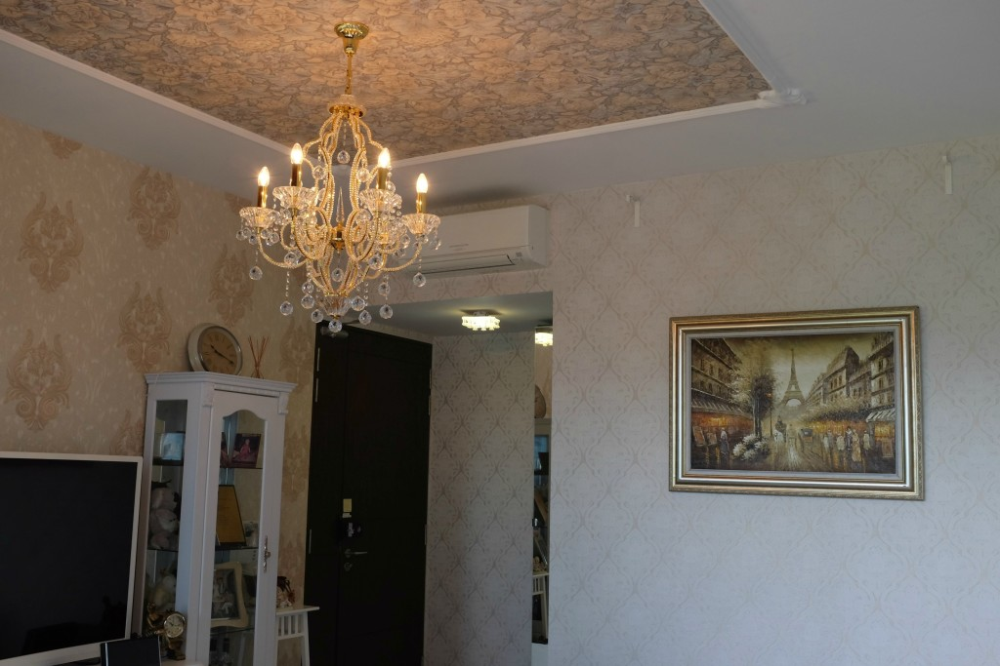
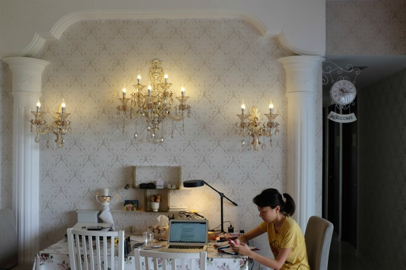

_From [Quora](https://www.quora.com/Should-you-renovate-the-whole-house-at-once-or-little-by-little):_ 

**Should you renovate the whole house at once or little by little?**

Let's start by clarifying your situation.

Do you have the option of living elsewhere during the renovation, like your parents' home or a rented place? Your question only applies if the answer is yes. Otherwise you'll have no choice but to live in the same home while it's undergoing renovation! (Seems like I'm stating the obvious, but I imagine some of us should consider our personal circumstances--eg. can I live with my in-laws for a while?--as a prelude to your question).

Ok, with that out of the way I'm going to try to answer your question with a combination of (objective) consideration and (subjective) experience.

I got married last year to my wife at the age of 26, and I'm incredibly fortunate to have parents who paid a significant portion of our mortgage for our first home here in Singapore (where property prices are astronomical; either that or wait 3-5 years for a built-to-order \[we literally call them that\] flat subsidised by the government).

But to save money we decided to think up the interior design of our new home by ourselves (ie. we didn't engage anyone to do anything for us except for hooking up some light fixtures). It helped that we both appreciate interior design and thought we had enough taste between us to be able to make our home look decent. So began our journey.

Due to our circumstances (I don't dislike my in-laws), my wife and I had to move in early. For the first 2 months whenever the sun set, our day would end because there were no lights around the house, just wires dangling from the ceiling. **I remember these days fondly now and sometimes when I walk down our small walkway I smile, satisfied with what we've done** to let there be light when the sun is resting.

Moving into a bare 110 sqm apartment also meant that in our sacred master bedroom--seriously, isn't that the room that the heads of the house get to sleep in?--we had to sleep on a thin mattress on the floor that we borrowed from my parents. Between no light evenings and sore backs, we **prioritised** spinal health and quickly got down to choosing and buying a good king-sized bed (of course!). It came about a month into our stay. We still love having it.

The renovation process went on for 6 months, little by little, like building a castle with lego. Each piece that we deliberated and finally decided to buy/make, we'd carefully put up. We took special care because it took us time and effort to source for each lego piece. Overall, **we saved a lot of money** (in the region of tens of thousands) by:

- Not engaging an interior design specialist ($1,000's saved there)
- Ordering stuff online whenever possible (our king bed was ordered online)
- "Importing" things like lighting fixtures from our trips to China at less than half the retail price in Singapore with similar quality (you don't necessarily have to go to China if that's out of the way, but go to a city with lower costs of living) - you'd be surprised at how much you can pack into a big roller luggage!
- Learning to do things on our own, like working with plaster to put up roman pillars, drilling and installing curtain rails and storage racks, buying from IKEA and personally putting furniture together

_We pasted our own wallpaper! (Yes, including that one on the ceiling)_

In hindsight we are immensely satisfied with what we've done with our home. Not only did we save a couple of thousands of dollars, we became more than home owners - we were home makers. This made the new home feel much more like _our_ home. In Singapore and, I imagine, many cities around the world, this is the closest thing to building your own home.

Oh, and because of our experiences, **we relish every opportunity--hopefully without being insufferably self-satisfied--to tell friends whenever they visit of the countless stories we collected**...

Of how we quarrelled while having both hands in the air attempting to paste wallpaper on the ceiling with perfect alignment while sweat rolled down our backsides, how we dreaded working with those hollow plaster roman pillars because we had no freakin' clue where to even begin and how they ended up sitting on the living room floor for months before we ever did anything, or how we spent New Year's Eve lying on a cheap mattress looking at each other saying how lucky we are to have our own home (and living in the master bedroom!) before eventually dozing off, until the entire neighbourhood went "3... 2..... 1.... !!!" and momentarily woke us up. We just laughed and went back to sleep.

_Our living room dining / work desk_

So, I've very haphazardly described the pros and cons of renovating bit by bit. While I don't have personal experience renovating a home without living in it, I can tell some of the most obvious pros and cons, especially when juxtaposed against the bit-by-bit approach.

**PROS (of a big renovation project where you temporarily live elsewhere)**

- No bad air to breathe in (dust, toxic gases)
- One-off house moving instead of frequent smaller moves (especially shifting things from one room to another)
- You don't have to live in an inconvenient transitory state (if you're both living where you currently are)

**CONS**

- Less memories embedded in or associated with parts of your home (this is going to be true even if you _did_ do some of the renovating yourself because you won't be seeing little changes in your home everyday)
- Typically more expensive, especially when costs are added up (ie. contractors, electricians, interior design specialist, etc.)
- You have to put up with either: (1) living in a rented apartment, or (2) with either of your families

Back to your question. Should you carry out a big renovation project in a short span of time or take it one step at a time?

I think you should discuss with your fiancee what you'd each be doing (together or separately) in either case. Then ask yourselves whether you'd be happy or stressed living in a transitory state where various things are missing (you might get backaches sleeping on cheap mattresses, for example), knowing that you'd probably save some money and have a lot more memories (fond or not, you decide; but stories are what we live for) if you did.

All the best! Remember to savour this phase while you're at it - once you've crossed the chasm of living in the master bedroom, you never go back!
