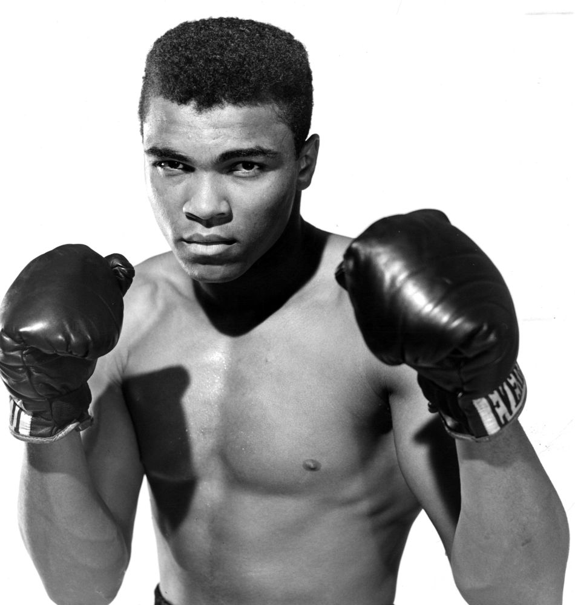
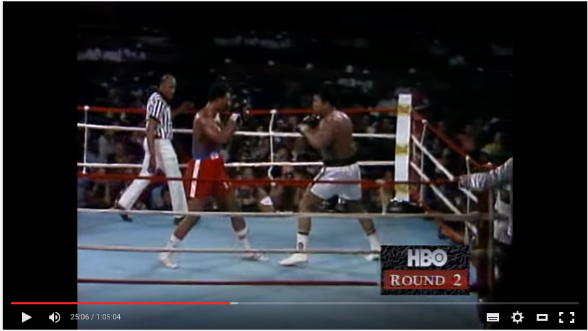
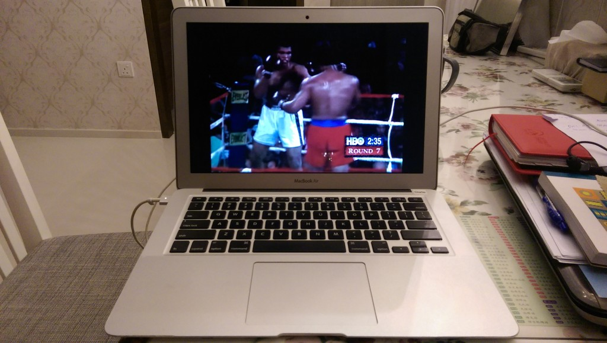

It was 8:30pm when I entered into the Youtube search bar: “George Foreman vs Muhammad Ali”.

Earlier in the day I was driving around Singapore as a deliveryman for a friend’s company. Manual transmission is interesting until I got the hang of it again. Then, it began to require almost no cognitive resources at all. My hands and feet were on autopilot and boredom soon kicked in.

I plug in my headphones into my smartphone, hooked it up to the in-car charger and placed it on the dashboard as a GPS. And I tuned in to my favourite podcast, the [Tim Ferriss Show](http://fourhourworkweek.com/2016/03/11/the-interview-master-cal-fussman-and-the-power-of-listening/). Today’s guest was [Cal Fussman](https://twitter.com/calfussman), someone Tim Ferriss introduces as one of the world’s greatest question-askers.

As with most Tim Ferriss podcasts, you never truly know how it’s going to turn out until you tune in. Some interviews go off course but most stay on point on deconstructing the game of world-class performers to glean insights that might make us all better humans.

With Cal Fussman it was a mixed bag. The two men discussed at length how Cal’s style of interviewing evolved with his life experiences (he credits a lot of his ability to his 10-year—yes, holy shit—solo travels where he always makes conversation with people on the train), which is definitely on point.

But evidently these men were both huge fans of boxing, too, and Cal had quite a history with the sport personally. He’d foolhardily entered one of New York’s greatest boxing competitions, the Golden Gloves, with a month of training prior and got punched delusional. Then, as a way of regain his manhood after countless shaming at dinner gatherings, he decided to take on one of the world’s top boxers.

I’ll cut the story short here and give you a chance to experience his powerful storytelling, but I’ll summarise what happened for me in these two hours of listening to the podcast. I became enthralled with boxing.

_"The Greatest" Muhammad Ali_

Tim and Cal dropped many boxers’ names, of which I knew only one; and it’s probably the one everyone has heard of - Muhammad Ali. They mentioned a few epic matches and I got so excited I decided that becoming a hazard on the road (and risking my own life) to note them down in Evernote while driving was worth it. Nobody died in the preparation of this article.

It paid off.

Youtube truly has every video on the planet. It was 8:30pm when I entered into the Youtube search bar: “George Foreman vs Muhammad Ali”.

_George Foreman (red) vs Muhammad Ali (white)_

For a millennial to watch an hour-long video on Youtube from 0:00 to 1:00 is a modern day accomplishment. I started with my back resting comfortably against the seat at the dining table but as the intensity built up (with Ali dancing and air-punching in the ring waiting for George Foreman, the angry heavyweight champion), my butt clenched and slowly inched toward the edge of the seat.

The next hour was one of the best experiences as a spectator in my life. To immortalise the moment I took a photo of the setup: a laptop on a messy dining table. “What a sport!” I exclaimed to myself as my wife had long left the table to do something else.

_The humble set up on the day I started to appreciate boxing as a sport_

Boxing had never appeared interesting to me at all before today. Two guys tangoing around a square ring with ropes dealing punches and occasionally hugging each other before shooting more punches… that’s sounds interesting, but since boxers are generally tough guys, punches didn’t seem to do very much. I didn’t know what I was looking for.

Now I think I know: you’re supposed to look for signs of damage, fatigue, psychological dominance and technical and physical superiority.

All of a sudden I saw the beauty in the sport. Boxing mirrors life in many ways… to me, it’s a metaphor of living. A boxer, being human, has limited physical and mental capacity for each match. His job is to ration that well, because well, energy and morale are finite. His opponent in the ring is the monster that’s upsetting him, unsettling his momentary peace (ie. his reign over a title). Should he focus on jabbing and delivering uppercuts right off the ring of the bell, or should he dance around and strategically deliver timely punches? How should he look tough even if he is scared of his opponent, especially when he’s fatigued and his opponent seems to be still going strong?

The show of boxing is in the subtle moments after each successful or missed punch. In these moments we’re able to evaluate each boxer’s state and try to understand how much pain and how tired they’re feeling, who’s more afraid of the other and who’s more likely to win.

I enjoy watching boxing because I love noticing and analysing each boxer’s play (even though staring hard trying never to blink for fear of missing a knockout punch wears me out fast).

Muhammad Ali likes to “float like a butterfly and sting like a bee” and bounces around avoiding heavy punches while simultaneously hurting his opponent through multiple precise strikes. George Foreman is more like a tank; he moves forward and tries to deliver his signature (and one of the most powerful) left jab to end the fight with a KO. Later on I’d watch Mike Tyson fight and realise that he’s found a way to combine both styles…

What’s interesting here is that these boxers’ styles are a product of choices and their environment (ie. their coach and boxing circle) - the same for us with our personality and disposition toward others. And just like life, things can take sharp corner and change in a matter of seconds.

Now having been introduced to boxing, I couldn’t resist juxtaposing it against the WWE. Compared to boxing sanctioned by the International Boxing Federation, the World Wrestling Federation, which I poignantly recall being renamed the World Wrestling Entertainment, is a joke. It’s like a bouncy castle versus a Roman amphitheatre! Though truth be told, I’d rather be in neither.
