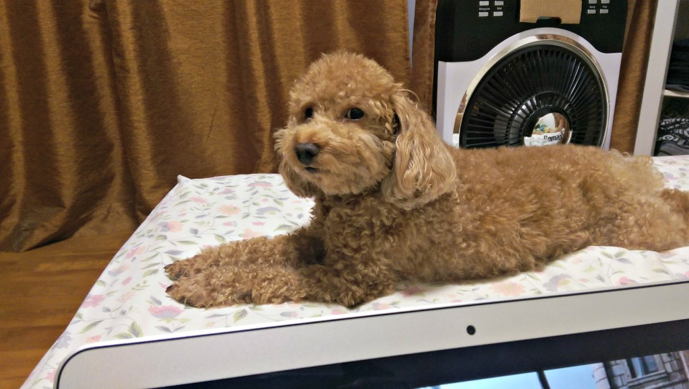

Brownie, my toy poodle, might just be Buddha. I seriously think that to myself about once a week.

I’d be sitting in bed with my laptop thinking what I should be doing first and what’s next in a list of 5 things to do, and I’d find him lying with his belly on the floor next to me resting his jaw on his little paws, eyes wide open and looking at me as if asking, “Lost in your mind, again?”

_Brownie, looking as though asking with contempt: Lost in your mind maze again?_

Of course, dogs don’t judge, so all that interpretation is just happening in my mind. Oh look, my mind again.

Or I’d be sweeping and mopping the floor and throwing out the dirt and black water, taking in and folding the laundry, boiling water to later fill up our dispenser… among what must be at least 10 other things to do to maintain order at home, and he’d again be on the floor near me (he’s always near me somehow) giving me the same look.

Sometimes I’m not sure whether he looks at me and thinks what I think he thinks, or that he’s doing it knowing he’s kinda cute and hoping it’d appeal to me to rub his belly. Sometimes I conclude it might be both.

Whichever his real intention isn’t important. What’s important and interesting to me is that **he’s almost always in a higher state of being than I am.** (Perhaps except when his only two weaknesses are played upon: food and dogs). He’s always there, while I’m always somewhere else, mostly in my head. That bothers me somewhat, knowing a dog is better than me and my mind.

I’m sure if Brownie ever wonders anything, he’d be wondering why humans have so many things to think about all the time. Then again, I doubt he wonders anything, because if he did I would’ve already caught him spacing out into the future, planning something like his next meal or spot to curl up and nap.

It’s obvious to me that dogs live more in the present than most human beings, and Brownie is one of the most live-in-the-moment dogs I’ve ever known. Living a freelancer’s life (ie. being mostly at home) means spending a lot of time with him, and being in close proximity to another living being so oddly humanistic yet mightily present is a strange but powerful experience.

Every once in a while when I catch myself in the act of thinking involuntarily, I’d instinctively turn to look at Brownie, only to find him already looking at me, as if telling that he’s ready to accept me for who I am (a thinking human) and to offer comfort through his formidably present companionship.

I’m convinced Brownie is the Buddha. Or they must at least have met each other before.

I’ve got to catch up with my dog. And apparently I’ll have to do that by slowing down. Be more aware of my thoughts. Cultivate mindfulness.

For now I think I’m going to kick back and lay on the bed and look at my wife. I wonder if it’ll have any effect on her… I _wonder_.
