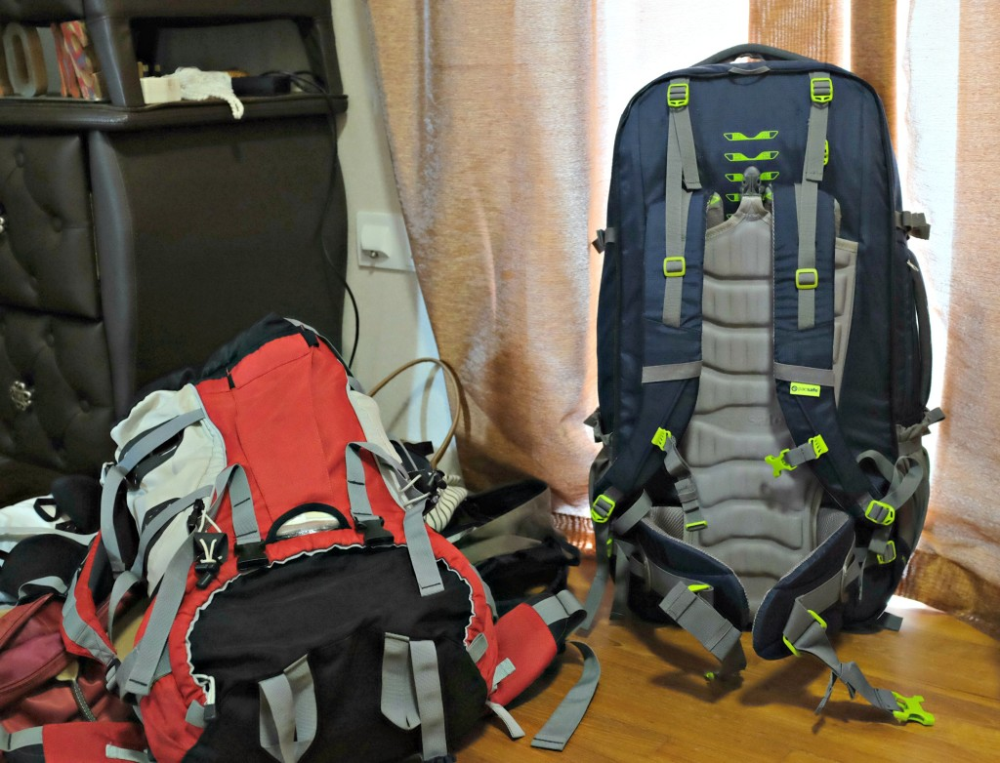

_2 Travellers, 2 Backpacks, 1 Month in the US!_

We finally began packing our backpacks for our coming month in the US. Six days before the trip - not bad. I'd usually wait until the day before to pack. I attribute this change to my wife.

Packing is a dreadful thing, only slightly less dreadful than unpacking. But this time it wasn't quite as dreadful as before when we packed for our shorter trips. Length of stay abroad apparently improves my attitude towards packing. I think I'd attribute that to our general excitement knowing we'll be spending a month traversing the ends of the United States. That's always been _the_ trip to make in my gullible, easily indoctrinated head.

So we started packing and as we were rolling T-shirts and vacuum-packing our jackets that can only be described as overkill, I began noticing a feeling I'd never noticed before: a heightened survival instinct.

We're about to go on a great trip that I _know_ will be memorable even without visiting prominent places or deliberately doing anything epic. As long as I'm travelling alone with Mei I'm sure any trip will be inherently wonderful.

That said, it's also likely that we'll face a problem or two during the journey; a punctured tyre in the middle of nowhere on Route 66, unwittingly leaving something we're supposed to take with us behind, getting pulled over by the police for doing a rolling stop at junctions…

Anything can happen. It's the wild west for a reason! More than that, it's unfamiliar territory to us. A different land of many divergent peoples with hugely contrasting cultures from Singapore's. We wouldn't know if we offend anyone or did something okay to us but unacceptable to them. (This is America, though, so I think there'd be less of that?)

It's going to be an adventure, especially since 90 percent of the trip is still wide open and unplanned. All we've done so far and will do prior to leaving Singapore is book our accommodation in New York City (in Brooklyn), confirm our stay with a friend in Boston and book two free city tours ([Free Tours by Foot](http://www.freetoursbyfoot.com/new-york-tours) at NYC and Boston).

We're leaving plenty of space for spontaneity.

I'm keeping my fingers crossed that Murphy's Law fails for our trip. But just in case the law doesn't take a hiatus, we're taking our own precautions:

- Medicine box with pills that treat the common illnesses in case, well, life happens
- A TSA-friendly padlock for our check-in backpack and steel wire cables for tying down to something when we leave our bags unattended
- Two separate day packs (with money and passport) in case we lose each other in the busy streets of Manhattan, or any other crowded American cities
- Packing as light as possible in case we have to move around on foot more than we imagined

That last point made me feel the most like a survivor. Pack as light as possible so we can go on for a longer time without needing to stop. In my mind, lightness equals sustainability of a long journey. We'd be able to walk 10 miles to find a motel, outrun a zombie army and probably last without food for an hour or two longer. Self-preservation is the name of the game!

Though in the end, if I were to be completely honest, I kinda hope some (hopefully small) things would go wrong. These are the things I live for - a good story and memories of days of us being a little closer to the edge.
