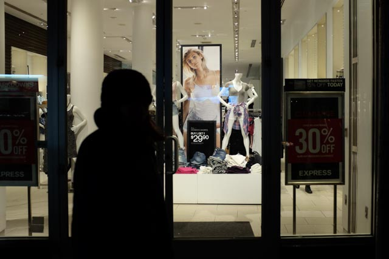
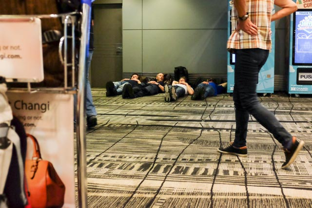
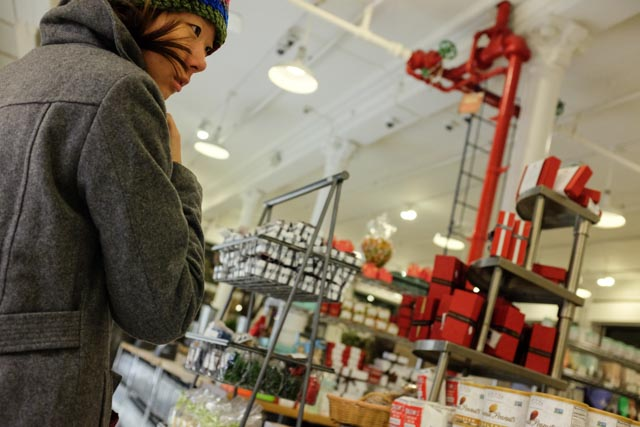
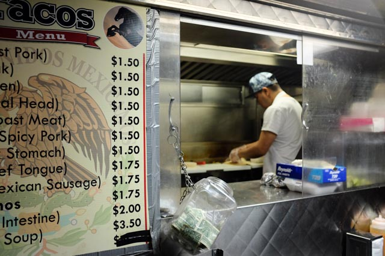

And finally, the day is over. Phew, we’re beat!

I’m going to keep this brief so I can go to sleep soon, seeing that it’s just going to get colder into the night.

We’re in Brooklyn, New York. It’s a first for both of us in the Big Apple (why is it called that anyway?) and to be honest, I’m not sure whether it’s the fatigue or not, but I was underwhelmed. Neither was Mei gasping in awe when we walked around the streets of Sunset Park in Brooklyn.

 Leaving Singapore

Come to think of it I’m pretty sure it was the –1 degree celsius weather that made everything hard to appreciate. All we really wanted was to find that damned Airbnb apartment as soon as possible so our noses wouldn’t fall off.

 Looks like the New Yorkers took their winter clothing off the shelf too early

It’s Spring in New York, and apparently that doesn’t mean it’s above 10 or even above 0 degrees celsius here. Snowstorms are common. I don’t think we experienced a snowstorm today though, since, well, there wasn’t a speck of snow. But it’s definitely not normal spring weather either. Lucky us, I guess?

Speaking of lucky, some cool things happened today during our pilgrimage to the John F. Kennedy (JFK) International Airport from Singapore’s Changi Airport. What kind of cool stuff?

 In Frankfurt I swear I wanted to be just like them at Changi Airport

Free upgrades!

And not just the kind where you go from a normal Economy seat to an emergency Economy seat with bigger legroom. I’m talking about a real upgrade that came with bad weather in our original layover city, Guangzhou. We got transferred to fly on Singapore Airlines for free!

Hardly able to contain our excitement (and to put a value on our luck), Mei pulled up her smartphone and checked the Singapore Airlines website. The flight from Singapore to Frankfurt and then on to JFK was supposed to cost SGD $4,500 for the both of us - we paid $2,100 for our original tickets with China Southern Airlines. Awesome.

On to a rapid fire Q&A:

- Where should I put my lithium ion batteries for a flight leaving from Singapore Changi Airport? - In your carry-on bag. Don’t check it in or it might bounce! (This differs by airport, I believe. Once, in Xiamen, China, security confiscated—ie. threw away—Mei’s $70 powerbank when she brought it in her hand carry).
- Why do headphones on planes use two pins instead of one? (Not sure, but I know and can feel my brain slowing down a lot right now, so I’m going to guess it’s something to do with legacy technology infrastructure…)

 Inside a Dean & Deluca, an upmarket supermarket on Broadway

Over the 20 plus hours flights I’ve had time to read Mike Tyson’s autobiography, watch one and a half films and wonder about things.

Mike Tyson’s book is a riveting read so far. I got an inside look of the life in the ghettos of New York City by change reading his book. Very timely for a first trip to the city. More than that, the way Mike wrote his story transported me to the days he was growing up, getting bullied and toughening up and kicking everyone’s asses. I now know that this man’s early life was tremendously rough, and it has everything to do with how he turned out to be the world’s youngest heavyweight champion.

I had time, so I wondered about a few things here and there:

- Oh how spectacular it would be an experience to fly in an electric plane. I think Mei and I have a chance of seeing that in our lifetime (we’re in our mid–20s). Maybe not fly it since it’ll probably be only affordable to the super wealthy at first.
- There’s a clear transition to a different mode of being that begins the moment you step out of the house for an adventure. I noticed a few things change right away: we ate nuts and drank soda, things we never ate normally. We were also more ready to accept something as a challenge (instead of just a problem) and find ways to solve it.
- Speaking of nuts, I also realised that when we (ie. people) eat a pack of nuts, we actually look like a bunch of apes. Perhaps with less lip movement.
- The sounds in iconic cities like New York and London are loud and raw. Something like a siren went off at the airport to signal the arrival of our baggages at the carousel. In Singapore, that sound would have been considered alarming. Another notably raw auditory experience is the subway (NYC) / tube (London) ride. Singapore’s trains are almost silent compared to them.

Sitting at my Airbnb apartment in Brooklyn now, having eaten some cheap tacos we found at a food truck nearby for dinner, I feel satisfied. Our host Ariell is very gracious, apologising for not providing towels upon arrival and other little things like that that shouldn’t warrant profuse apologies. Everything is looking good. Ok, maybe except my greasy hair and cracked feet.

 Food truck tacos near our Brooklyn apartment

It’s been a good two days of acclimatisation. In the plane I had a blocked nostril and couldn’t taste my food, and for the first time I told myself to just accept it and eat the food anyway. I did, and it felt great even though it didn’t taste that much. An adventure is the perfect playground for experimenting, and this one worked out fine. The next time a blocked nose comes I’ll just go along with it. (Hmm, this way accepting things as they are seems applicable to many more things in life…).

Tomorrow we plan to explore downtown Manhattan. Onward with adventure!
