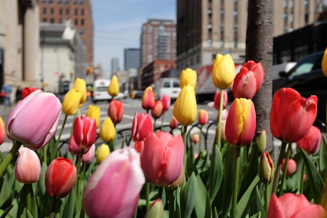 Few flowers have bloomed even though it's Spring time, but these ones are doing well

Oh, what a day it's been in Manhattan.

Actually, it’s kind of been one and a half days. We were so beat at 5pm when we got back to the apartment, we'd slept till this morning, waking with a throbbing head while nursing ourselves with blackberries and grape tomatoes.

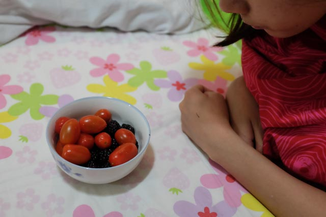 The only food we could scavenge at 4am - USD $4 for two big boxes of those

We spent most of the day walking yesterday, exploring the jewel of NYC, Manhattan. Our expedition started well at about 10am, with blue skies, light winds and our first McDonald’s breakfast in our bellies (courtesy of Ariell, our Airbnb host who felt bad that she’d given us inaccurate directions to get to her apartment).

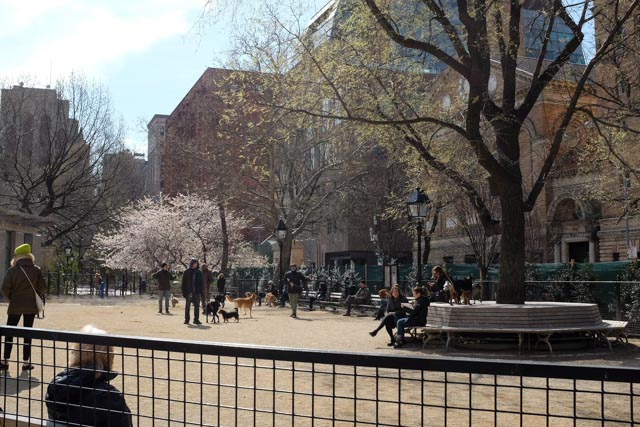 A dogs-and-owners only area in Washington Square Park - wish we have this in Singapore!

Our first stop was Washington Square Park. We knew nothing about the park except what we’d read on the Lonely Planet guidebook that we brought with us. Apparently it used to be a cemetry for penny-pulling New Yorkers and was saved from development because of that status, and was later revamped into a park that’s now very well used.

I can attest to its utility, seeing so many people strolling about, passing through, performing songs, playing chess, even commanding pigeons. It’s now one of my favourite parks, perhaps occupying the position just below my favourite Hyde Park in London.

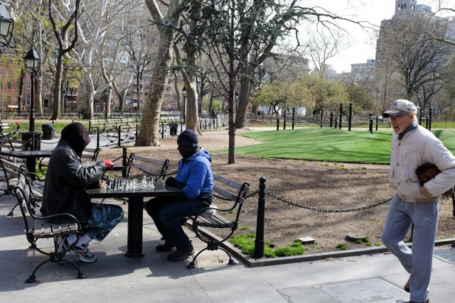 Chess players at Washing Square Park

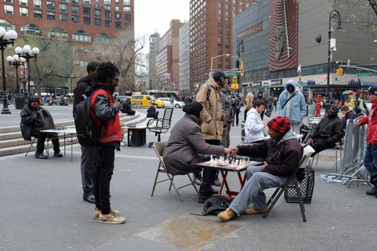 And in Union Square

Like most places in US cities, it’s a big rectangle about 1,000m by 400m or so. So we walked along the periphery and began to realise just how great Washington Square Park was - it’s functioning like it was designed to, as a square, connecting all four sides together, creating a unified and unique identity for that whole space. We don’t have anything like it in Singapore and I now wish we did. I’d sit there even if it was a hot day if I felt like being in public, watching other people going about their daily lives.

Surrounding the park was the sprawling campus of New York University… what a glorious institution! I love that NYU’s campus is basically interwoven into the fabric of the city: it has huge buildings scattered throughout what I think is the Chelsea district of Manhattan.

Looking at the students walk into these beautiful big buildings, presumably to get to lecture or set up base to do school work, makes me envious. A quick look at [NYU’s website](https://www.nyu.edu/about/news-publications/news/2014/11/17/nyu-ranks-no-1-in-attracting-international-students-and-in-american-students-studying-abroad.html) reinforced my envy: in the 2013–14 academic year, 11,164 of its total student population in New York City were international students.

I missed that chance, to live independently in the world’s most cosmopolitan city, to explore interests beyond engineering, technology, science and pseudo-geography, to live among people who had tremendous drive and rub off some of them.

I missed that chance as an undergraduate. Maybe I’ll do a masters programme somewhere for a year…

Moving on from my adulation of Washington Square Park and New York University, we continued walking about Manhattan following a trail in the guidebook. That was an underwhelming experience in terms of learning about yankee heritage, but it was fun nonetheless to walk through small streets instead of the the Avenues which are the broad main arteries of the city.

Here’s a funny thing: I actually said that I wanted to have some greasy food for lunch! It was completely subconscious. Perhaps in my mind there was no better way of saying, “Hello America, I’m here!”

So we had pizza in a random deli shop that sold slices that were in themselves a meal each, and grabbed a cup of Chobani yoghurt to clean the pipes. We ate by the roadside of Eighth Avenue at a junction where a lot of school kids walked by, using some electrical box as our table. It was a nice meal. Quite enough grease for the body for a while though.

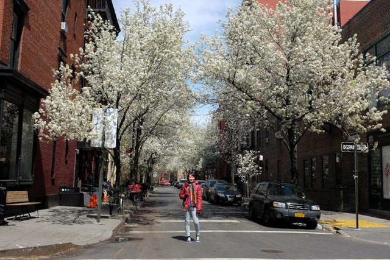

As we walked through the smaller streets, I noticed that that there were leaves swept into piles and left as mounds around the trees lining the sidewalk - precisely the thing I’ve been openly wondering about for Singapore. Why don’t we do that in Singapore? Fallen leaves will be broken down by the forces of nature and their nutrients will recirculate into the soil, so it makes perfect sense to do it. It’d be like assisting ‘nature’.

I think it’s time we started doing this instead of collecting all those leaves into big black plastic bags and disposing them, and then buying fertiliser and paying people to go around applying them to our trees. It’s a small but silly thing we do.

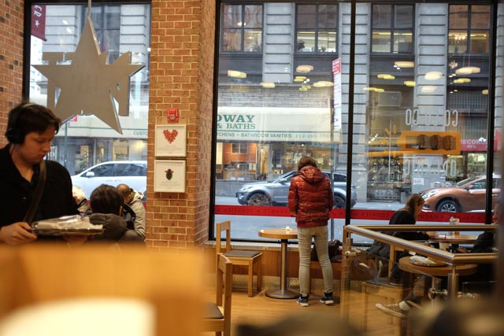

Next, we happened upon a Pret A Manger store in Manhattan today. I think it was along Broadway. As I was having my large earl grey tea to warm my insides I remembered the history of the sandwich and coffee store in Singapore.

They’d came to Raffles Place once, operated (probably at a loss? I could be wrong; perhaps they were testing the local market) for a while before shutting down and pulling out of the country. I believe they’d recently made a re-entry into Singapore under an unoriginal name, “London Sandwich Co.”, with a store at Ion Orchard shopping mall. It looks exactly the same—the signature maroon and white colours and plastic sandwich boxes wrapped with red tags that say “freshly made”.

It makes me wonder: How come Pret A Manger style cafes don’t work well in our city, when it works so brilliantly in cities like London and New York City? I can tell the Americans love going into Pret A Manger (which is British) more than their homegrown Starbucks. So where does the difference lie?

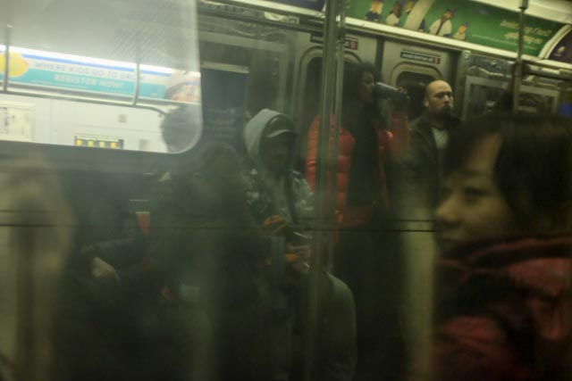

Another distinctive thing about New York is the strength with which the people talk. New Yorkers are talkers. Whenever they’re in pairs, they talk. Whenever they’re alone, they still talk, almost always with a white pair of Apple stock earphones dangling from their ears.

I like that. I think talking out loud unabashedly in public is a good thing - it means people are comfortable being themselves. (Of course, I’m not talking about people screaming at their phones or friends in a crammed subway ride.)

Again, this is in contrast to Singapore. We talk loudly when we’re alone, but discreetly when we know there are other people around. My guess as to why we’re like that is that it’s cultural. Something about being Singaporean Chinese and seeing loud-talkers as brash and uncivilised.

But it’s a valuable thing, being able to talk out loud comfortably. The biggest benefit is to be able to go about your business more efficiently, be it coordinating errands for home or scheduling supplier meetings for work. Talking like no one is looking gets things done faster, by virtue of not having to find a quiet corner to speak. The side benefit is the contribution to the facade of a lively city.

**Some other photos on the honorary roll...**

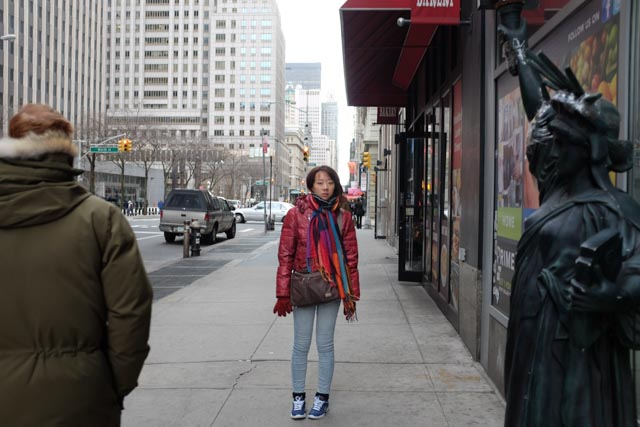

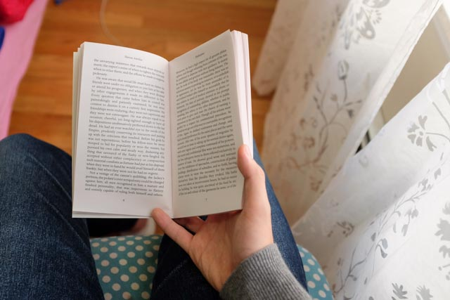

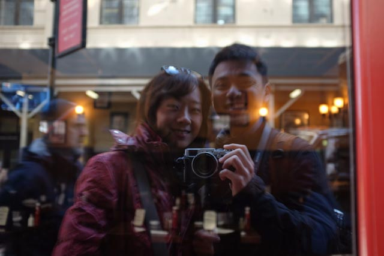 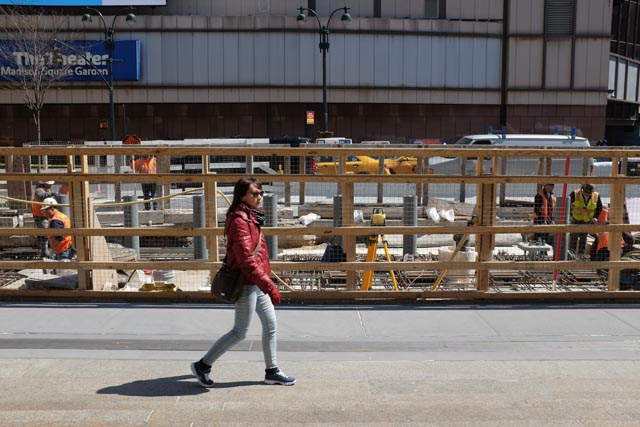 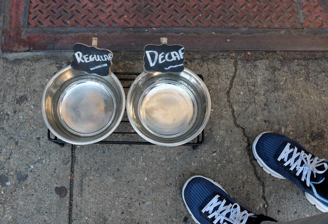 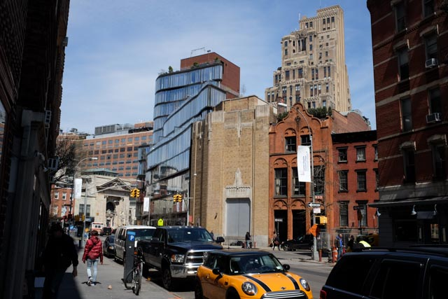 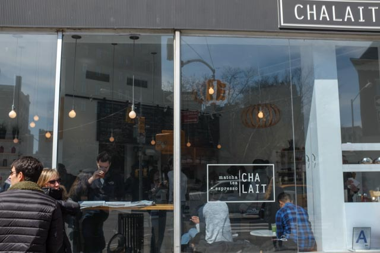 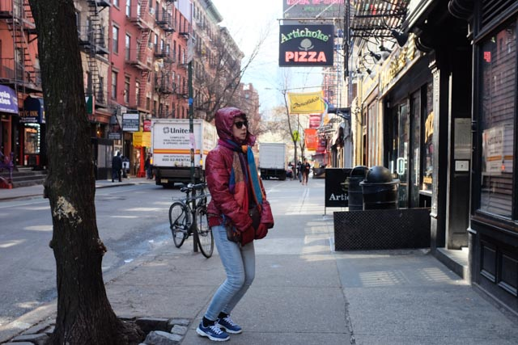 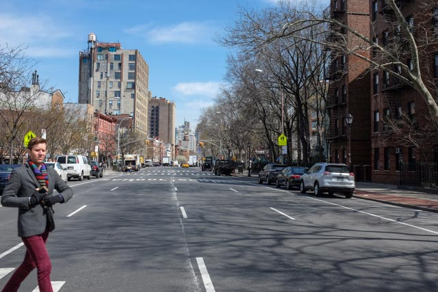

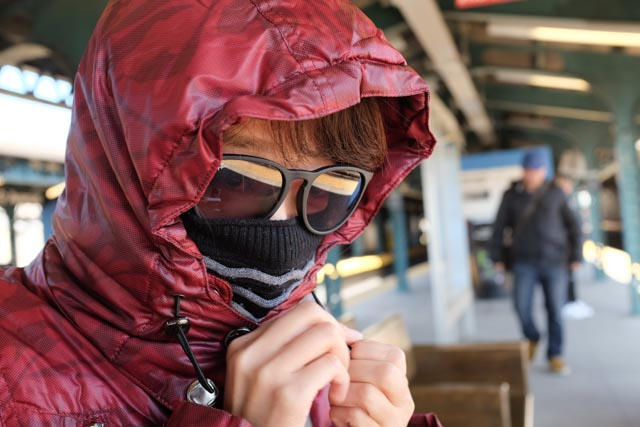

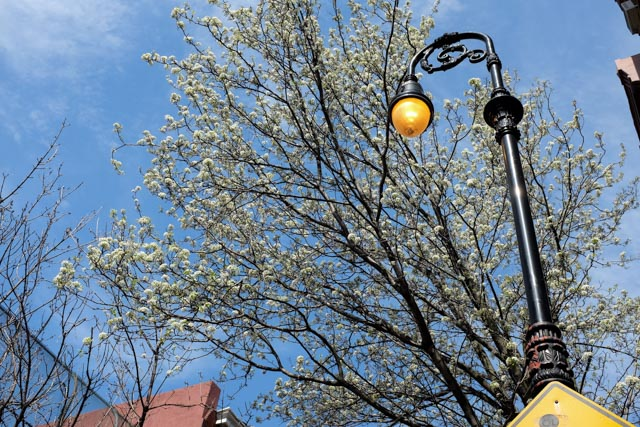
