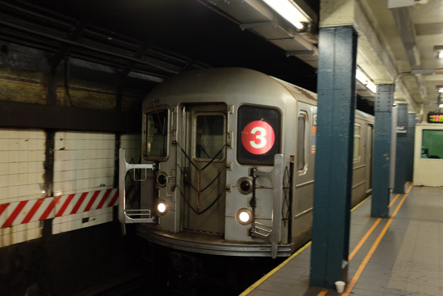 Every train has a thunderous arrival in NYC

A train in New York City’s subway first sputters before growing into a series of clanging as the old train grates the tracks that are more than a century old.

[Yesterday](https://www.nickang.com/us-manhattan-nyu/) I wrote that I found some New Yorkers to be a loud and uninhibited when talking in public, and that I quite like it. Now I’m certain that the subway and its thunderous metal gnashing has something to do with it. Perhaps the same way the modern—and come on, let’s admit it, virtually silent—trains have imprinted on Singaporeans to be more reserved in our mannerism.

Case in point: I’m someone who gets easily nauseated on moving vehicles and I don’t get light-headed while reading on a train in Singapore; there’s no doubt that I do in New York. Ask the person who sat next to me today.

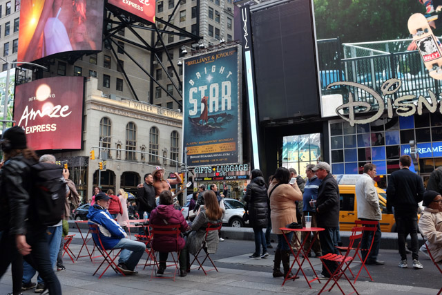 Times Square and a little weirdness from that naked Cowboy Oysters guy

##### Broadway

Every trip to New York has to be accompanied with patronage of a Broadway play or musical, right? I thought so, but neither of us felt an urge to catch one so we waited for chance to creep up on us like it did in Times Square.

Sitting at one of the red tables in the renown Times Square—popularised the world throughout by film makers everywhere (the latest movie I remember with a scene there is _The Martian_, when Mark Watney played by Matt Damon is on the cusp of forced ejection out of Mars on a emergency launch module with a tarp-lined nose)—Mei and I talked about London v. NYC, the crazy guy from Cowboy Oysters playing a guitar in his underwear in near zero degrees weather and the scented candle store behind us that Mei had heard Asian American Youtube celebrities promoting for months before we’d gotten here.

That’s a memory I think I’ll have for a long time to come.

After flattening our butts on the metal-grill chairs in the middle of Times Square on 260 Broadway, we were on our way to explore the area a little more before heading home to Brooklyn when we chanced upon a giant white capsule with four letters “tkts” emblazoned on the side. It looked so peculiar we had to find out more, so we approached the digital board beside the capsule.

It’s a list of Broadway shows, some at 50% off!

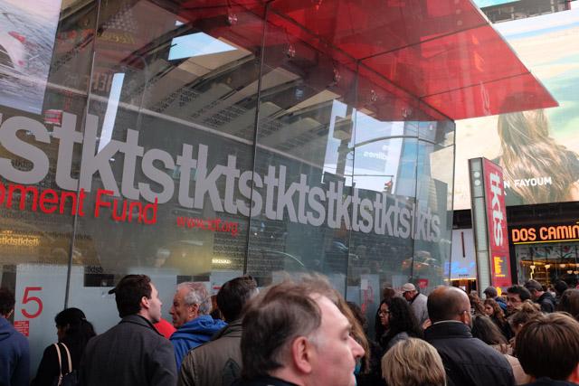 tkts I suppose means tickets

Tkts is apparently an initiative by the Theatre Development Fund, which I imagine is a non-governmental organisation, maybe even a non-profit with the self-understood aim of developing theatre in New York City. Even though Broadway is Broadway, there has to be unsold tickets, which I suppose could be let off cheap?

We queued in a line that snaked by one side the capsule, and there must have been at least 50 other people in front of us. A few theatre-talking people were scattered throughout the line offering unsolicited advice about which plays and musicals to watch because of which famous director who won how many Tony Awards - we just smiled at them (no words) because we didn’t want to appear ignorant.

“Hi, we’re thinking of getting two tickets to Matilda. How much would that be?”

“Ah ok, two tickets to Matilda. The 50% discount applies to the best seats in the theatre. Let’s see… Okay, two tickets at 50% off will be $160.”

I looked at Mei and she looked back at me and we knew we weren’t going to watch a Broadway show. Not on this trip.

You see, we’re on a budget trip. We have to control how money flows out of our wallets, because we don’t have that much. And even though catching a Broadway act is quintessential to a New York experience, we had first to be quintessential penny-pinchers, otherwise we wouldn’t be able to travel to more places.

I did try thinking of hacks to catch an act cheap, but we’ve only got one day left and it felt like too much of a hassle, so I just dropped the idea. At least I’ve watched Les Miserables and Billy Elliot and School of Rock in London’s West End. I’ll just equate them one for one.

We’ll return a few years from now and if there’s little reason to pinch pennies then, we’ll catch a couple.

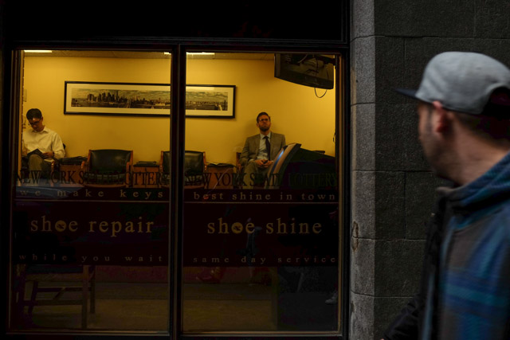 A guy whose shoes must be shined... Wall Street!

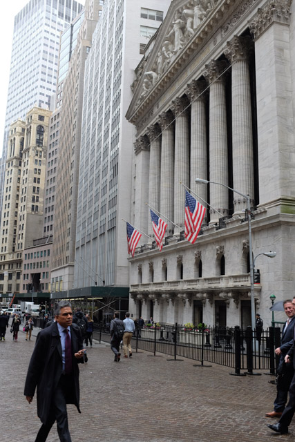 The NYSE

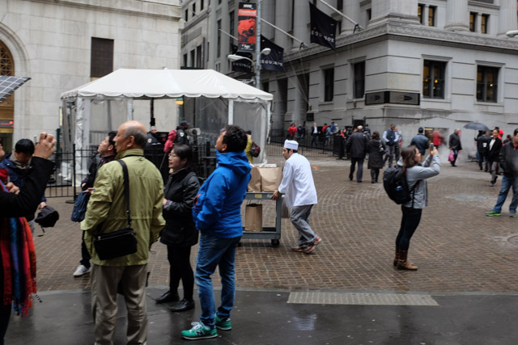

Some other things I thought about:

- The library is one of my favourite places in the world. It has a clear higher purpose and manifests as a peaceful environment. I love libraries!
- Amish people in their black coats, velvety top hats and long sideburns look a lot like magicians to me.
- I’m definitely visiting NYC this time as an outsider, a tourist, and I’m not seeing it for what it is. That must be the reason I feel done with the city in just 3 days. (I didn’t feel that way in San Francisco or London).

**Some other photos**:

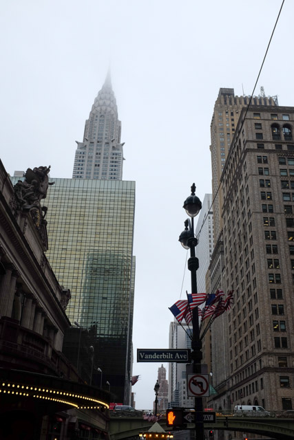 The Chrysler Building - I think this looks better than the Empire State

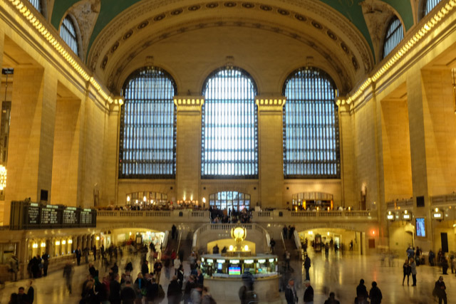 Grand Central Terminal, a herculean beauty

 Police raiding a car in Broadway. I bet brutality is on everyone's mind as they watched

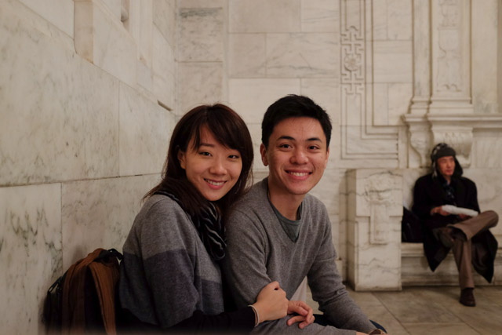 In the New York Public Library

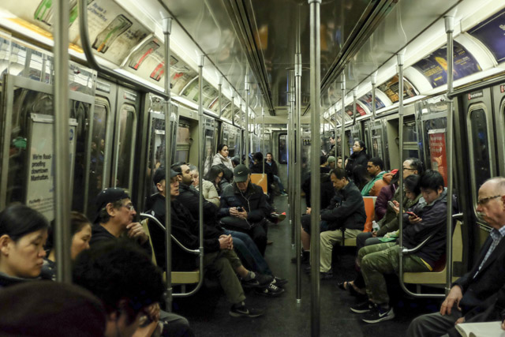 Typical of a subway ride in NYC - everyone's tired

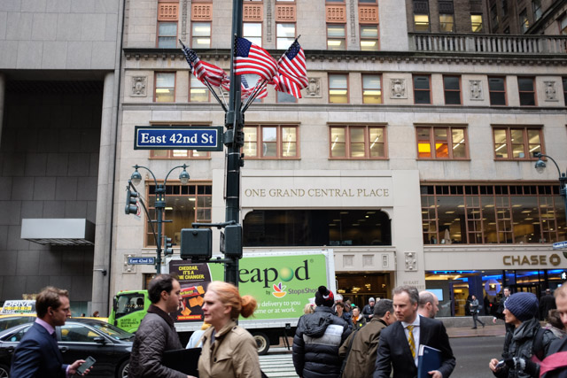

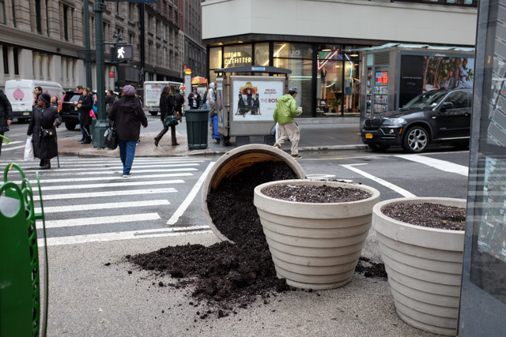

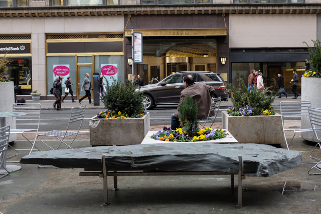
