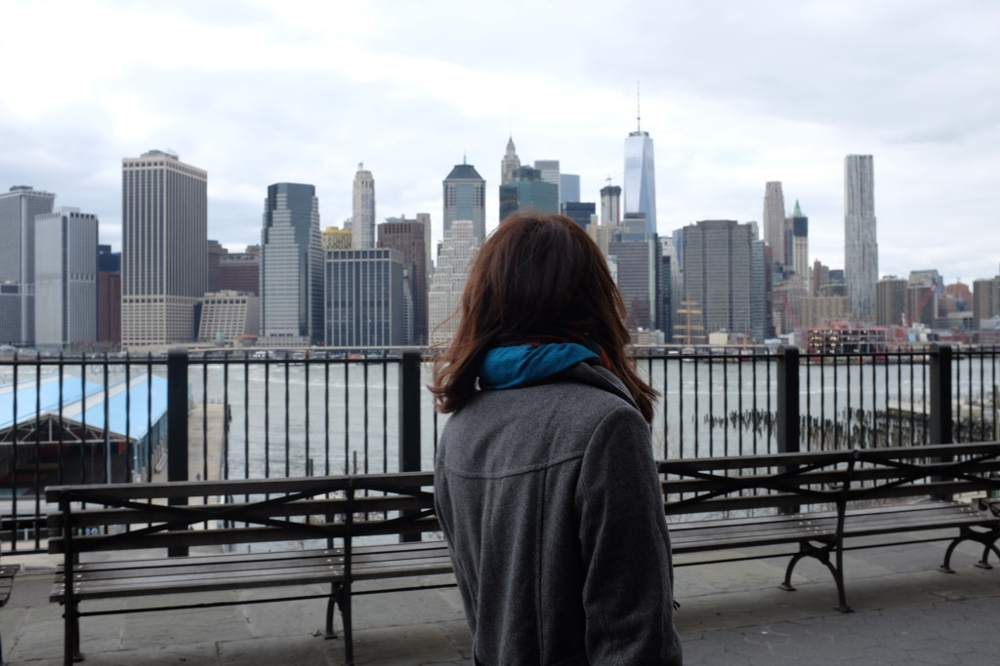
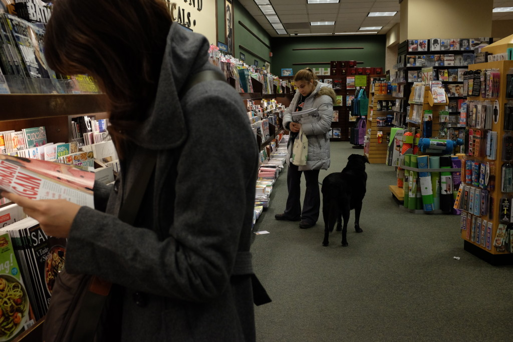
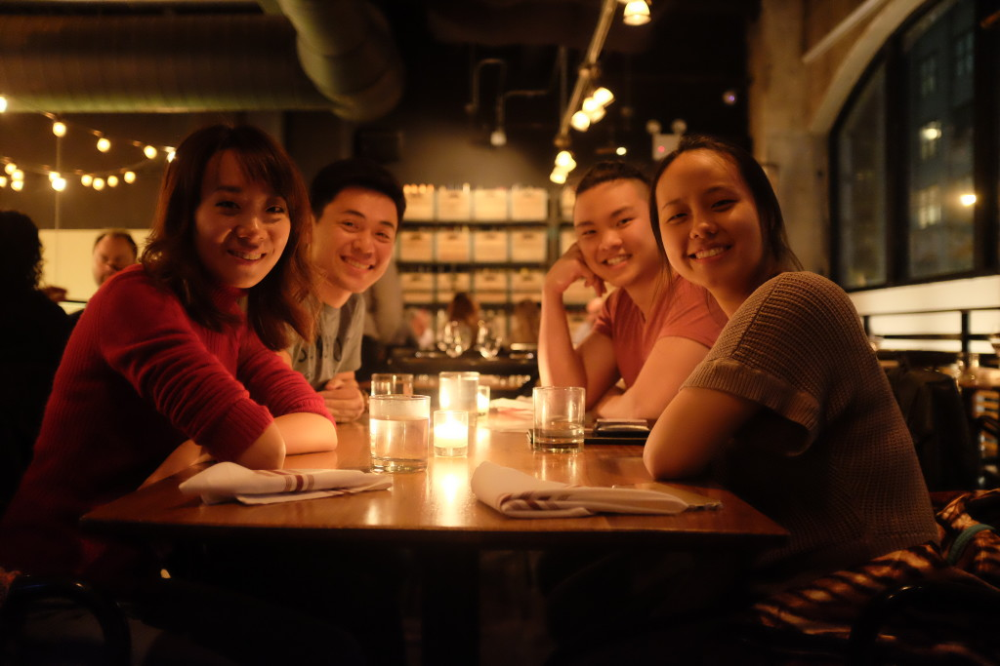
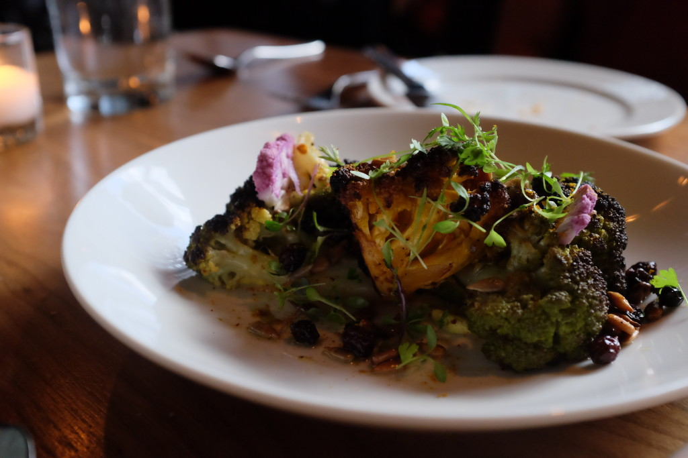
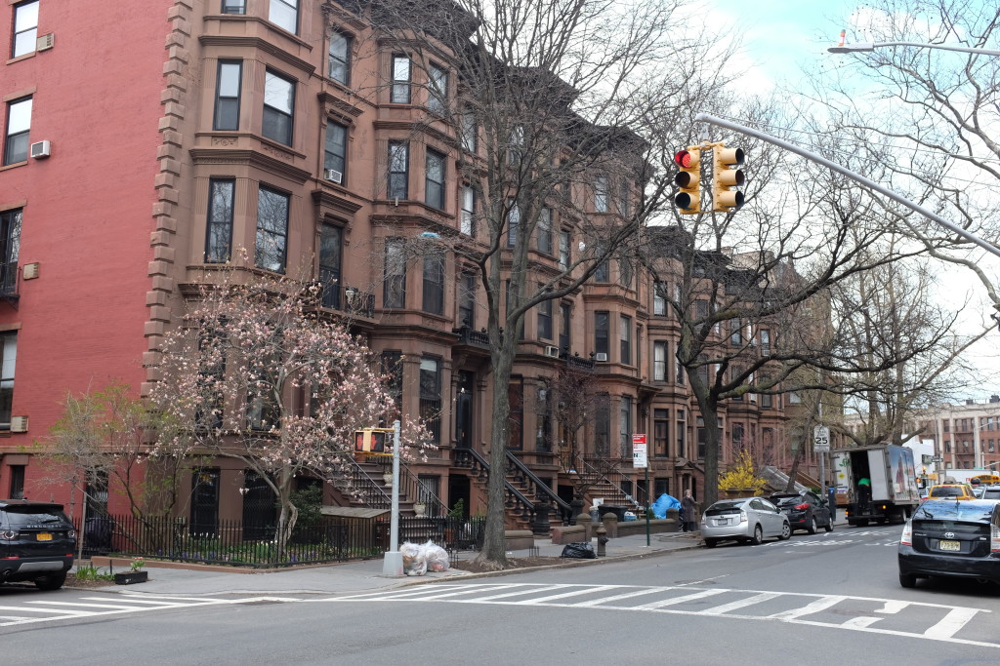
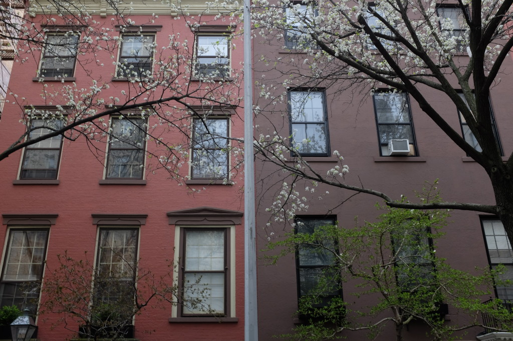

It's four days into our trip to the US and I think we've settled into a groove. We'd get up unhurried, wash and prepare for the day at a pace similar to when we're back home. After carefully considering our options we'd calmly pick two out of the list of over ten possible things to do instead of trying to do five in the day.

That's a good sign. Internal stability on a trip like this is something I consider very important - how else can we reflect deeply and truthfully, unhindered by vagaries? That's the point of travelling to me–to think and reflect and learn things about people and places–so I always hope I'll get to that state as soon as possible (sometimes it's not possible, especially for short getaway-type vacations). Glad I'm able to notice it today.

 The dog has entered Barnes and Noble - this should be a problem, except it isn't and shouldn't!

Interesting things that happened today:

- We saw someone bring their dog into the Barnes and Noble bookstore we were in. I was browsing an article of Emma Watson and Tom Hanks discussing gender equality when I noticed a black furry thing in the corner of my eye.
- We discovered the Dumbo district in Brooklyn, which happened to be the perfect place to see the Manhattan skyline and the iconic Brooklyn Bridge. This marks the first gem we've discovered on this trip - I'm hoping we'll find a few more great ways to experience a place in a relaxed manner without being squashed by tourists!
- We had dinner with two lovely people—Keng and Sherry—who were our former Airbnb guests and now friends at Dumbo in an upscale "Michelin-recommended" French restaurant called Atrium.

## Over dinner at the Atrium restaurant

_Can I sit on your lap while you're pooping?_ I think that was the title of the book I was reading when someone tapped me on the shoulder and said "You should definitely read that, it's a great book!"

After recovering from a mixed moment of surprise, shock and awkwardness I greeted Keng with a firm handshake and a look that I'm sure said "How have you been?" We proceeded to some chi-chi restaurant with waiters who are extremely well-versed with everything on their menu. Not my kind of place, but it'll do as a place to catch up with friends in.

Our friends who were our former Airbnb guests in Singapore have been living in New York City for a couple of months now, both working at the same startup in Brooklyn. One is a developer, the other is a business person, or if you have to, a hustler.

Eating charred broccoli with them in a small restaurant in NYC was oddly fun and familiar, and us four sitting at a table together reminded me of the nights that they spent with us in our home in August last year. Sherry is the business person with an explosive personality and Keng is the developer with a serious penchant for open-source software and artificial intelligence.

 Said charred broccoli - I'm sure this wasn't part of the plan. Right?

Now the thing is, with only less than two weeks of intermittent interaction back in Singapore in our apartment, our friendship shouldn't be robust enough for us to want to meet up in a faraway land (they're not from NYC either). But we did. It was a pleasant surprise hearing from one of them asking to meet when they'd seen some update on social media about us being in town. It's always a nice surprise to learn of a friendship that you weren't sure existed.

While the food and setting had too much of a high-end faux sophisticated vibe to it, I thoroughly enjoyed their company. I've always loved being in the company of friends in unfamiliar places. The different social context thwarts all established practices and everybody comes to the table with fresh and open minds.

It's the perfect recipe for a memorable and eventful night, and a much better way of spending it than eating takeout from the Chinese restaurant one block down from your Airbnb apartment.

Other photos in the roll:

 Beautiful brownstone houses, just like the kind in the movies where the girl kisses the guy by the porch

_(all photos in this post were uploaded direct from my camera - I'm too tired this evening to do post-processing.)_
