It’s Tuesday now, which means I missed two days of writing and posting, so I’m going to make up for it now in subsections.

We spent Sunday doing precisely nothing outdoors, except running to catch our long-distance bus to Boston from Manhattan because it was rainy in a particularly cold spring day. For all of humanity’s technological progress since our cavemen days, we continue to be contingent on good weather. It’s quite ironic. And for all our growth as individuals, we continue somehow to have to run after buses. Weird.

Thanks to Mei’s quick thinking, we flagged a taxi and got to the Bolt Bus just a minute before departure, and arrived at the Boston South Station at 10:45pm. With an empty stomach we approached the McDonald’s and got ourselves $10 worth of carbs and downed them desperately hoping it’d help generate some heat in our bodies. Out here in Boston at this time of the year with visiting snowstorms, body heat has become the currency we’re most concerned with.

Our friend Dai Nan came to receive us at South Station. I have to admit, it’s amazing to be picked up by a familiar face when you’re this far away from home.

He’s in Boston University doing his masters in education and offered to put us up for the three days we’ll be staying here, for free, in his college dorm. (Thanks Dai Nan!) I predict we’ll deplete some of his food stashes while we’re here since its so freaking cold outside.

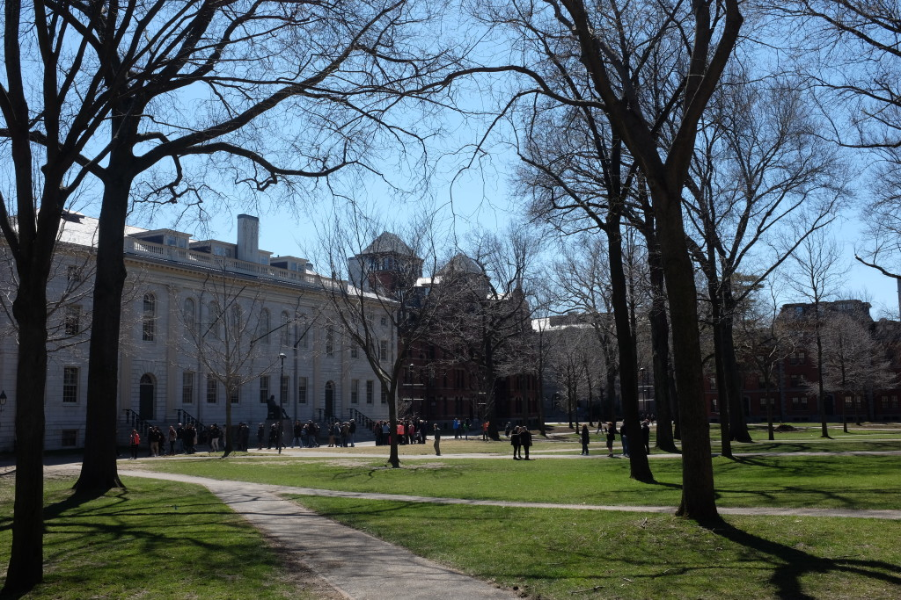 Harvard Yard

## A Walk Through Harvard University

We got up at 9am yesterday morning to prepare for our Free Tour By Foot in the famous intellectual powerhouse that is Harvard University. Next door MIT comes close but Harvard’s name has a real shine to it in our eyes, probably from fantastic marketing, so we signed up for that.

Truth be told, the tour wasn’t too interesting. Our guide David was a knowledgeable local Bostonian (Bostonite?) and a great storyteller, so it wasn’t his fault. One thing that kept coming up was interesting though, and that’s Harvard’s unabashed elitism, both from the establishment as well as parts of the student body.

This isn’t too surprising, but it’s interesting to observe up close how this plays out. People in Harvard are top notched intellectuals and most of them are also good all-rounders. They’re good. David (our guude) tells us that it’s home to 47 Nobel laureates who are teaching staff here. That can’t be right… can it? Notable alumni include 6 or 7 US presidents, including the current one. Barack Obama graduated from Harvard Law.

Ok, so they’ve proven themselves to be good - great, even. But their elitist mentality still bugs me.

Originally, I wrote three full paragraphs on why I think elitism can be problematic for society but I think they’re not yet polished thoughts and I probably wouldn’t be able to defend them, so I’ll hold back from posting them here for now.

But I’ll state two facts I learned on the tour:

- More than a handful of Harvard's yearly intake of students consist of those whose parents also went to Harvard.
- Apparently there are about 12 invitation-only clubs that against the wishes of the administration, and these clubs have millions of dollars in assets.

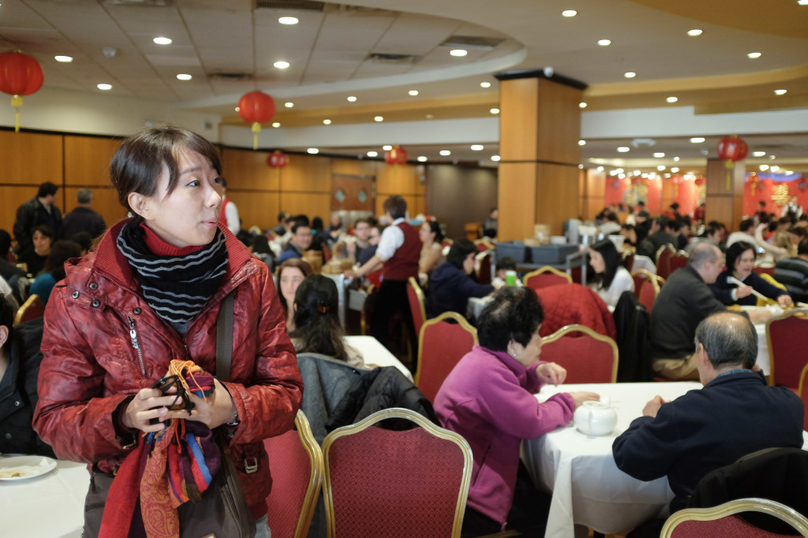 Dim sum in Boston Chinatown

## Tipping: The Most Unbearable Thing In American Culture

Well I think it’s best to state here upfront: perhaps it’s just me. But I have a feeling it’s not, and the tipping culture here is something I believe many non-Americans berate. A quick lowdown on what’s to hate about the ‘tipping’ culture:

- It’s ‘tipping’, not tipping, because **you are expected to pay it**. That’s not tipping, my dear American friends, that’s soliciting! I wonder how long it’ll take the US government to take things into their hands and institute a proper service charge to help service-related businesses and end this nonsense.
- It’s actually kind of rude to call it a ‘tip’ when really what you mean is ‘mandatory service charge’. To me, **this exposes an ugly truth - that most people are serving you with a false smile** just to get your money (just try not tipping and you’ll see that this is true).
- Expected tipping is **socially dreadful, because you’re always being judged** of your ‘generosity’ after every meal is just unpleasant. Recently after a meal in a Chinese dim sum restaurant in Boston, I’d forgotten to tip and was called out in front of everyone, “Hey, you haven’t paid your tip ah!” I didn’t know whether to laugh or hide in embarrassment seeing that it was an elderly Chinese lady who said that to me in a Chinese restaurant (only in America, truly).
- This way of collecting gratuity is **cumbersome** (read: inefficient) because it splits service charge collection (let’s call a spade a spade) into two parts unnecessarily. Just collect them both instead of waiting for the tip!

These are my top reasons for hating the American tipping culture. And no, I frankly can’t find anything to like about it.

/end rant

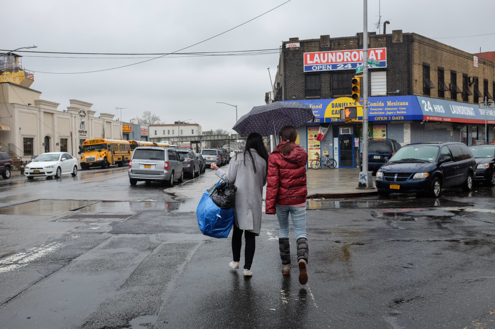 On a laundry run with our Airbnb host, Ariell, in Brooklyn

## Sounds of New York City

On our final subway ride in NYC on this trip, I decided on a whim to record the sounds. Initially it was for posterity, but very quickly I’d realised that this might make for good travelogue-ing material, so I’m posting it here.

What riding a New York subway train sounds like:

<audio controls="controls">
  <source type="audio/mp3" src="Voice0035-New-York-City-subway-sound.mp3"></source>
  
Your browser does not support the audio element.

</audio>

Boston 'T' train (their subway):

<audio controls="controls">
  <source type="audio/mp3" src="Voice0036-Boston-train.mp3"></source>
  
Your browser does not support the audio element.

</audio>

## Interesting Sights in Boston:

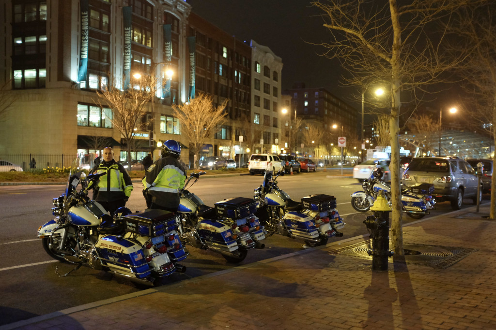 Boston Policemen have badass rides

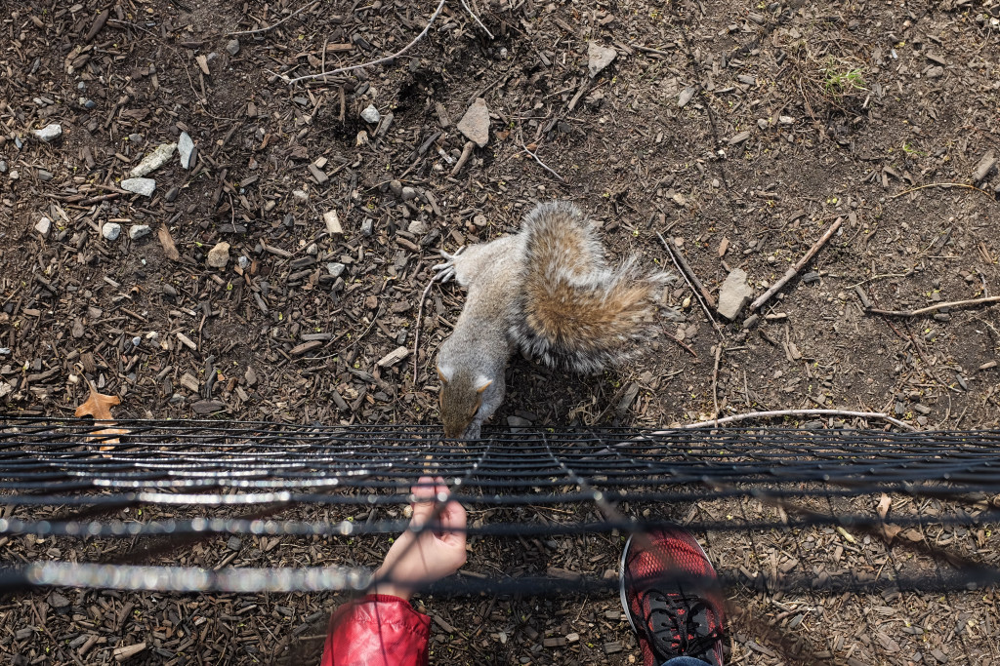 Shameless American squirrels

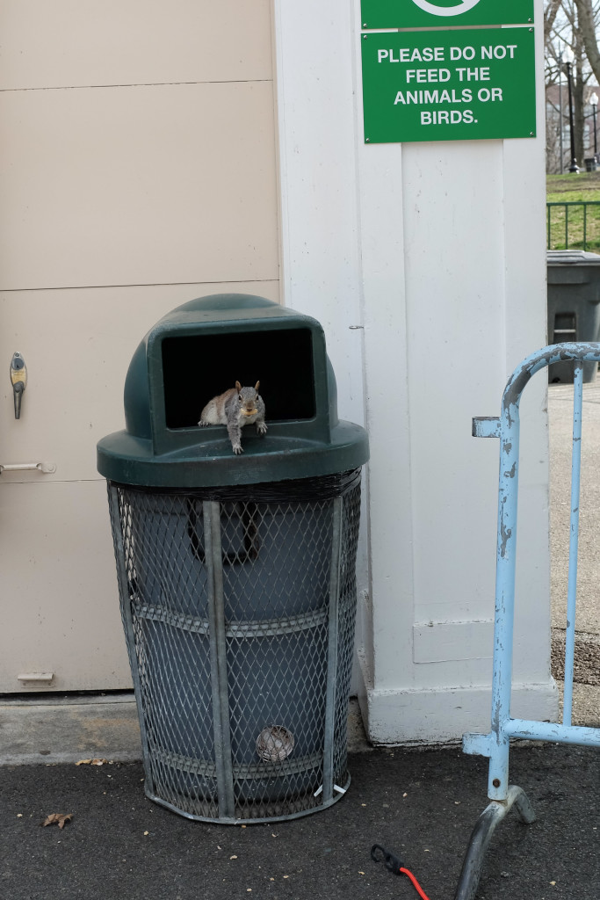 A squirrel's gotta do what a squirrel's gotta do (to eat)

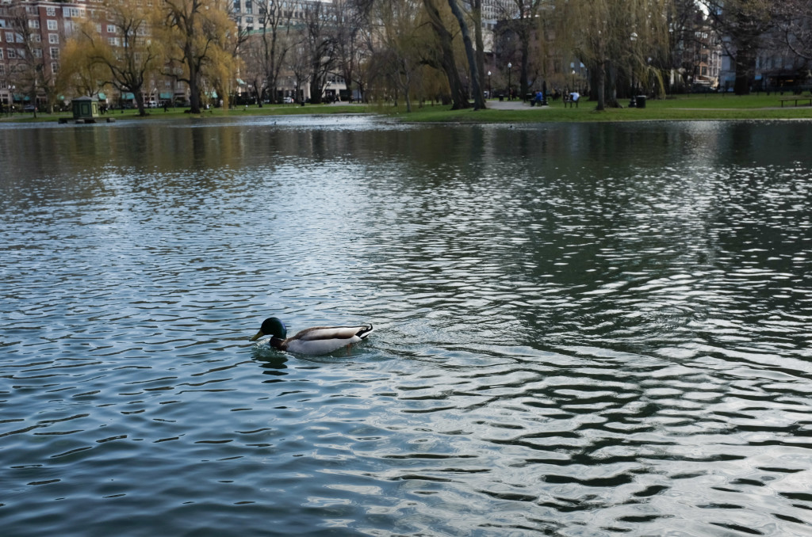 Swan Lake in Boston's Public Garden, established in 1873

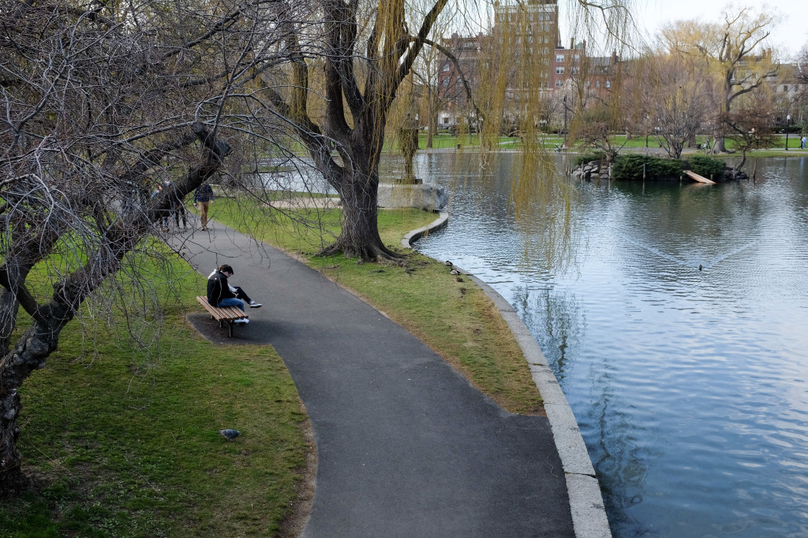 Contemplating in Boston Public Garden

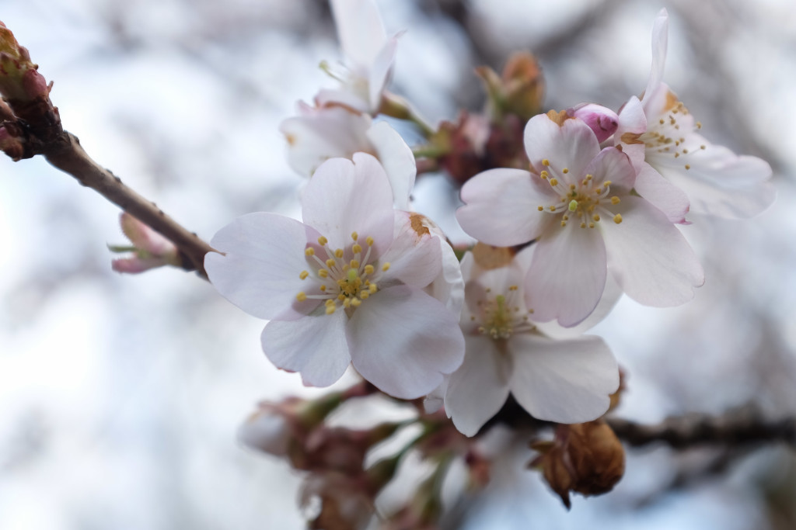 Signs of Spring in zero degree celsius

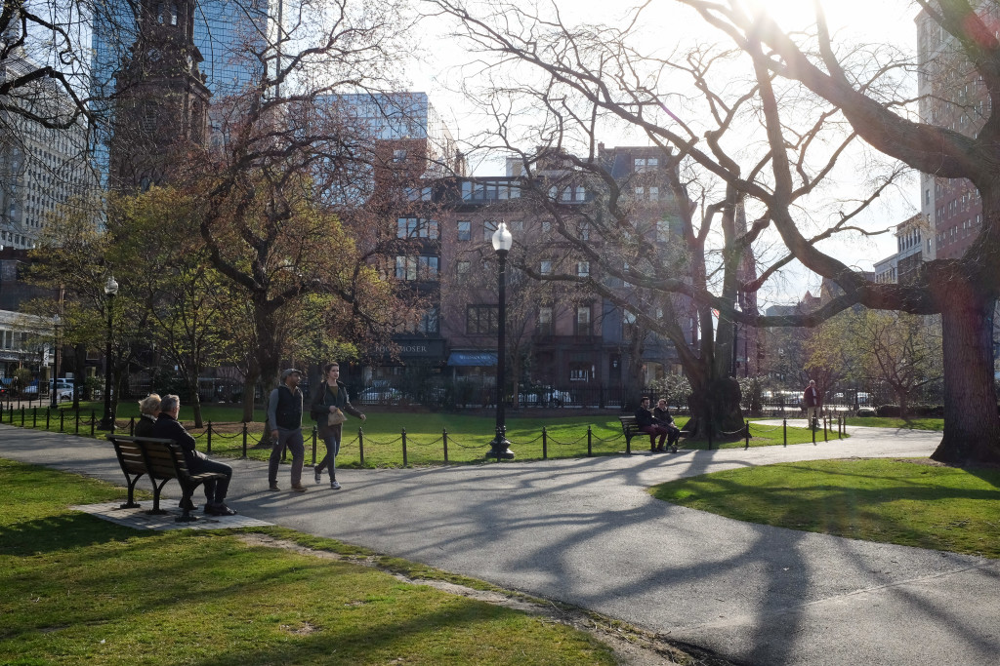 Boston Common, established in 1634 - that's 140 years before US independence!

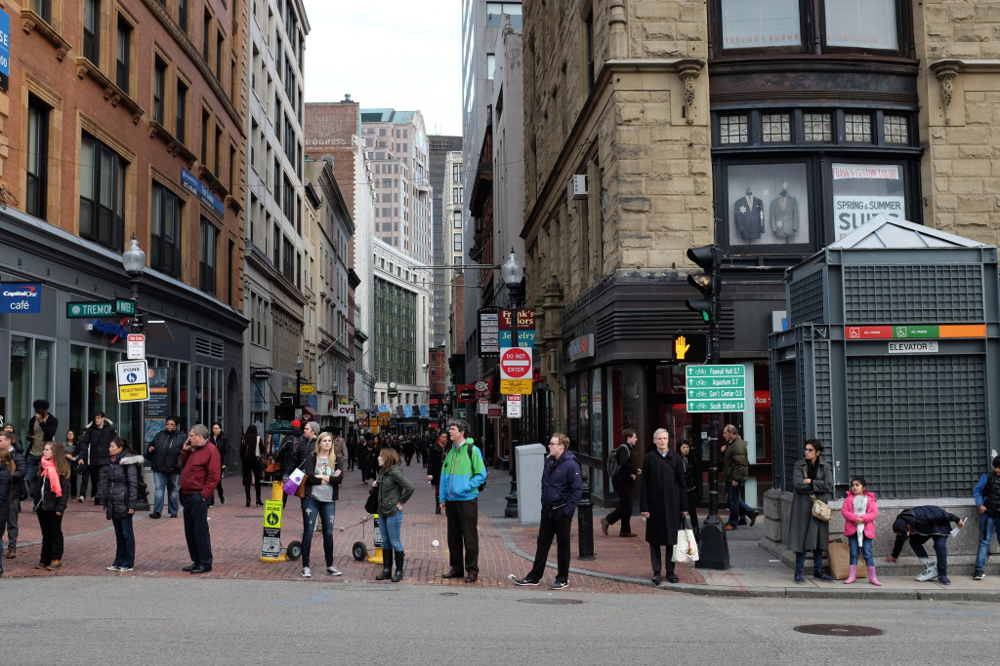 The happening Downtown Crossing in downtown Boston

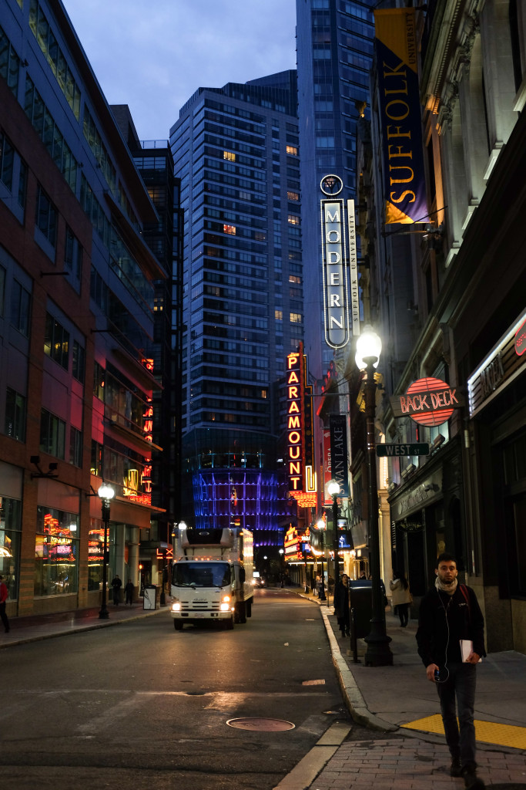 Near Chinatown - looks straight out of a romance movie scene

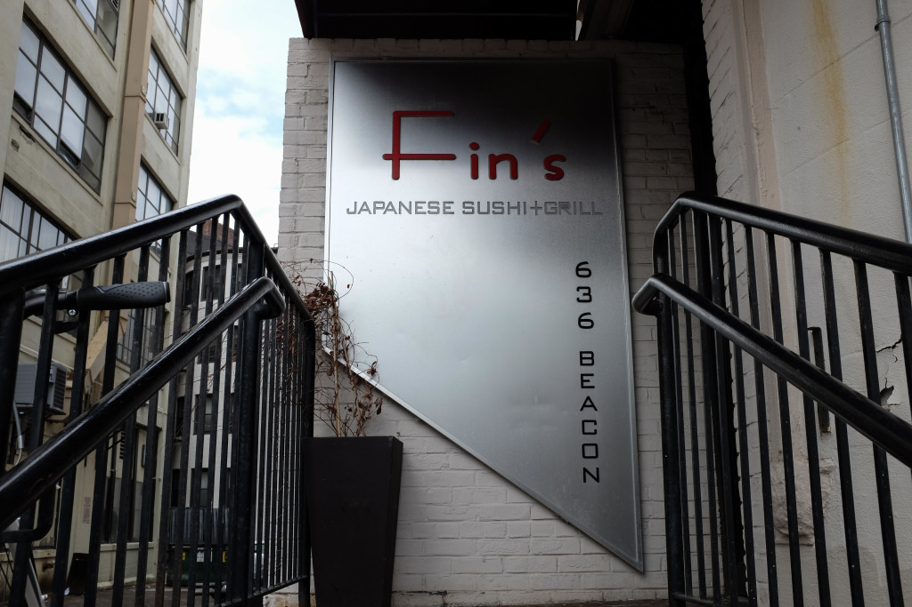

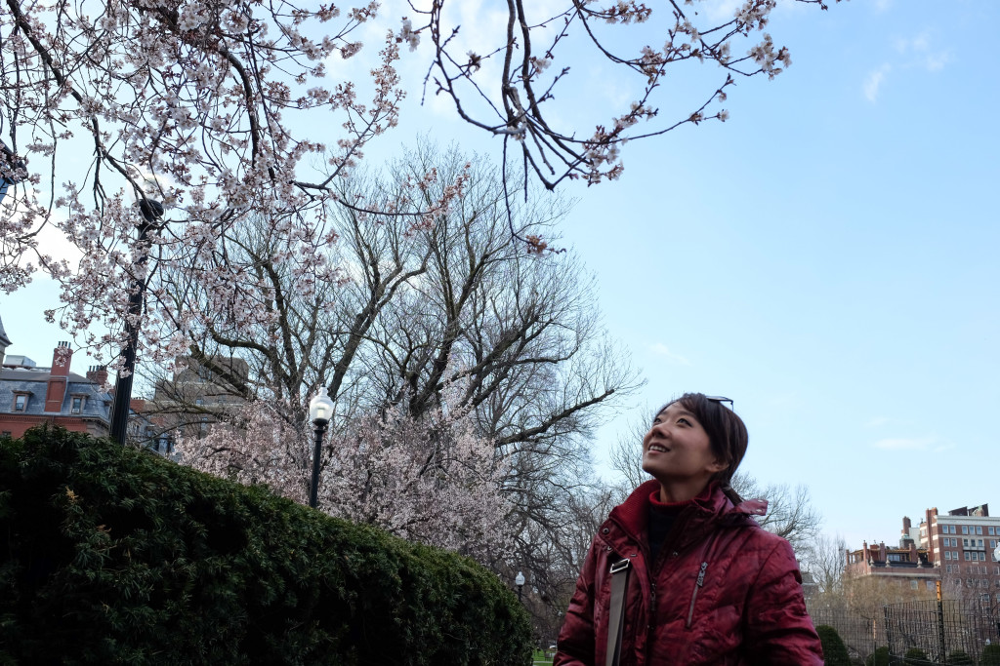

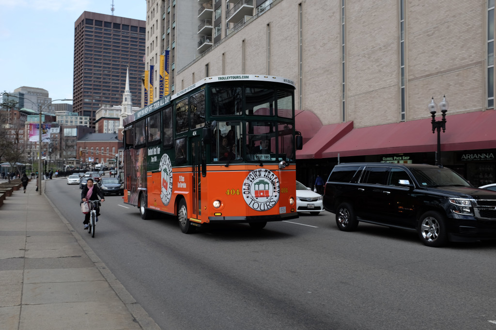
