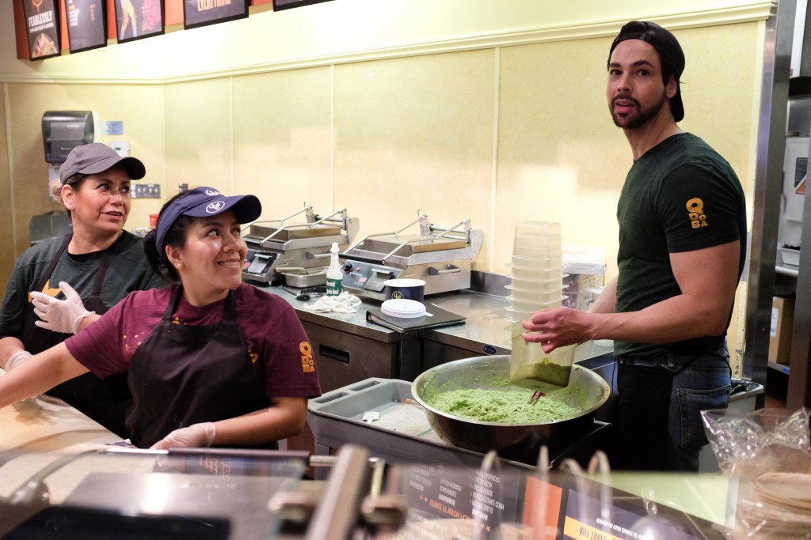
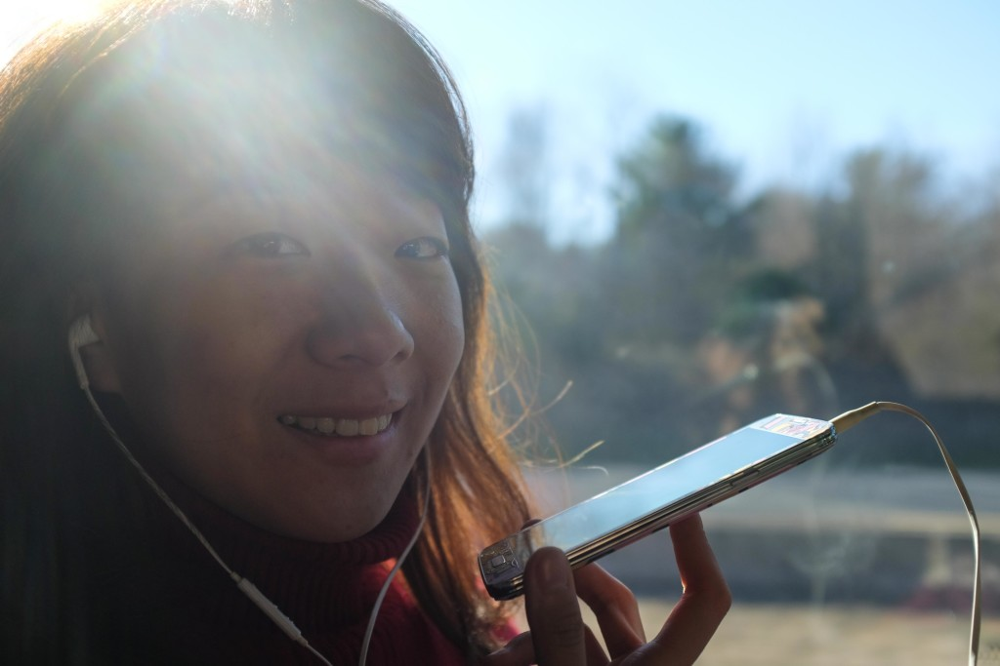
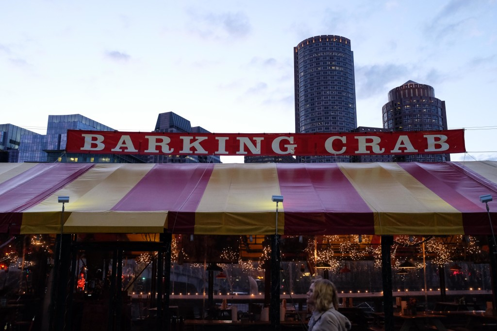
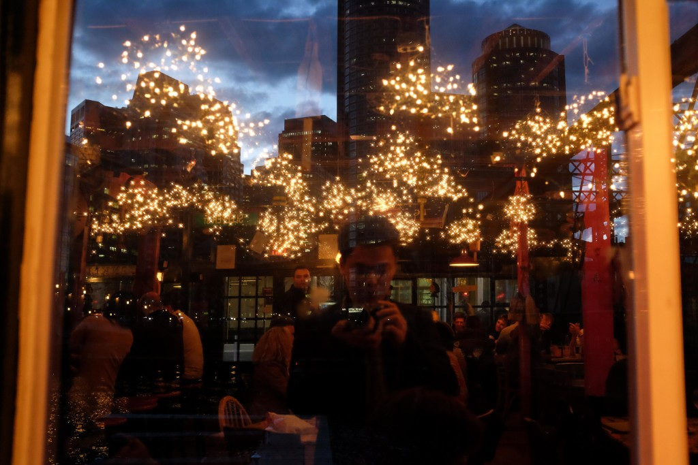
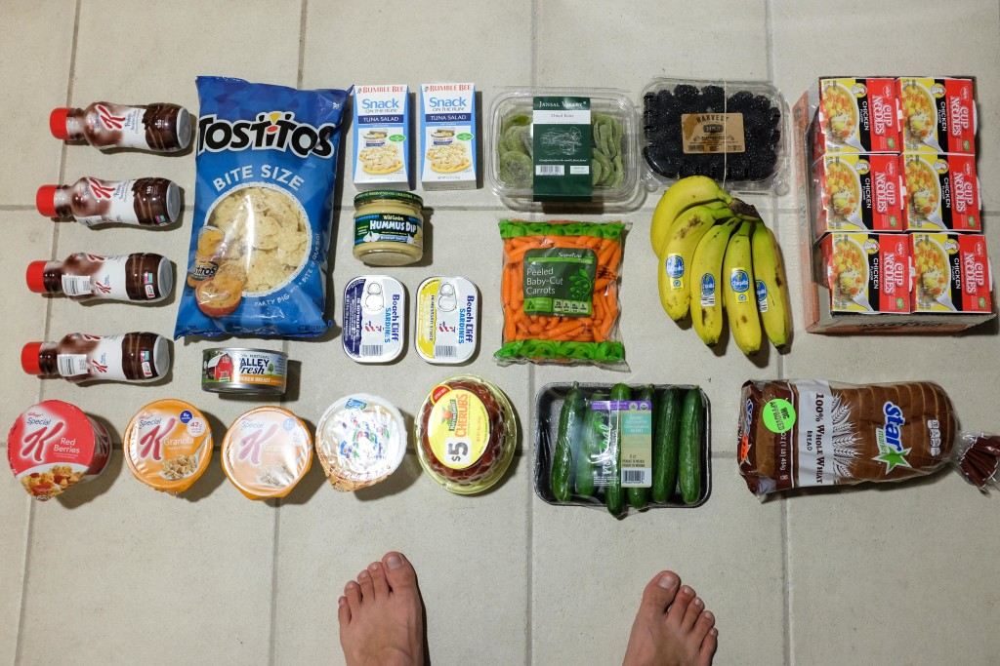

 (Guacamole) man of the hour at Qdoba Mexican restaurant in Boston

For today’s travelogue post I’m going to try something different from what I’ve done so far and write about one (maybe two) thoughts inspired by events on the road at some length instead of just recounting them.

As I write this we’re in the bus on the way back to New York from Boston. We leave Dai Nan behind, our good friend who’s put us up (and put up with us) for the past 3 nights in his graduate residence room. In a month’s time he’ll have to make a decision on leaving or staying in Boston. Everyone’s going to move at our age, it’s one big adventure.

A couple of interesting things I've learned about America these few days:

- “You all set?” means “Are you done with that? Can I clear the mess on your table?” It does _not_ mean “Do you want to order more food?” Think the wrong thing (like I did) and you’ll have someone clear your remaining delicious mess in front of your eyes.
- AT&T offers a no-obligation prepaid SIM card with 2GB data and unlimited talk for a month for $47. The surprising fine print? After the 2GB you still get data, just slower. We’re counting on it to power our road trip GPS!
- Wanderu is a bus service aggregator that works very well. I’ve gotten tickets to and from New York City and Boston and from NYC to Chicago (yes, we’re going by bus) at great prices. $30 from Boston to NYC. $16 from [NYC to Boston](https://www.wanderu.com/en/bus-tickets/us-ma/boston/us-ny/new-york/). <$200 from [NYC to Chicago](https://www.wanderu.com/en/bus-tickets/us-ma/boston/us-il/chicago/). All prices for 2 tickets! That’s affordable travel. Cool fact: Wanderu was advertising on public buses in Boston when we were there. I hope they stay in business! (EDIT: Someone from Wanderu actually wrote me after he'd read this post. If they keep this up I'm confident they'll still be in business the next time we come to the states!)

\* \* \*

 Enroute to Chicago via NY, there's Wi-fi on Bolt buses!

##### Shuffling From State to State (of Being)

It must have been close to 8pm when our food finally arrived. Today’s our last night in Boston and our host, who’s also our good friend from secondary school, thought it’d be a great idea to eat at the famous Barking Crabs restaurant as sort of a welcome-and-farewell dinner. I thought it a swell idea too but didn’t want him to pay, so we tussled back and forth for a while before finally deciding on who’s paying.

Between scanning the simple menu at Barking Crabs and deciding how many clam chowders to have, I realised that we were struggling to decide what to eat because some items on the menu were expensive. We’d look at an item and check the prices to see if it falls in our acceptable range before deciding whether to get it or move on to something more affordable.

We’re in a highly rated restaurant so there’s no worry at all that we’d be paying good money for bad food. It’s good money, good food in here, that much we were sure about. But we still had trouble ordering food, especially for Mei and I because our arrangement was that Dai Nan (our friend host) would pick up the bill for food and we’d pay for drinks. Seafood remains more expensive than hops even in Boston.

 Boston Barking Crab restaurant has amazing lobsters and seriously the perfect white beer

 Inside Barking Crab, overseeing the harbour and Boston skyline

At times I’d come dangerously close to getting a jolt down my spine when I catch the word ‘market’ in the corner of my eye. Market is short for ‘market price’, which could pretty much be substitution for ‘more expensive than you’d think to pay’. Those are the ones that truly scare the likes of me off. Market price? I’ll order it when I have money.

And that’s the thing I realised: we’re still young! This wouldn’t sound like a surprise to anyone except me, I guess, since we’re still only in our mid–20s, but it does surprise me because I’ve been feeling old lately. It’s become a thing for Mei and I to say to each other “Oh man, we’re old”, although I think we’re mostly joking.

Not only do I think we’re quite old (particularly when we saw the undergraduates during our tour of Harvard University and noticed just how youthful they are), I’ve been having a tougher time finding areas in my life that I feel young and inexperienced in, except in the arena of work. The daily routines in other aspects have settled into more or less a steady rhythm. Very few lines remain uncrossed.

Believe it or not, what I’m saying is that not being able to tell the waiter “I’ll have this lobster platter” without batting an eyelid makes me feel young. I feel great! And now I have a new state of being to look forward to, like I did two or three years earlier with adulthood. You’d know what I’m talking about if you’ve recently crossed over too - you know, when you notice that you’re being spoken to as an equal when talking to other adults.

What’s really important here for me is to remember that with time, we all cross these lines naturally. The way then to savour it is not with nonchalance but with awareness. So even if it might be inevitable (at the rate I’m going) to be able to occasionally walk into a seafood restaurant and order something expensive without worrying the bank will claim my collateral, it’s best to learn to feel the youthfulness while it lasts - even if it means having one less market-priced just-caught fresh lobster at dinners. I’ll just have the fish and chips, please.

##### New York to California in 4 Days

 We're ready for our hands-free part of the trip from NY to Emeryville, California!

In other news, we're on the way to Chicago now. We'll leave New York for Chicago in half an hour from now by bus (Megabus). It's an 18 hour journey. Once we're there, we have 5 hours before boarding the California Zephyr Amtrak train that stops in Emeryville, California. The plan is to take a connecting bus from Emeryville to San Francisco which takes half an hour, and we should be able to walk to the Youth Hostel and crash in our bed.

I'm looking forward to everything along the way.

\* \* \*

Currently reading _[On the Road](http://amzn.to/1NaNEAR)_ by Jack Kerouac. Recently watched [Automata](http://www.imdb.com/title/tt1971325/) (2014) by Gabe Ibáñez, [Begin Again](http://www.imdb.com/title/tt1980929/) (2013) by John Carney and [Ex Machina](http://www.imdb.com/title/tt0470752/) (2015) by Alex Garland.
