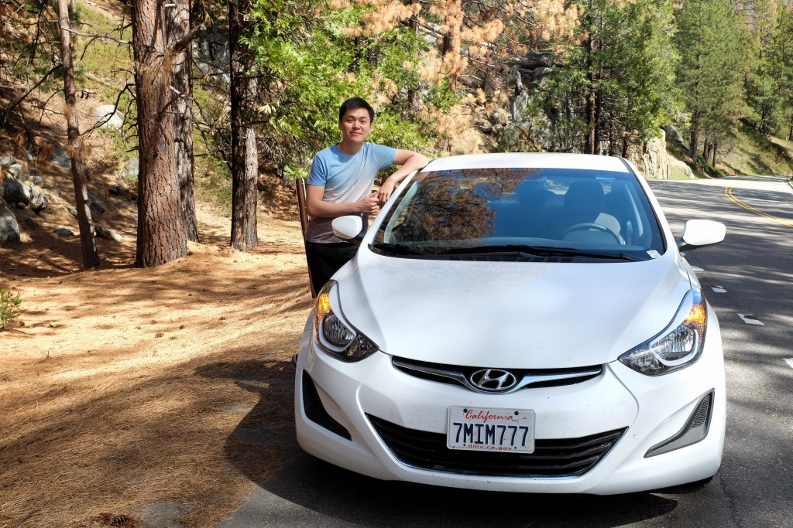
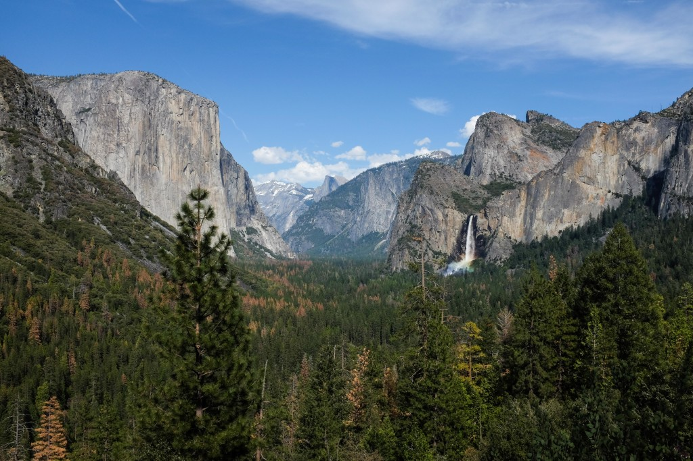
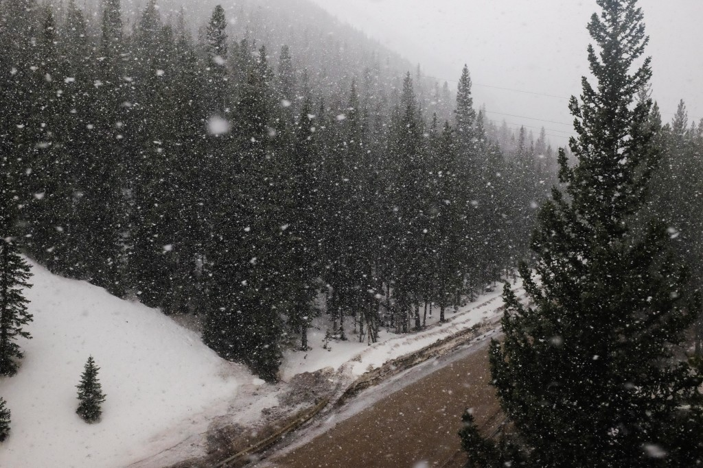
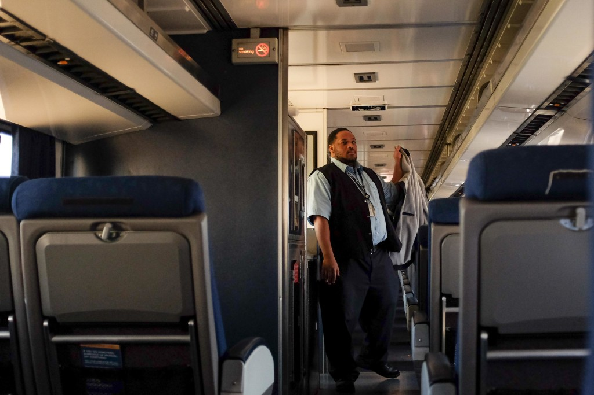
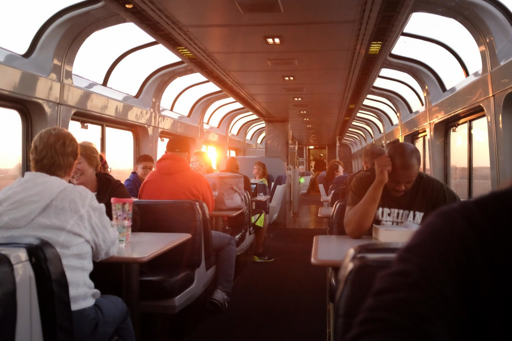

\[caption id="attachment\_330" align="aligncenter" width="840"\] Took a picture of this roadside wildflower with stunning colours\[/caption\]

Finally found the time to write my travelogue. I’m behind by three days now I think. I’ve been experiencing and seeing and thinking about so many things I hope I don’t miss too many out.

Throughout the trip I’ve been taking short notes on [Wunderlist](https://www.wunderlist.com/) on my smartphone. When an idea comes up, either something I’d like explore more as an essay or a potential business idea, I’ll summarise it in a short sentence on Wunderlist to review later. When I write a post I’ll typically cross out five or six of these. So far that list is the longest it’s been since we started.

We’re in Los Angeles now. In fact, we’re in a posh Hilton Hotel near the LAX airport (where we’ll fly home from), even though we’re not guests here. Our only business with the hotel is our Hertz car rental. Not all car rental locations will offer the same rental rates, and I found this one to be the easiest on the wallet, so here we are.

Prior to this we’d taken the [Bolt Bus](https://www.boltbus.com/) from San Francisco’s Transbay Terminal to LA’s Union Station for $30 for two. Then we paid $16 for two to get from Union Station to LAX airport, and took the free shuttle bus to Hilton Hotel. We got the VIP treatment because the driver was clueless we’re just renting a car that happens to be in the hotel lobby.

The driver did something worth mentioning though. He gave me the _tipper stare_. And it worked. When he had so dutifully insisted to offload our bags for us and pulled an eye-to-eye, I couldn’t not give the man a tip. This was despite the rehearsal I had in my head telling myself “These other people who are tippin’ him are rich, staying in Hilton and all. I’ll let _them_ tip. I’ll just pay with a smile.”

Alas, eye contact was too effective. Had I proceeded to take the bag without tipping, he’d feel embarrassed and I’d feel slightly guilty and I’d surely look bad. I don’t mind the last, but I hate the first two and will try to avoid them if it doesn’t cost me too much. So I tipped a dollar.

Once we were inside the luxury hotel, I wasted no time and headed straight to the Hertz desk to pick up my car. I was already an hour late. The car should be spick and span, ready to be driven from south to north and back.

But it wasn’t ready. “We don’t have a compact as you requested, sir. But we have a full-sized car, a Chevrolet 200, that you can use with no additional charge. Except for insurance. Instead of $11 per day, to use this car you’ll need to pay $17”, the manager told us in a seasoned way.

My face turned red in a mix of disappointment and frustration. I also felt like I was being unfairly treated.

“I don’t really care about a better car, but I care about having to pay extra $6 every day for something I don’t care about. I’m sorry to say this, but it’s not very fair to us”, I replied.

“I see what you mean. I think it’s a little unfair too. But the fact’s the fact. We don’t have a smaller car here.”

After explaining to him our previous experience with Hertz in the US being good (we’d gotten a free upgrade with no extra charge to a Chevrolet 200 convertible because of similar reasons), I think he finally realised that we weren’t soft boned first-timers in the car rental scene.

“Okay, I can call and check nearby Hertz outlets to see if they have a compact that they can transfer”, he conceded.

I tell this story because when it played back the first time in my head during our drive along the American highway, I realised how much I’d grown as a mature consumer.

Frequent travellers mature as consumers the earliest, I think, because being abroad puts you closer to your survival than cruising mode. That means you’re more alert to people who don’t care about you (since at the back of their minds they probably won’t ever see you again) and might be out to profit off you. Ultimately for me, travel has made me a much more savvy consumer and accelerated my growth in self-reliance in general. And what more are we but consumers most of the time throughout our short lives?

\[caption id="attachment\_329" align="aligncenter" width="840"\] Our $33/day Hertz Elantra car parked near Yosemite National Park's south entrance\[/caption\]

So we got ourselves a Hyundai Elantra in the end. Renting with car companies is always an interesting experience because you never know what car you’re going to get exactly. I can’t say I’m disappointed this time. This white Elantra looks like as though it just slid out of the factory floor; it’s clean inside and outside and has only been driven 18,000 miles. I happily hopped in with Mei and pulled out of the driveway of Hilton Hotel like a play-pretend rich guy in a Ferrari.

In minutes we were on the great American highway. Even though this is the second time we’re driving in the US, the distance of the Interstate highways still remain unfathomable to my Singaporean mind. In fact the vastness of the United States is something I find difficult to wrap my head around even till this day. I like that.

Enroute to Bakersfield from Los Angeles where we’ll spend the night the ‘Car Pool Only’ lane caught my eye. It’s actually quite hard to miss, since it’s the leftmost lane meaning it’s the fastest lane. Somehow I’d forgotten all about it, this wondrous piece of social engineering.

A car pool lane here is meant only for cars with two or more people in the car. So drivers who are alone cannot access the lane to skip traffic and drive comfortably at 80 mph (132 km/h). What a brilliant invention! By reserving an entire lane on the highway for cars with two or more people, the state government is nudging people to car pool. They’re effectively saying “Hey, if you wanna get around faster, you can do it on this lane. We’ve reserved it just for you. All you need to do is bring a passenger or be one with your friend!”

I’m not sure of the numbers but I’m quite confident this has an impact on the number of car owners in the state of California. It boils down to two options:

- Buy a car to use on your own (ie. single driver) most of the time -> drive in congestion-prone traffic
- Buy a car only if I know my partner or someone from my family will ride with me most of the time -> drive more or less congestion-free

Since heavy traffic is the biggest pain in the anus for drivers, especially for those like me, I think this is a strong incentive. The sight of an empty express lane on a congested highway gets people thinking. It got _me_ thinking for sure. I hope the Singapore government will seriously consider implementing this on our expressways eventually…

On the topic of driving still is another interesting fact: non-US drivers who drive on the opposite side at home can rent cars without here without paying any extra for insurance. Isn’t that odd?

With many firsthand experiences driving on the opposite side from what I’m used to, I can attest to the potential risks involved. It’s confusing. Throw in the differences in traffic rules—like San Francisco’s four-way junction no-rolling-stop rule—and car insurers should have a quandary in their hands. Strange as it seems though, they don’t. I’m not complaining though, since I’m not asked to pay more and besides, I’ve always sold myself as quite adept when it comes to driving.

\* \* \*

Sometimes I think I digress way too much with these travelogue entries. Should stick to more documenting the journey and less philosophising on ideas as they come along. I think I’ll make use of the latter as fodder in future posts.

\* \* \*

_9:02pm, Tuesday 19 April 2016 in Y__osemite Sierra Inn_

First of all, I have to remark that this post is turning out to be a mega post. I’ve been slowed down by my sore throat and threatening body aches in the past two days and haven’t found the energy to write. But I conceit that’s just an excuse. Moving on.

We left Bakersfield today, which is a 3-hour drive away from Yosemite National Park’s south entrance. I pulled us over at a town just 10 minutes from the entrance called Oakhurst. We had a filling meal at Burger King for under $10 accompanied by two of their six or seven types of packet sauces. I think there’s only three in Singapore: chilli, ketchup and ranch. I have no difficulty imagining an American adult dipping everything in everything though.

We planned to do a 3-hour hike today in Mariposa Grove surrounded by giant redwood trees (also known as giant sequoias) but it seems we were out of luck - the National Park Service has shut it down for restoration work till 2017.

But saying we were unlucky wouldn’t be true. By some remarkable means, we’d visited Yosemite at just the right time. From 16 to 24 April 2016, entry to all national parks around the country is free! We saved $30 for a 7-day pass right there for being lucky.

National Parks Week is wonderful annual affair that encourages people to step into the closest thing to the wilderness. I love that they have an initiative like this. Collecting substantial fees that go into the preservation of the vast (and I mean gargantuan) national parks throughout the US for 358 days is enough. Seven days of free admission might just be the most democratic thing I’ve witnessed so far.

Driving through the windy and up-and-down single-lane roads in the ‘park’ is really enjoyable. It’s fun to go with the flow of the road which itself follows the mountain contours, and magical to be surrounded by untainted trees and herculean granite mountains. I absolutely loved driving in Yosemite.

Getting out and sitting on a huge slab of granite that must have fallen from the face of the mountains is also an experience not to be missed. Photos don’t do justice to the majesty of a place like Yosemite, but we try anyways. It’s just too beautiful to be left unrecorded. In these situations, a photo serves merely the function of eliciting the shape and form of memories; it’s dull and mostly unremarkable until you fill it in with your unique memories that colour and give it depth.

\[caption id="attachment\_327" align="alignnone" width="840"\] Spectacular rainbow mishmeshed with the waterfall at Tunnel View, Yosemite\[/caption\]

As I wound along the road of the Yosemite, I eventually caught up with the car in front. On the way in there were take-over lanes that periodically came up, but on the way down there were no such thing. And this car was going _so_ slowly I almost fell asleep tailing him.

While I drove, displeased, behind the car in front, I realised that I was being silly. I knew I hated driving behind someone who drove slower than they should, especially when the road is supposed to be fun to drive on, yet I continued to tail this stranger with poor driving skills. In my mind I had the perfect solution to this problem: pullover to the side when the chance presents itself and wait half a minute before carrying on. That should put some distance between us and I’d redeem my joy ride.

But while the plan sounded perfectly logical and I knew it was going to work (at least I won’t be stuck behind _that_ car), I didn’t put it to action until a lot later. Strange!

I think this happens in other areas of my life too. I’d think of a great way to solve a perplexing problem like how to get away from a social situation I disliked and I’d hesitate to make it happen and break free. In moments like these a hundred alternate reasons spring up that try to convince me not to do what ought to be done. My stupid human mind.

Merging back into the lane half a minute later, I regained every bit of enjoyment driving through Yosemite.

**A Note About the Camera I’m Using**

Days prior to this trip Mei and I decided it’d be a good idea to invest in another camera. My previous camera purchase was more than five years ago and is a DSLR. I brought that with us on our previous trip to the US in 2012 but found it cumbersome. Travelling abroad already comes with many things to worry about. I shouldn’t have to stress over whether to bring the camera with us on walks everyday.

After some research—okay, too much research—I decided to get the camera we’ve been using for this trip - the Fujifilm X100S (here's a link to the [X100T](http://amzn.to/1TilzXE), the latest generation of the camera). I bought it second-hand from a Filipino guy for SGD $750 (original price over $1,100), and I really like it.

It’s very light compared to an entry-level DSLR. It’s also much smaller, about half the footprint. Despite its size, it packs a punch. Controls are very easy once you get used to them. Since I used a Canon 550D before using this, it was a breeze learning to set the shutter speed, ISO and aperture on the Fujifilm.

Without sounding like a reviewer I’m just going to say one last thing about the camera. It’s impeccably designed to encourage use. So light, small and fun to use. Neither of us regret investing in this camera.

##### Some Photos From the Journey

\[caption id="attachment\_332" align="aligncenter" width="840"\] Snow! Ok, it felt more like a blizzard; luckily we were in the comfort of the California Zephyr train\[/caption\]

\[caption id="attachment\_331" align="aligncenter" width="840"\] Member of the Amtrak staff who I saw throughout the two-day cross country ride\[/caption\]

\[caption id="attachment\_333" align="aligncenter" width="840"\] The splendid Observation Deck onboard the California Zephyr where all the socialising happens\[/caption\]
