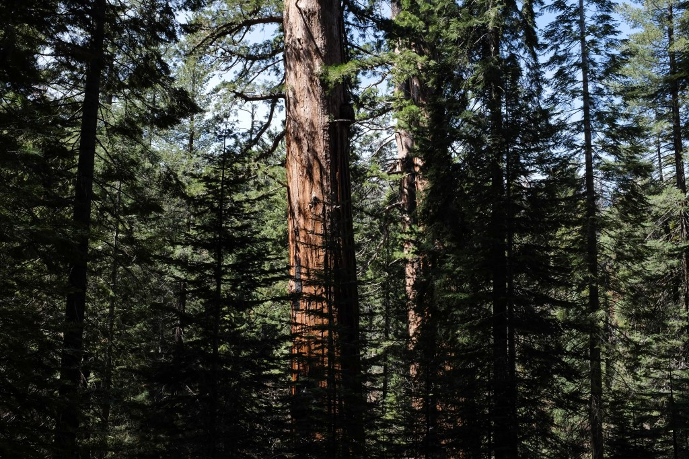
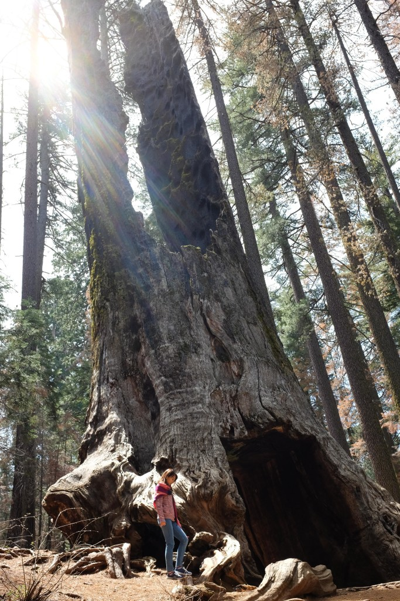
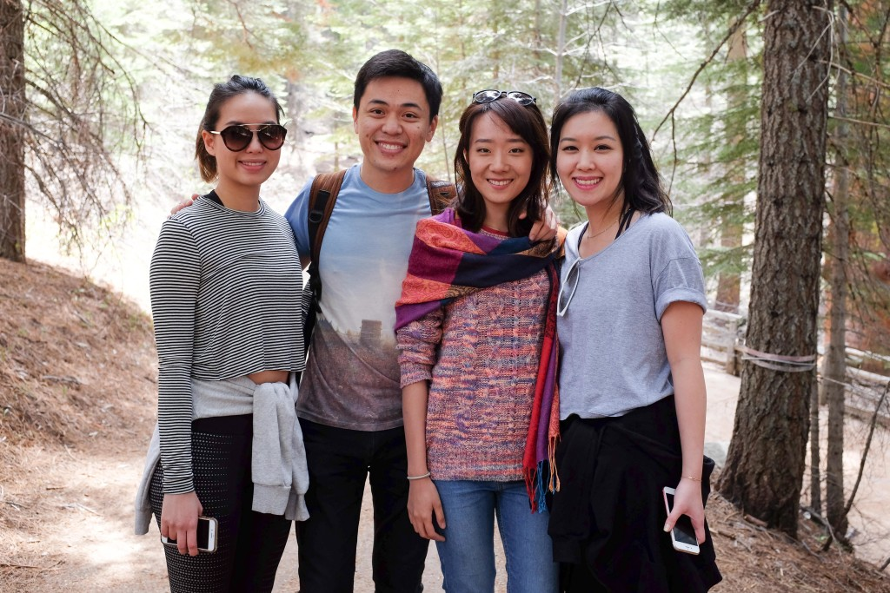
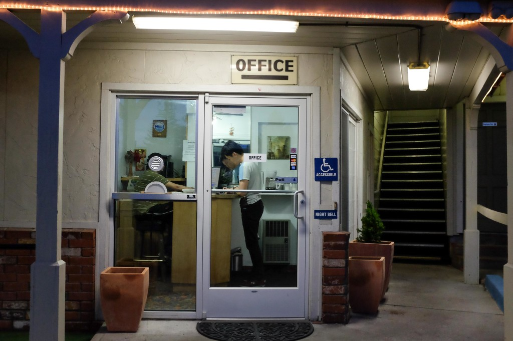
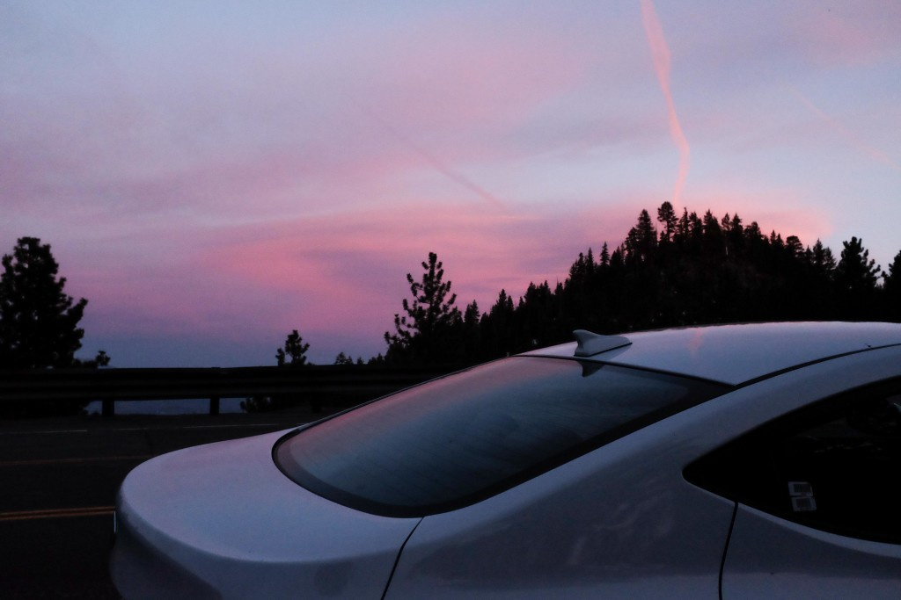

**_8:32am, 20 April 2016 in Travel Inn, South Lake Tahoe, California_**

We left Oakhurst for good early this morning. To be honest, I'm glad to be leaving that overpriced accommodation behind. Yesterday I made a mistake in the booking dates and booked our hotel just outside Yosemite National Park for 21st instead of the 20th. It was a pricey mistake - we paid an extra USD $25 for that night's stay. Silly me be gone!

For about a decade I'd heard about giant redwood trees that stand in California. The photos I remember most of these ancient trees are those with a man with climbing gear on hanging on a rope and smiling to the camera, him looking like a tiny bug scaling the wide red bark of the redwood tree.

Today I finally saw it. I think we drove about 2 hours from the south entrance of Yosemite before arriving at the quiet Tuolumne Grove, home to about 20 giant sequoias. I counted about 15 standing and 2 fallen trees. They are astounding. Tall and broad beyond words.

 Some brothers augered the tunnel in the 1870s to attract tourists - so here we are!

I hate to have to put it this way, but the two fallen giants actually helped me understand their hugeness. Standing beside a fallen giant sequoia, I come up to less than half its radius! I didn't lie on the floor and do back flips so I don't know how many me's it takes to run the full height, but it's safe to say that it's extremely tall. It might have been over 10 storeys.

Awestruck, we started our return hike from the Tuolumne Grove. Before we even started the ascent, though, one of the most astonishing things that ever happened to me happened. I saw my junior college friends, Wan Pin and Ariel.

I stood there, feeling my eyes spring open and my jaw falling, when Wan Pin saw me and yelled, "NICK!"

It's one of the most surreal experiences in my life so far. The world is kind of big, you know? To bump into someone you know well in a foreign land (none of us were living in the US) and in such an obscure part of one of a few hundred national parks in the US is an unthinkable coincidence. I never imagined this would be possible. It's probably the same for them, I think. We skipped the imagination and headed straight for the implausible reality - we met in a small forest in a big forest in an enormous country tens of thousands of miles away from home.

 Unfathomable awesomeness

I'll leave it to you to imagine how it feels.

Leaving that behind took a while but I eventually came around and shook off the adrenaline, and we started our way north. Yellowstone National Park is our next stop but that's over 900 miles away, a distance we can't cover today and especially not by driving on the dark American highways. At night the highways are not lit and it can be extremely dangerous to drive unless you are practised in driving those roads. So we decided to push as far north as possible, and covered quite a lot of ground and arrived in the small town of Minden, Nevada.

 Checking into Travel Inn at South Lake Tahoe, California

## How to Get Cheap Accommodations Without Prior Booking

We didn't have any reservations for lodging, so I pulled over at one of the large open-air carparks that are so commonplace throughout the states and took to Google.

Tonight's lodging arrangement was deliberate. Mei and I meant it to be an experiment. We wanted to know the best way to save money on accommodation and we thought it made sense that some hotels and inns would cut their nightly price as night time drew closer, since making some money is better than making none from vacant rooms.

For today, our hypothesis was right and the experiment paid off. We paid a grand total of USD $32.70 for the room that I'm writing this in. It's very comfortable and has all the amenities that a normal traveller would need but because we booked it last minute, we snapped a great deal. The Indian guy at the front desk who I think owns and runs the inn told me that it's off-season, so that must have had an impact too. $32.70 for a night's stay in South Lake Tahoe surrounded by mountains, with a long stretch of cafes and restaurants within walking distance from us - it's budget travel perfection.

It was dark by the time we got here, but I'm looking forward to seeing the lake under the early morning sun tomorrow!

 Taking a moment to stretch our legs and absorb the sublime sunset

## People Moving Around

We've so far eaten at about six Chinese restaurants and Mei and I take turns to ask each other "Why?" Why did these people migrate to X part of the US, especially if they are far flung places like the passing towns hundreds of miles away from major cities?

I haven't gotten a suitable answer to that. I'm not sure how they'd react if I asked. What if they regret their decision and me bringing it up is like pushing my thumb into an open wound? But I'm still curious. That means I'll probably ask soon before our trip ends in 13 days.

Near the Chinese restaurant where we had linner (dinner and late lunch…?) today was a petrol station, so I drove over to refill the tank of my rented Hyundai Elantra.

South Lake Tahoe was recommended to us by the lady behind the counter. She looked like she was slightly over 40. Over a short chat I found out that she used to live in San Francisco where they have "real Chinese food" compared to here, and that she used to work in a startup that at some point filed for bankruptcy after owing money to multiple foreign investment firms. Suddenly she was out of a job and because she had a house out here (in the middle of nowhere), she packed up and relocated.

A woman over 40 years old, a failed startup and a house in the middle of nowhere. I wonder how many times something similar to this has played out for people all around the world…
