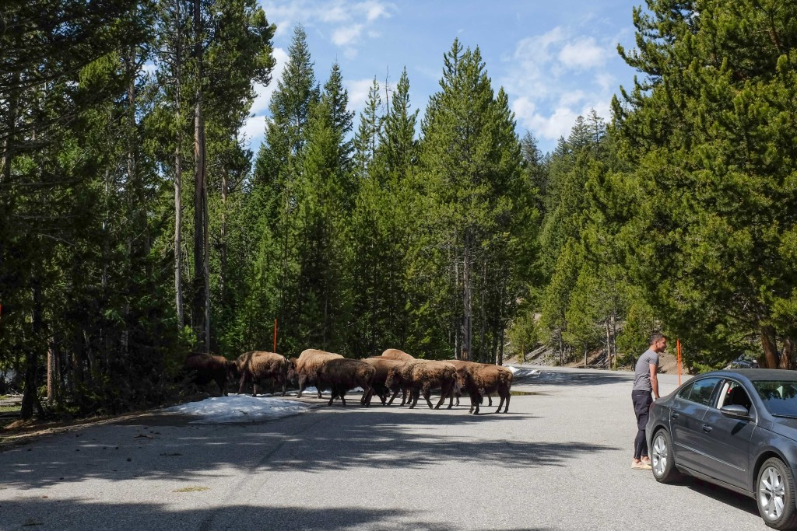
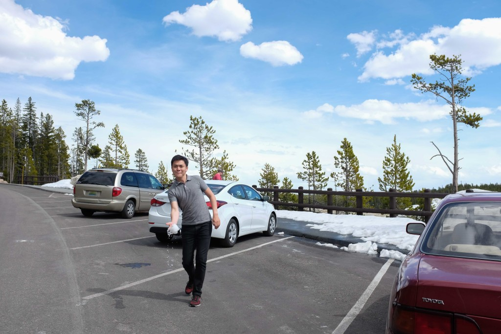
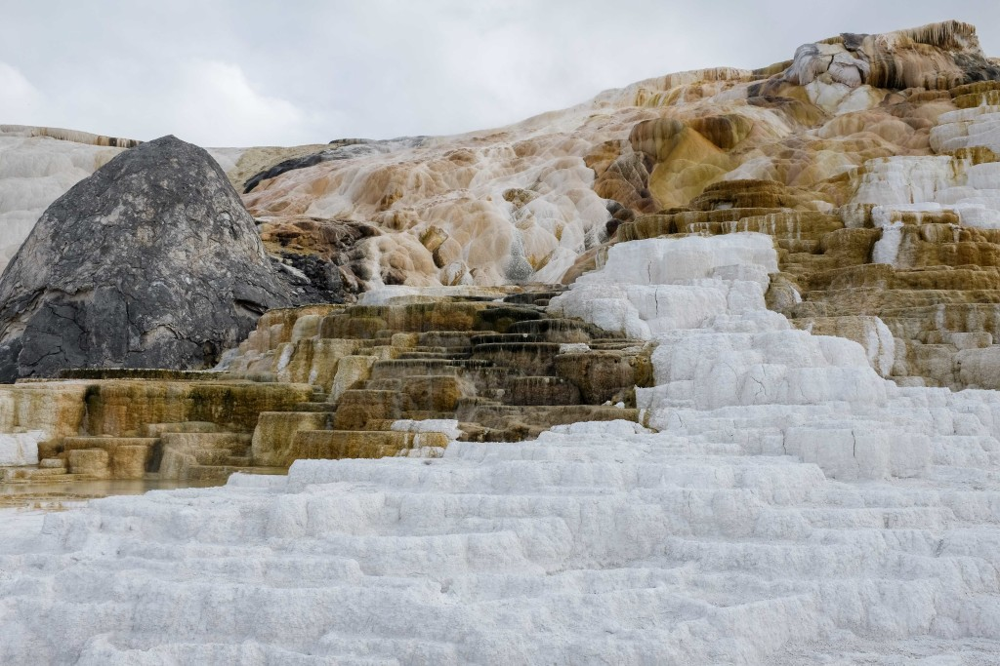

 Bisons sharing the road with us

**_9:10pm, 22 April 2016 in Stage Coach Inn, West Yellowstone, Montana_**

_Hooold on, hold on to me. Because I’m a little unsteeeady-ey, a little unsteeeady-ey-ey_. (_Unsteady_ by X Ambassadors)

Part of the magic of a road trip, I’ve come to think, is radio. Over the past few days we’ve been driving across the states of California, Nevada, Idaho, Montana and Wyoming, and music’s been there every mile of the way.

At first I didn’t know about satellite radio. We hopped channels as we rolled by towns and their dedicated broadcasts faded into unreached territory. Having to change stations every ten minutes (or listen exclusively to signal noise) was a pain the ass and not very enjoyable. Satellite radio on the other hand is amazing. [SiriusXM](http://www.siriusxm.com/) is good stuff, perfect for big countries.

We spent the entire day today more or less on the road. For the first two hours we drove north, stopped by a small town for clam chowder and hot pockets, and entered Yellowstone country. We must have drove around for six hours with multiple hop-ons and -offs. Anything from bisons to birds to steam rising from the ground (hot springs and geysers) got us out of the car.

For a nature lover, I’m surprised that I didn’t fall from a head-swooning experience driving through America’s oldest national park. It was okay. Wild animals roaming freely from horizon to horizon including the road was novel and quite fascinating, of course, but it wasn’t a teary-eyed experience for me. I think Mei enjoyed it more than I did today though, and that made it worthwhile.

Tomorrow we’ll carry on exploring [Yellowstone Park](https://www.nps.gov/yell/index.htm) by car and maybe hike a bit. Entry remains free for the week since it’s [National Parks Week](https://www.nps.gov/findapark/national-park-week.htm) and the National Park Service’s centennial celebrations. I wonder how many people went to both Yosemite and Yellowstone in the week like we did. Going now would save upwards of USD $50 so I’m confident we’re not the only ones…

 Trying to sneak a snowball attack on Mei

 One of the surreal landscapes in Mammoth Hot Springs, Yellowstone
