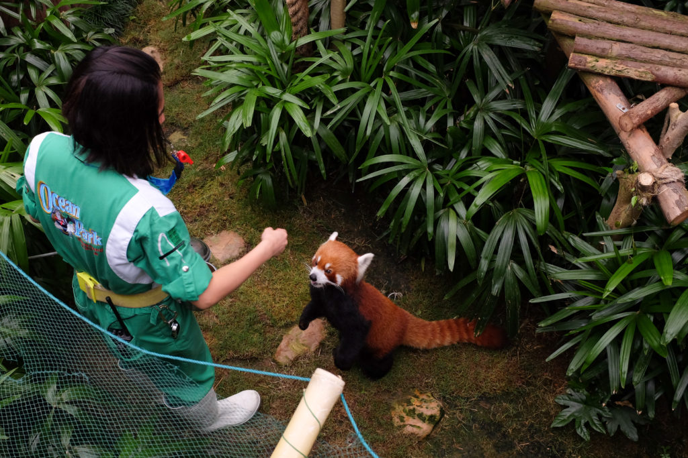
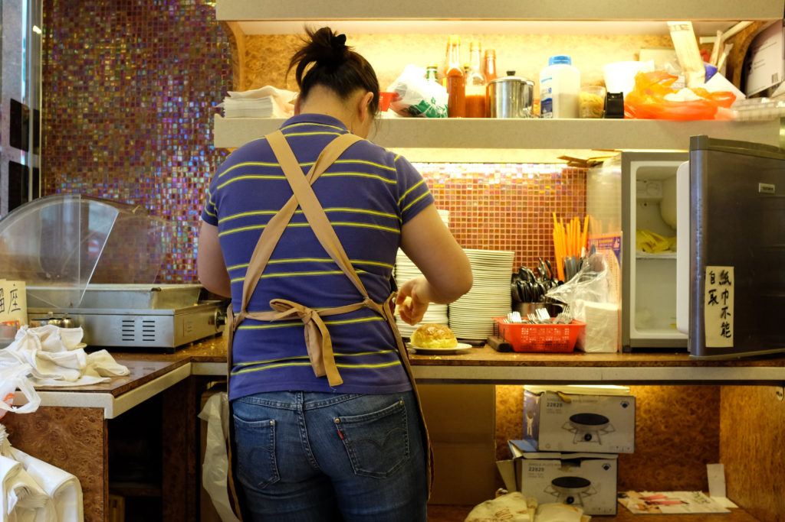
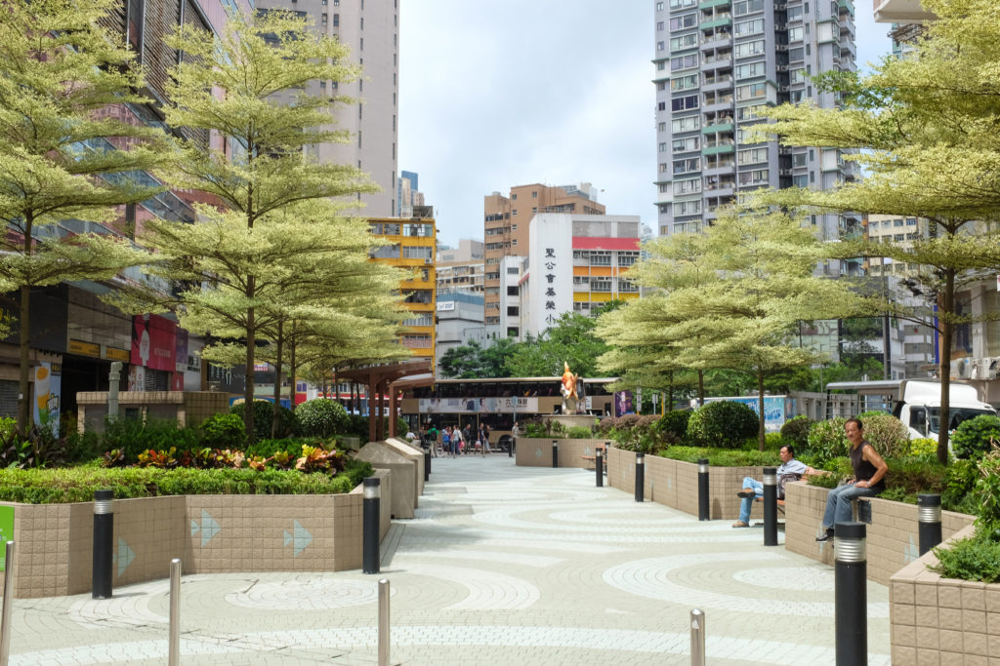
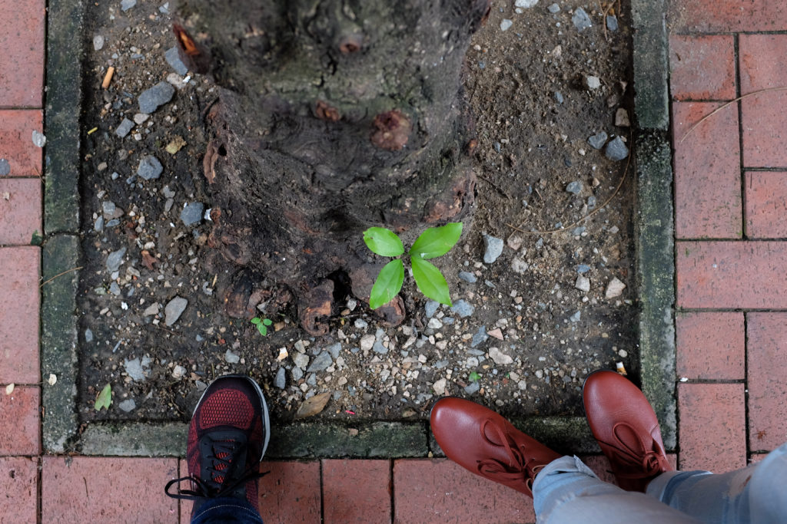

My 4 year old niece doesn’t even know to position her mouth above the bowl she’s eating from, and the fact that I needed to be reminded of this shows my age. I might not be 40, but at 26, the effects of ageing have become sensible and it takes a greater conscious effort to remember what it’s like to be very young.

As we grow older, our repository of been-there-done-that experiences, sometimes every-single-day, grows with us. Before long the day to day starts to feel less interesting because, well, most of the things we would be doing are things we would have already done before many times. Eating at a street side stall, ordering coffee at Starbucks, searching for a public toilet and the sensation of relief, how to respond to strangers who don’t understand the concept of personal space… so on. The list is long and growing.

There is, of course, a silver lining. We become less perturbed by the ebb and flow of life by growing increasingly familiar with its rhythm. That means technically having more cognitive resources for doing other work. Creative work, programming, making things, organising events, so on. In short, adults are well-equipped to do original work.

So while kids have good days made out for them, adults are better at making good days. We just have to remember that. Instead of being bogged down by over planning and worrying about every thing big or small all the time. As with other things, learning to use that adult edge is an acquired skill.

     
