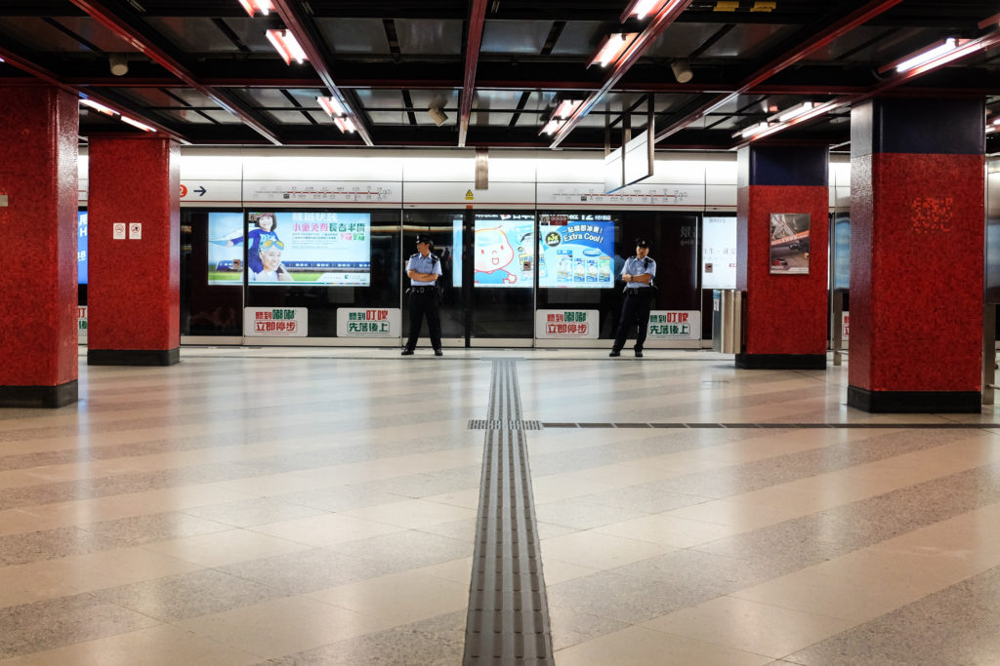

For the first time in my life I’m yearning to go home early from a vacation. The only time this has happened was when I was 12 and stuck in the never-ending Women’s Street in Hong Kong with my mother and sister. I guess I could blame it on women, or Hong Kong.

But really, who does that? Who finds time to go on a vacation and then rushes home before its supposed to end?

What we’ve been doing in Hong Kong is walking and shopping and eating, which to most people (or at least any Singaporean) would be a fantastic holiday. Not to me though. Not this time, at least. It’s as boring as doing laundry. Washing the dishes is more interesting than walking in gigantic shopping malls with the same old big name brands. Eating in dim sum restaurants is nice, but this doesn’t feel like the time for it in my life right now.

Shopping isn’t what drove me borderline crazy today (though it had a part in it, especially during the hour that I stood at some corner in a shopping mall waiting for the family to finish their shopping). It’s the fact that I could have been spending this time working. I could be coding a website or deepening my understanding of programming or writing an essay. I wanna go home so I can work!

Maybe a few years from now this sort of thinking would appear to be a fallacy, but my drive to do more work is strong now and that is all I want to do right now. Write programmes, make electronics, write, create a business. Playing the guitar and street photography might also have a place in the list.

What is certain to me is that travelling to a familiar place has no place in my timeline right now. Travelling to a new place is different because that’s exploring, not relaxing and unwinding. There’s nothing to unwind. I’m not wound up.

Put me beside an average older person who has worked for 30 years and we will look like two different animals. I know deep down that that day will come for me too, as it does for every human being. In the end, we all realise that the only real currency we have isn’t wealth or even legacy, but time.

I know that, but I want to do good work and be useful to other people while I still have the drive and energy in me. I wanna go home!
