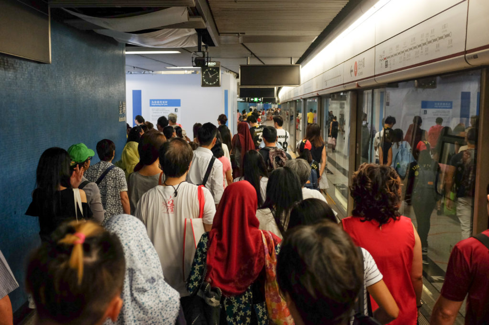

A lot of problems are bubbling as I try to find a way to make money while deriving meaning out of the job. If I saw them as separate pursuits I would well have a clearer head.

In order to banish the dizzying and often headache-inducing uncertainty, I should just get a job like everyone else. That would neatly split the problem into two halves and make them easier to wrap my head around and tackle.

But to obtain clarity of career this way comes at a cost. If I start seeing meaningful work to be something outside of making money, I would have only half the time left to do meaningful work! In reality it would probably be even less than half.

So the pursuit carries on, down the same path. Along with millions of millennials and those after us, I continue my search for a meaningful career that pays enough to live a comfortable, un-extravagant life.

# **Coffee quality affects mind quality**

On a lighter note, I realised today something important about coffee. I drink coffee once every day. It destabilises my biochemistry, but that is a cost I’m willing to pay because the hour after a cup is always the most creative and productive of the day. Besides, it’s the richest beverage that exists other than Canadian ice wine!

The revelation is this: the quality of beans correlates with the quality of my post-drink high. At N1 cafe in Hong Kong earlier today I had the best iced Americano (black coffee) I’ve had in months! When we walked out of that cafe I felt renewed. My mind was alive and sharp. The difference between today’s caffeine high and that ushered from the 3-in-1 coffee I’ve been having at home is so palpable I swear I could have pinpointed exactly the part of my brain that was experiencing a neural thunderstorm.

In other words, $5 coffees made from arabica beans roasted and served by hipster cafes can at times be a worthy investment. I’m going to re-start making espresso based coffee at home when I get home. I just have to figure out how to calibrate my grinder without wasting 20 percent of every bag of beans.
