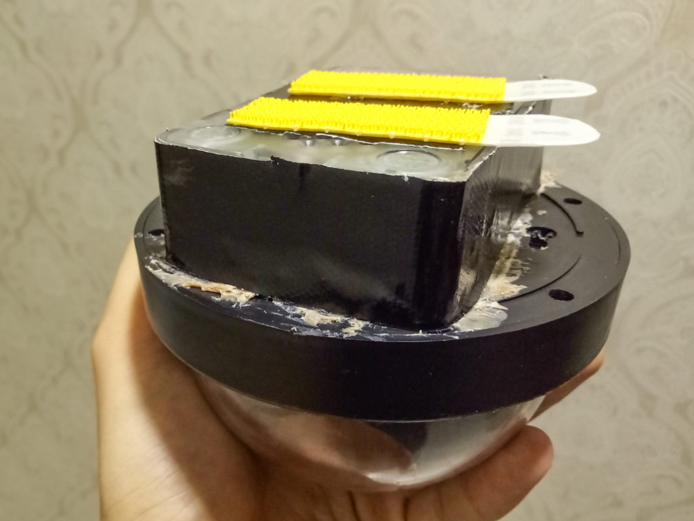

Recently we realised the need to protect ourselves with a surveillance camera in case of one of our Airbnb guests decides to be an idiot and doodle all over the walls, or something worse. So I did what I thought was the perfect thing to do: make one myself.

It took me a couple of days to make it work. There was plenty to figure out from the get-go since I had practically no experience in creating electronic products that actually worked.

I started by listing the features I needed to have, like the ability to selectively capture footage whenever a person’s movement is detected and upload the footage to Dropbox or some other online repository. I wrote these in the acclaimed ‘user story’ format:

> As a homeowner, I want to have security footage of my living room, so that I am able to furnish evidence in cases of bad guest behaviour.

Something like that. Wrote a few of those.

Moving along, I searched for the medium I was to use. Would it be a Raspberry Pi single-board computer? Would an Arduino microcontroller do? Can I use a webcam or do I need to buy a special camera to work with it?

I decided on the Raspberry Pi in the end, and successfully programmed it to work as a surveillance camera. That journey is chronicled in detail [here](https://medium.com/getting-technical).

While the Pi has been a great surveillance camera, operating as it was intended as a surveillance camera, a small problem has surfaced and in fact, has been recurring. It keeps falling from the ceiling!

This has nothing to do with anyone else but me, since I was the one who installed the camera in the ceiling at the corner of our living room. Since it went up, it has fallen from its vantage point on 5 occasions. If this were to be a finished product used in a customer’s home, my business would also be finished.

 Raspberry Pi on top, 'fake' CCTV shell below

The camera is a two-part contraption consisting of the Raspberry Pi in an enclosure and an empty CCTV shell precariously taped together. It has fallen once every week or so, and each time I do a post-mortem to identify the point of weakness. It falls, I inspect, remedy, and re-instate it.

At first it was the sticky part of the 3M velcro that I used to hold the contraption onto the ceiling - it wasn’t sticky enough. So I used a set that is rated for more weight. That solved the sticking problem.

Then, for the second, third and fourth times, the weakness was in the interface between the Pi enclosure and the fake CCTV shell’s bottom plate. First it was transparent scotch tape, then masking tape, then duct tape. All of them eventually peeled off under the weight of the hollow plastic shell of the camera enclosure.

This time, today, I reinstated the camera after I applying some Selley’s Liquid Nails to the two parts to bind them permanently together. Screw modularity and reusable-ness! I really want it to work this time. Besides, gluing the Pi’s enclosure to the CCTV shell doesn't prevent access to the microSD card slot and USB ports, which are really all I need to reprogram the device if the need ever arises.

Each time the camera fell, Mei would look at me and shake her head, half lovingly, as if saying, “There must be something I’m missing here… how can it drop so many times?”

But I quite like how things have played out so far. The fact that I’ve had the opportunity to learn 5 different ways (so far) of how _not_ to join two components together and install it on the ceiling _in the comfort of my home_ is fantastic. What’s a better way to learn something than to try and fail and try again?

I think Thomas Edison once had similar sentiments toward failure.
