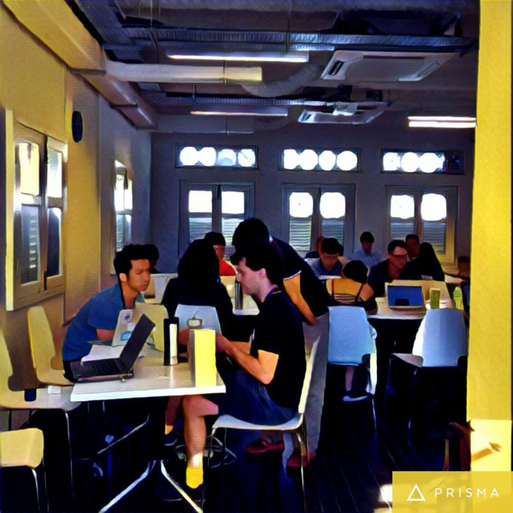

 What our classroom looks like from the inside.

Michelangelo said this of marble: inside every block lies a sculpture to be discovered. All it needs is for its edges to be carved off.

I like to think that I’m my own sculptor, trimming the excess to make the whole coherent, compact and beautiful. Alas, I can’t be my own sculptor (who would be left inside?). Learning is a partnership, between marble and sculptor, student and teacher.

Yesterday I officially put one foot into the jungle of computer programming. Then I put the next foot in front of that, and then proceeded that way until the point of entry became nothing but a small dot on the horizon.

So far, I love it. Class was a little slow for me, so I spoke to one of our teaching assistants about it and got assured that things will pick up by next week. Meanwhile I was getting to know personally my instructor and TAs—programmers!—and that was fulfilling. Never had I known programmers on this level. I was finally speaking to them at a technical level. And now we’re friends in profession.

## Having it easy

There’s something to be said about getting tips before having to live with the pain it purports to relief.

An example: setting up Terminal to open new sessions starting from the current working directory (instead of home) by default. Having before used the Terminal on Codecademy exercises as well as for using ‘SSH’ protocol with my Raspberry Pi single-board computer, I felt the inconvenience of always starting from the home directory - but never thought to solve the problem. But when Steve, our instructor, told us it’s useful to change the default, I did and enjoyed the new convenience. My classmates who haven’t used Terminal before might not be able to appreciate the change as much.

Jumping from self-learning through online courses (like Free Code Camp and Codecademy) to an in-person instructional course means, in many respects, having it easy. There’s no longer a need to be constantly on your toes, eyes wide and ears propped up to read and interpret every moment and asking yourself, “Is there a better way to do this?”, or “Am I missing something here?” Instead, instructors volunteer that information to you in good spirit as their new friend in the industry.

Having it easy is a privilege. As with any, it is easily taken for granted. What’s important for learners to remember is how much experience it took for tips to accumulate in our instructors’ minds, and to always wonder, “What is it like to not know this hack, technique, solution?” I find that asking “How did you arrive at this?” and “What else did you try?” helps to illuminate the pre-problem-solved history and helps me appreciate the real value of a little tip.

Oh, speaking of tips, I also ditched Sublime Text editor to Atom yesterday because a TA vouched for it. While I don’t believe that any good editor is measurably superior to another, I trust the instructor, so I’m going for it. Best to remind yourself that the editor is just a tool. You should still be able to write a programme with TextEdit and the internet.

## DNS for real-life addresses

Why is there no domain name service (DNS) system for real-life addresses? Steve reckons it would be a superior way of recording every person’s home address.

What is DNS? It’s a simple system that resolves a textual domain name, like “Google.com”, into an IP (internet protocol) address. What few people outside the internet industry know about IP is that every website online is actually found via an IP address, not domain name, in the back-end. Try keying in ‘220.255.5.182’ into Chrome - it should load google.com!

If every address in reality has a permanent DNS name, say “Nick.Ang123” then whenever we move homes the only thing we’d need to do is go to the DNS registrar and update our IP address in the back-end. All mail marked for “Nick.Ang123” will still go through to the correct address!

Sounds like a better system to me. Probably just a matter of time before a city government adopts this and gets the ball rolling.

I still haven’t found the answer to this question though: who runs the DNS for the internet?

## Mac viruses

A classmate told me that she had changed from a PC to Mac because it didn’t have any viruses. Is that true or just a well-managed problem on a Mac? If it’s truly virus-free, I’m curious to find out, which aspect of the OS X architecture makes it scum-free?

## Technical bits

- If you create a file/directory when logged in as root, it remains a root-created file and will always require root permission to edit!
- IP addresses have 4 blocks of 3-digit numbers, from 0-255. 255 \*\* 4 = 4 billion. That’s not enough. That’s why we moved to IPv6!
- Who runs DNS?!
