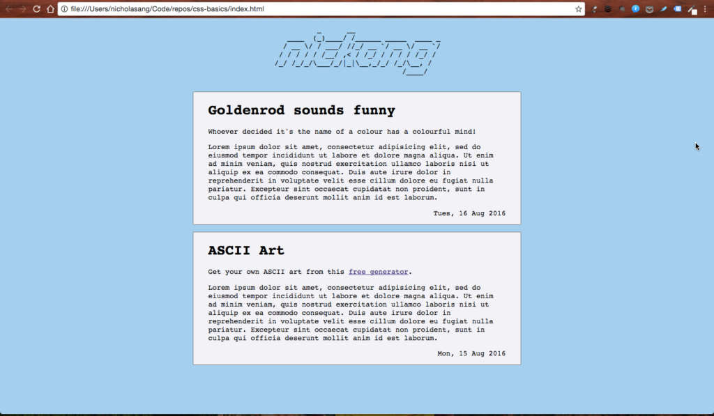
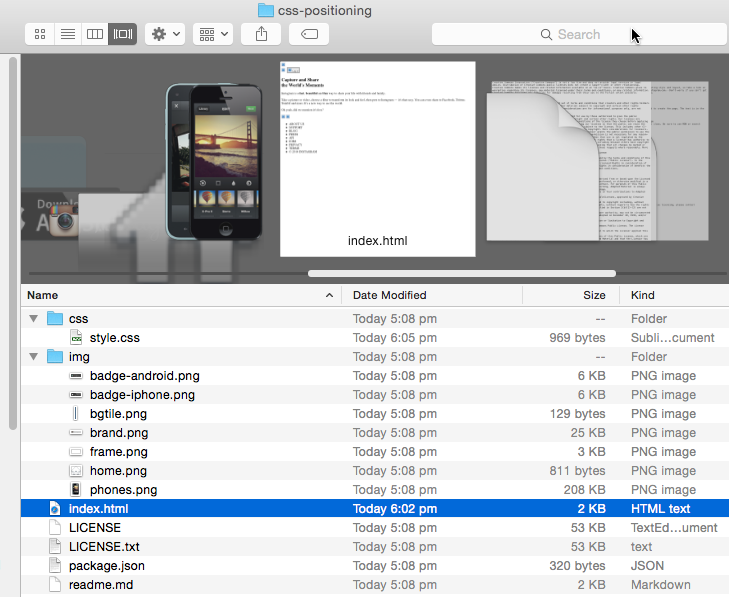

I'm going to keep this post short because I think tonight's homework is going to take over 3 more hours…

Yesterday was day 1 of our web development immersive course at General Assembly Singapore. I found ourselves off to a slow start. Perhaps someone from the instructional team had read my blog (though I really doubt it) and decided to kick things up two notches, because one of today's assignments may look easy but in reality, they are anything but.

First one was easy enough: code a simple blog with two entries, hard coded. (Hard coded means written explicitly in HTML, rather than having a way to create new post entries dynamically through user input.) I did this:

Right after that project, which I now think was meant to be warm up, Steve went through a large number of CSS syntax with us. Though by no means exhaustive, I believe he went through just enough to justify throwing us into the deep end with the next two assignments: - Recreate Instagram's landing page - Recreate Airbnb's landing page

I started with Instagram's, but I struggled for a long time just trying to get the CSS file (style.css) to be properly linked to the HTML file (index.html). Turns out, I used `href="/css/style.css"` instead of `href="css/style.css"`. The `/` is a simple but important distinction.

With that out of the way I went on to put things together bit by bit. At about 30 minutes in, I had to restart all over again because my architecture was messy and I had enough. The GitHub repo was deleted. I forked a fresh one, cloned it onto my system, and began over.

## Fork, then clone

On GitHub's website you can fork a repository. This makes a copy of the repo from the original owner's account to yours. Great.

But the repo remains in the cloud, accessible only through your GitHub account. This is when `git clone [url]` comes in. Enter that into the command line with the URL on your GitHub account ending with a '.git' format and your machine will download everything in the repo from the cloud, and establish a link between that repo (in the cloud) and the folder (in your machine).

Once that connection is made, it's permanently binding. The only way I know to destroy the link is to manually key into the command line `rm -rf .git` when in the correct working directory that needs to be unlinked.

## Confusing relative paths

I ran into a problem while trying to set the 'background-image' of a 'div' in CSS today that I think gave me a new wrinkle on the forehead. It has to do with folders inside a project.

'index.html' is on the main directory, while 'css' and 'img' are their own subdirectories. That is intuitive enough. The problem's root lies in the fact that it is convention to work on HTML and CSS as two separate files, and to store the HTML file in the main directory while the CSS file is stored in a subdirectory.

When writing code, I typically have two panes opened side by side - one for HTML, the other for CSS. To insert a background image for a particular 'div', I had to write this in the CSS file:

div {
	background-image: url("path/to/image");
}

If only 'path/to/image' was so straightforward.

The actual relative path to the image—relative meaning relative to the path of 'style.css', not 'index.html'—is "../img/bgtile.png". For over half an hour I used "img/bgtile.png" and frowned as no background image ever loaded, no matter how hard I tried. If I was writing that line of code in the HTML file, it would have worked; I had completely forgotten, switching from one pane to the other incessantly, that I was not writing that in the HTML but the CSS file.

Good news is, mistakes like this will only happen once. Go through it once and you'll never commit it again.

## Like muscles

That brings me to my final point. Learning to code, I now realise, is like working out in the gym.

The aspiring programmer puts herself through strain each day just as a bodybuilder does with weights. At the end of the day, their muscles (be it in the brain, body, or fingers) are so worn out they have micro-fissures. In response, the body repairs the cracks by filling them up with protein, or in the case of the programmer, new neural patterns.

Repeat this enough days, and you'll have an effective programmer!

I'm glad that on day 2, I'm already feeling my mind stretch.
