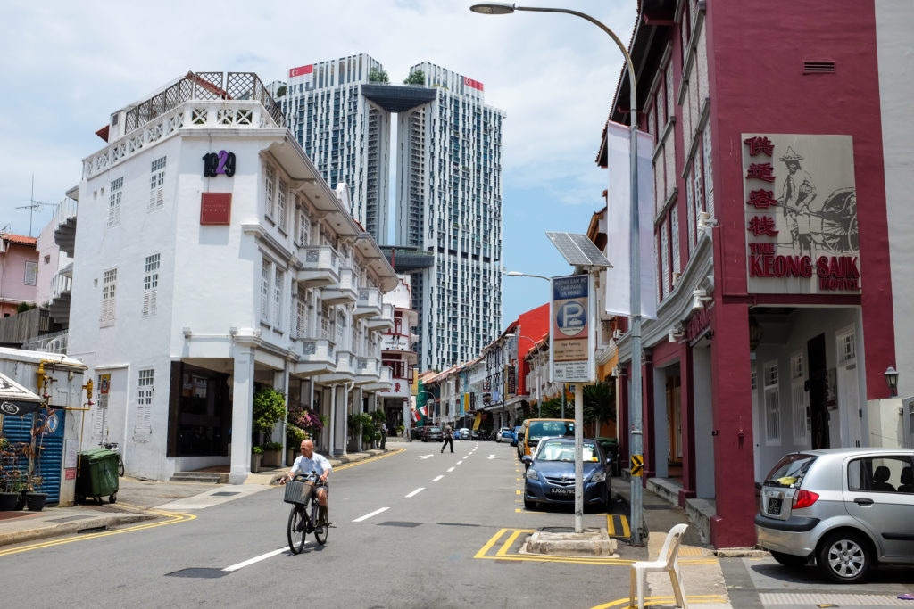

To juxtapose elements in a scene against others is to pick on contrasts. In Duxton where I’m having programming classes, the contrast is stark at every corner: newly erected skyscrapers behind two-storey shophouses that have stood since Singapore was a British colony; adults, mostly corporate workers, walk around the old streets dressed in clothes that are up to date.

When we get into the frame of mind of juxtaposition, contrasts are highlighted in our minds, and we marvel at how things came to be. Today, as I rode down the gentrified Keong Saik Road in Duxton, it dawned on me that Singapore underwent some dramatic transformation since independence 50 years ago.

 Keong Saik Road, Singapore

Perhaps our government planners decided it would create just this effect of juxtaposition that they splurged on the mega Housing Development Board project The Pinnacles @ Duxton. It worked on me!

Here’s the thing: manufacturing juxtaposition, with buildings as an example, can reek of pretence if the whole was not true. I’m reminded of scenes in variegated Chinese cities that have giant skyscrapers next to poverty stricken neighbourhoods.

The Duxton HDB project doesn’t give off that vibe because as a whole, Singapore is really high up on the totem pole of development after years of hard work and strategic governance. Instead, when I see the giant among dwarfs in Duxton I see a symbol of how far we have come. HDB, itself at the pinnacle of government agencies providing public housing, shines through the juxtaposition. Substance exists in the contrast.

I don’t know why exactly, but I’m feeling slight--just slightly--proud of the sight.
