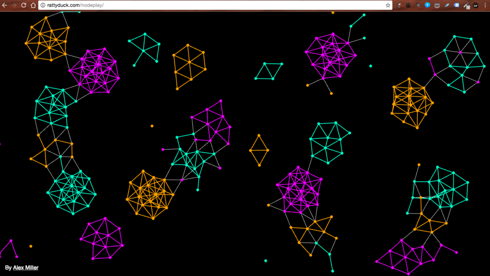

Projects that I’m used to working on are entrenched in structures (as in structure versus agency) that inevitably hold me back from full expression.

Say I’m trying to run an environmental awareness campaign. To pull it off I’d need to bend to the rules, protocols of the organisations that we have to partner, and even whims and vagaries of disgruntled bosses. To comply with these is crucial not just for the success of the project, it is fundamental to even have a project to talk about and work on. So no funny business.

When it comes to software, there is a lot more space for movement and expression. Sure, the technologies and frameworks that have been widely adopted set all new programmers down particular paths, but the beauty of programming is that you can choose to ignore all of it and _still_ build something useful. The core utilities are open to appropriation however you like - nobody can stop you.

(Besides, whoever came up with the idea that everything you do has to be useful (usually in the narrow sense of bringing convenience or other kinds of profit) must be a really boring person.)

\[caption id="attachment\_562" align="aligncenter" width="840"\] [Rattyduck](http://Rattyduck.com/nodeplay/), our instructor's friend, coded this. It's fun and feels like a work of art!\[/caption\]

Consider this with the fact that software has very little overhead to create and deploy (compared to other kinds of projects); it’s enough to make me walk with a skip in my feet, that's for sure.

Programmers have the magical ability to conjure something _useful_ out of nothing. How fascinating!
