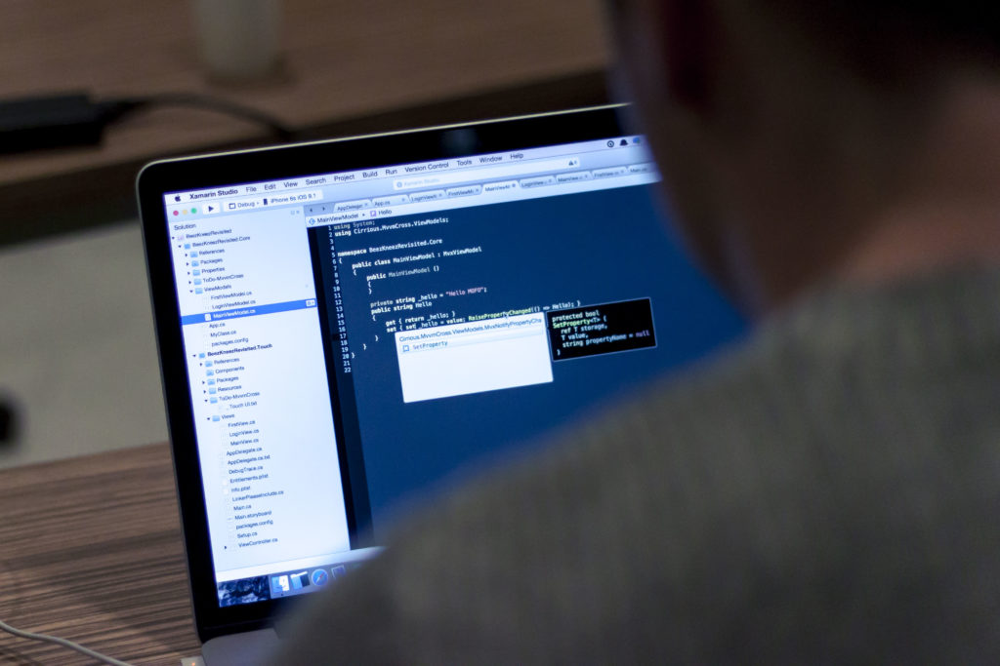

Have you seen a document full of code recently? Your answer is either “Yeah, too many” or “Nope, can’t remember the last time I saw a coder friend coding” - it’s probably not something in between.

This duality probably has something to do with the total non-existence of programming in most school curriculums. As a result, programmers are often misunderstood as loners, unhygienic and unkempt people who drink too much coffee and sleep way too little. Either that or “they are all hipsters.”

Aside from the vibe that programmers unwittingly exude, I’d say that the _nature_ of programming also encourages—necessitates, even—a particular behaviour among those who practice it. Programmers can sometimes look like zombies to other people.

Why? Here’s my guess: programming requires concentration. Clean, pristine and unhindered concentration. Otherwise it’s just impossible to write code!

You can think of code as pseudo-English. For a piece of software to be actually useful, it has to be dynamic. In other words, it cannot ever be hard-coded - it must be able to accommodate different inputs and produce a bunch of computed outputs according to them. Writing in sort-of English is difficult enough. Writing an architecture that allows values to be stored, mutated (computed) and transferred around to do what the programme is intended to do is much harder.

That’s why programmers always appear bent over staring into the black screen with colourful words - if they don’t, they’ll get lost. And finding their way back will require even more energy and time hunched over their desks.

(image: [Tirza van Dijk](https://unsplash.com/@tirzavandijk))
