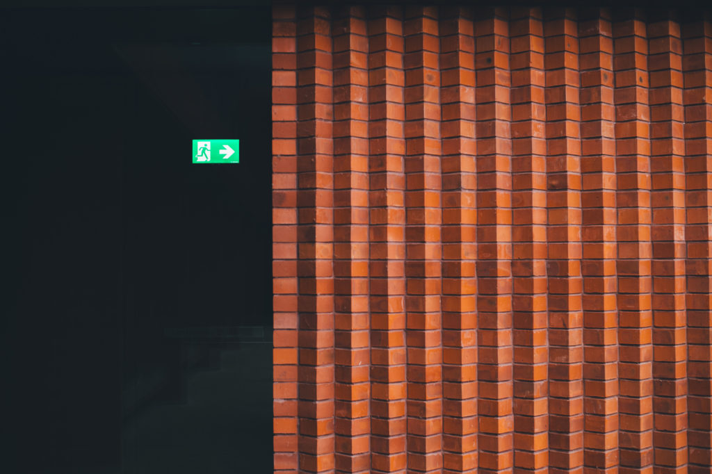
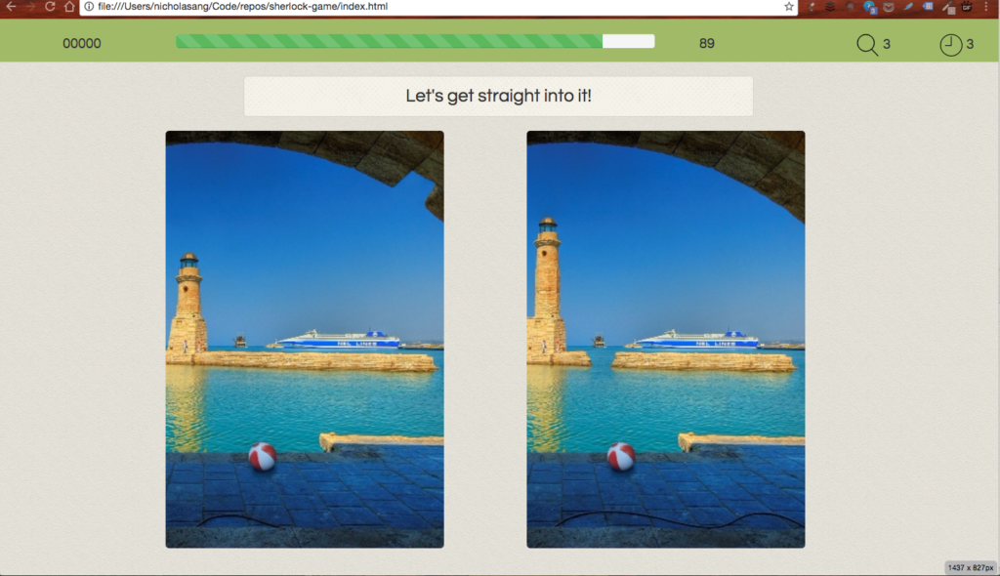

Week three is officially over. Everyone in class has completed their first big coding project and presented it to everyone else. Mine is [here](https://nickangtc.github.io/spot-the-difference/). It has been a great week!

## Steady… steady… oh crap!

Having had prior experience coding simple projects (on Free Code Camp), I thought this week would require a lot of initiative on my part to keep myself challenged. I was mostly right until Wednesday came around when I finally put two photos with actual differences side by side in my project. Before that I used a single placeholder image for both panels. Bad idea.

On Wednesday I had written most of the game logic according to my first approach - using 150 \`\` tags on each panel to create a rectangular grid that can be clicked to model the user’s click position on the image. All of it worked well, except for one thing I hadn’t (but in hindsight should have) foreseen: not all differences can be contained in a box! Since I had no idea how to circumvent the problem, I went in search of a new approach…

## Learning to prioritise what to do first

By Wednesday, time was running short. I had to find a new approach. The best one I’d come up with was to use HTML5’s in-built `<canvas>`—many of my classmates were using it—but that would involve learning something new, which meant learning from scratch. While I liked the idea of a challenge, I forced myself to stop and consider the implications.

If this had been a client project (let’s just pretend some company out there is actually cute enough to pay someone to build a web-based Spot The Difference game), I would have had to stop to do the same.

I considered what other pieces had to be created to deliver my project on time. We were expected to present on Friday, two days from now. One of the biggest things that came up was having to find Sherlock photos to deliver the Sherlock-themed project. I’d need time to find photos suitable to be photoshopped, and then photoshop at least 3 of them to make a game.

Knowing my PS skills, I dropped the theme entirely, and opted to rip images off existing games on the web. And I moved on to plan my new approach.

## Many approaches - which one?

In hindsight everything is obvious. At the start of this project I hadn’t had experience coding any game other than Tic Tac Toe. Without having amassed much experience, the only sensible way forward I could come up with was to start coding and refine later. That was what I did on Monday, and I didn’t regret it when Wednesday came. What else could I have done?

“I should’ve seen that one coming”, is not a productive way to think about the approach that turned out to be wrong. An approach is a particular way of achieving an end, and some times, due to inexperience, we mismatch the method and desired result. There’s absolutely no need to beat yourself over it. As Thomas Edison would advocate, just keep trying and eliminating the methods that do not produce the results - what you learn that is wrong is just as valuable as what is right.

I chose to use the `<canvas>` HTML5 element as my new medium for detecting and responding to clicks, and it worked beautifully. It isn’t without issues, but I’m happy that it at least worked. It meant having something to show on Friday.

## Choosing UX over additional functionality

On Friday, when one of my classmates presented his Baccarat online game, I was transported to an interesting crossroad. At the final hour with very little time left, my friend had to decide whether to make his game look good or code a betting feature.

To him, the latter was vital for the whole project to feel complete. He was planning to use it for gambling friendlies in the future, and it wouldn’t be usable without a betting mechanism.

In the end he chose to make his game more beautiful, and in that way, make his game more usable. Betting would be a future feature. His rationale? “I can’t present an ugly project to you guys.”

This was the moment I imagined myself at a similar crossroad. Between user experience and some functionality that I felt was important, which would I choose? Which one would seasoned _product managers_ choose for their team?

I think I’d choose UX as well. The reason is simple: nobody would go near an ugly game even if it technically had all the features and more. A product is only as usable as its interface is designed to be. Amazing functionality hidden underneath a poorly-made package almost always count for nothing.

Between basic functionality and user experience, I’d choose basic functionality. Between a great feature and good UX, I’d choose UX. My priority is for people to enjoy using my product.

## Bugs that don’t grow

Finally, our first project week is over. My rendition of the classic Spot the Difference arcade game can be found [here](https://nickangtc.github.io/spot-the-difference/).

It isn’t perfect, there are still bugs left to be squashed. Thankfully computer bugs don’t fester like real-life critters over time. Code is like a vacuum - as long as it isn’t opened and worked on, there aren’t resources to support their growth. Static bugs. I’ll fix them in the future, probably when I’m looking for a job.

Onward to bigger challenges!

(image: [Annie Spratt](https://unsplash.com/@fableandfolk))
