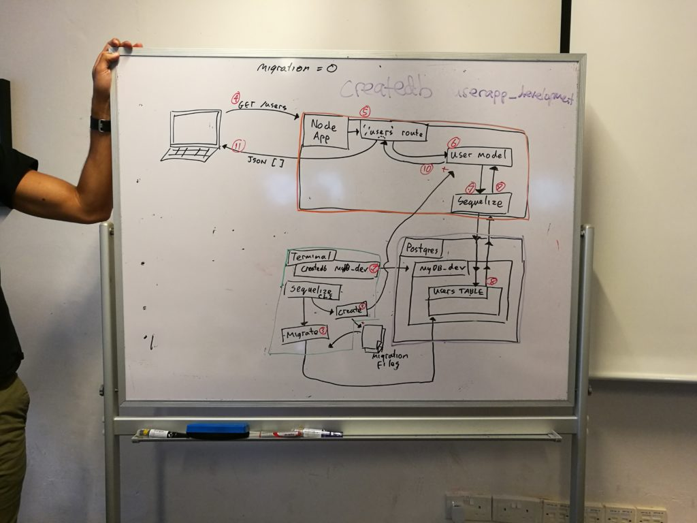

 Our instructor, Jeremiah, illustrating the relationship between the client, server, and database in a web project

Once you're over a certain age, enough knowledge of how the world works will be stored in your memory. That knowledge can then serve as the basis from which to draw parallels to other things, and by doing so, our imaginations can relax because you'd already have an inkling of how it _might_ work out.

The parallel between a box and a database is telling of this. Because I have lived for 26 years, I have a good idea what boxes are and what they are good for. People use boxes to store stuff or transport or contain or any combination of those things, right? So when I'm made to think about a database, I immediately relate it to a kind of box. "It stores stuff that can later be retrieved."

Of course, sometimes we draw false parallels. A database isn't _exactly_ a box - it's more like a whole collection of small pull-out drawers that contain items (or data in the virtual world). Even that may not be as accurate as saying that a database is a "glorified spreadsheet", as our instructor said in web development class today; but that hardly matters because the value of drawing parallels is really in its ability to help us visualise the abstract. As long as it's kind of the same, it will do the job.

Metaphors and parallels may be cool kids in the conceptual block, but in application town, they're about as interesting as a piece of unbaked clay. Come building time, visualisation must give way to implementation thinking - and that's the hard part.

To write code that sets up a database that can communicate with your application is a lot harder than visualising the database being somehow hooked up to your webpage.

It is difficult for everyone, not just me or you. Every aspiring web developer will need to put fingers to keys and create that bridge to learn how the whole thing works at least once.

My first try at creating a database-linked server application was met with countless problems, like knots in a long string. I know where I’m supposed to head, but the knots keep me from going through.

First it was the new framework called Sequelize, which apparently is used by many developers as a way to use the JavaScript language (practically every web developer’s bread) to communicate with the database, which uses something called SQL (Structured Query Langauge) - where “sequelize” got its name from. Then it was how to run Sequelize commands on the command line, as well as how to write code in the server side hosted on Node.js.

Learning to code is a continual process of de-knotting to get to the end of the line. Well, except there’s no end of _the_ line, but really just the end of _this_ or _that_ line. When I finally untied the knots today that were blocking me from implementing an exercise project that linked to a database through Sequelize, it was magnificent. I think I might have even said “it’s so straightforward after you get it!”

While having a straight rope now feels great, I know this is not the last time I’ll be spending hours in cognitive high-gear trying to chew away a knot. I look forward to undoing many more knots to come, because that's how I know I'm getting better.
