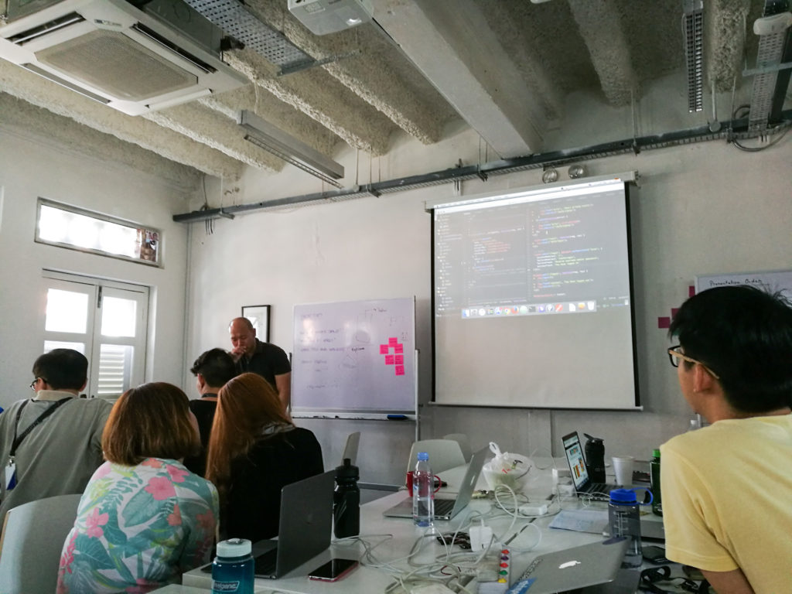
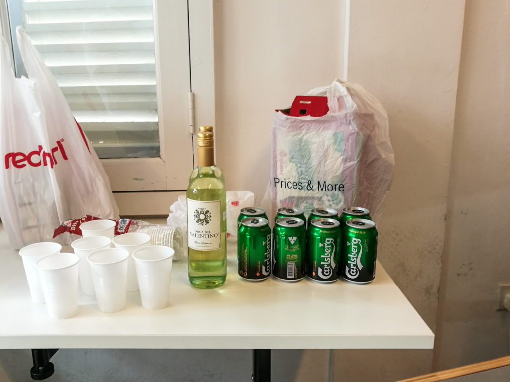

 It’s the end of the week, a project week, a project week-eeeennnnd! (Wong Fu Productions reference.)

Today is Friday, 23rd September 2016, week 6 of the intense 12-week GA web development course. Each of us have just completed a full-stack web app—the first for many of us including me—and presented it to the class. It was great!

Before describing the project I worked on, I’m going to list the things I’ve learned from this week of intensive, all-in coding.

## Lessons from a week of intensive coding

- You won’t know until you try. Good news with web stuff is that trying is (mostly) free. (Unless you need to pay to use certain data sets from APIs…) So whenever I _think_ something should work a certain way, I don’t ask someone. I try it out first. It is often faster and, even better, easier to internalise.
- There are plugins for almost everything, so search before trying to build another wheel. The caveat here is if you are building a business and are worried about being at the mercy of external library owners (what if the creator removed it from GitHub?!), I think it’s ok to try to build your own. Otherwise, it’s best to build your stuff on what others have built.
- It’s ok to leave CSS to the last, but nevertheless, do your CSS. A technically sophisticated product without good packaging is destined for failure. Internet users—everyone, basically—are human, and humans privilege vision.
- When learning to code, most of us will quickly notice the chasm between what we are creating and the finished products available out there in the world wide web. It is there, and yes, it is huge. Like _huge_ huge. We expect a button to _just_ do that thing. Nobody even thinks about _how the hell_ it does - they just expect it to be because there are great developers out there who built the web to be as intuitive as it is to use in 2016. But it’s useful to bear in mind that once you get to the peak of the first mountain (called HTML), it becomes that much easier to scale CSS. The skills are transferrable. Then take on JavaScript, then jQuery. Then Node.js and Express and Postgres. Eventually, the chasm will begin to close up as you will the other side towards you. We’ll get there.
- To learn as much as possible, always factor some time for experimenting with things that you haven’t used or done before. Plugins, different approaches to writing code that do the same thing but potentially more effectively, APIs, etc. Walk through a door but occasionally walk back out and check out the rest. You won’t know what you’re missing out if you don’t.
- Reading other people’s code is only interesting and useful at the right moment. Immediately after doing a project with the same specifications (but with wildly different implementations) is such a moment.

As you can see, I’ve learned a lot this week. I owe it to the good programming of the Web Development Immersive course and to my classmates who did their best and inspired me along the way.

 A great way to celebrate after a week of hard work and growth!

## Introducing Spidey 1.0

So, on to my project for the week. I made a dashboard for people who need to do research on the web, but need to do it in an efficient and non-distracting way. A live version of the project can be accessed [here](http://spidey-dash.herokuapp.com/). Updates to the project will likely be pushed to that link.

The process of using it is something like this: Enter search term —> Browse summarised results —> Click interesting search results to read full article on same page —> Digest info, synthesise into the project you’re working on —> Save article URL for later use/reference

Simple and straightforward enough, right? Here, if I wasn’t already 6 weeks into the web development course, I would’ve said, “Yeah, sounds simple and easy enough!” Alas, I _am_ a month and a half into the course and I knew what I was getting myself into when I chose to try and create this project in one week. It wasn’t extremely difficult, but it was challenging.

The bits I found most difficult to grasp were the server-side stuff. Using Node.js, we can use JavaScript to configure a server. But Node.js is a tricky son of \*. To get a server running you’ll need to create several folders and put in the relevant pieces of code in them. Authentication goes to the ‘auth’ folder, passport.js/bcrypt/express-session external libraries must be initialised in the root folder inside index.js, and oh, passport.js requires configuration, which should be done in a separate configuration file and in a folder called ‘config’. Full rant [here](https://www.nickang.com/nodejs-server-nightmare/).

Somehow, as a web developer, we’re supposed to know where every single thing goes and how they relate to one another. If you’ve ever looked left and right 20 times in quick succession, you’ll more or less know how it feels to create a server using Node.js.

Anyway, I feel good about how the project turned out, but if I were to be honest, I'm not completely satisfied with what it does yet. Spidey is still in its early development. It's not good enough even for me to want to bring it into my writing workflow, even though it was designed to be. The good news is that unlike the previous project--a Spot the Difference game--I will continue to work on Spidey. I can already think of one or two features that will make it worthwhile to use. One of them that I'm most excited about is the ability to add customised markdown to your article and let Spidey find the best materials online that you should read and append as hyperlinks to your own. That should easily cut down the time needed to write a great piece by half!

I like where I am right now. I feel like some of the worst days are behind me, at least when it comes to creating a server for a web application. I _know_ conceptually and practically how to set one up and how it works, even though it might take a while. It wasn’t easy getting here, but interest and grit got me through, and I look back smiling.

More adventures ahead!

—

PS. If you have seen my research dashboard project [Spidey](http://spidey-dash.herokuapp.com/) and have feedback, feel free to leave a comment.
