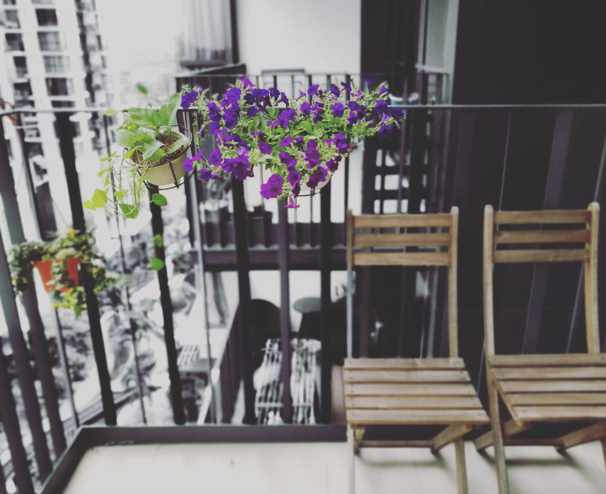

 The world's first 3 plants under my care

I used to fake a frown to look like I was thinking. You know, so I’d look just like an adult, always lost in deep thought, supposedly pondering over matters of importance. Nowadays I frown often and uncontrollably and I find it hard to snap out of it and breathe for a second. Guess I’m an adult now.

The thing that troubles me is the fact that most of the time, what I’m deep in thought about is utter meaningless nonsense. (How much is “most of the time”? For me it’s probably 80 percent.) Truth is, I could do without being lost in senseless thoughts. For one it would free up more time to enjoy what I have in front of me at any moment, which should make me a happier person in general.

Do you know what I’m talking about?

It’s scary to think that I once had to pretend like I was deep in thought when all I really cared about was how I looked or what people thought about me. That was only about 10 years ago. Now, things have taken a one-eighty and I can’t quit thinking about rubbish. At least I don't care quite as much about how others view me anymore. I’m nevertheless lost in stupid. stop-wasting-your-time thoughts too often, only to be snapped out of the daze when I inevitably walk into someone or am wrested into the territory of _another_ useless god damn thought. If I were to use a war analogy, I'd probably put it the same way Tim Ferriss eloquently phrased (and I paraphrase): these thoughts are like bullets ricocheting around my brain, leaving ruins in its path. It’s tough being a grownup I tell you.

Amidst all this I’m certain of one thing: even the 20 percent of thoughts that are supposedly important and sensible to commit time to thinking about are really, most of the time, _not_ that important. So I might as well snap out of it and get on with living all together. I want to choose to opt-in rather than opt-out of a session of focus (or daze, call it whatever you want).

Entering one’s thought palace should be a deliberate practice, not a mindless one. And actually, if you think about it (yes, take a moment to enter your palace), where could we possibly end up if we mindlessly enter our mind? Nowhere fruitful, nowhere peaceful, in my opinion. So walk out of that madhouse right now and keep the keys at home. If you need to go back in to that magical, dangerous place, you know where to find the keys.

PS. I must have frowned during the process of writing this.
