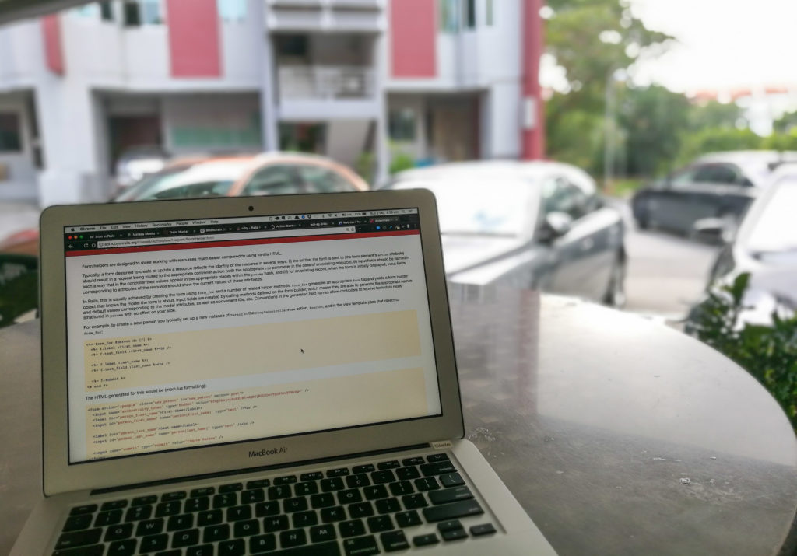

 Laptop work is inherently unhealthy (yup that's Ruby on Rails)

Recently I've been finding myself lethargic quite a lot and I think it's even starting to affect my mood and attention span, and my performance in class is deteriorating because of it. In other words, shit is getting real, and it's time to do something about it.

As if by design, my web development instructor is a pretty fit guy. He works out often and is in good shape. _Great_ if you remember that he's actually a programmer. How many fit programmers do you know? Almost all my friends who work mainly off their computers have a bulging belly, not washboard abs. (Fact check: I don't know if Jeremiah has above-described abs, but let's assume he does.)

At a party two days ago while we celebrated the end of our second project week (when I made [Spidey](https://spidey-dash.herokuapp.com)), I fatefully sat beside Jeremiah. At about midway through the night—I don't know why, but I'd chalk it up to the dizzying mix of a rapidly growing beer belly and beer—I asked him about his motivations for sticking to an exercise regime. His answer, after contemplating for a while, was both concise and compelling.

## Exercising is defying convention

As we age, the tendency is to wither less-than-gracefully, to grow fat and unhealthy. By 30, our energy levels would have dwindled significantly from the highs of our late teens and early twenties, and health issues start to creep up on us.

That is, if you don't exercise (enough). And eat (relatively) healthy. (Brackets) are deliberate, to make it clear that I'm not about to declare what would look like unrealistic New Year's resolutions in the next sentence.

That was the prelude to Jeremiah's answer to my poking question of "What is motivating you to exercise regularly?" I really like what comes next.

His basic argument is that knowing that we all age and naturally tend towards the state of un-health, by exercising, you are defying convention. Apparently he likes going in the face of what is "supposed" to happen. Isn't that such a fantastic way of creating self-motivation?

I love going against the grain in many situations too, and this is one of them. The fitter I am as I age, the greater the defiance. I'm _supposed_ to be obese and sickly, but I'm not. Sounds like the perfect humble brag to me!

## Strong body, sharp mind

It's been said many times by scientists that our mental and physical states are linked. They are in fact inextricably wound together, but of all the things our mind typically drones on about, its own relation to our body's physical state isn't one of it. The result is an fat body and a lacking mind, like mine has been of late.

My instructor (friend) Jeremiah recognises it though, and he has taken action to keep his mind at peak performance. In an unspeakably distracting world, I believe it's the sharp minds that stay above and make progress. And if that is accurate, everyone should start to spend more time exercising now.

Don't wait, because tomorrow never comes. All we really have is today. So what are you waiting for? I'm already at the gym. See you there!
