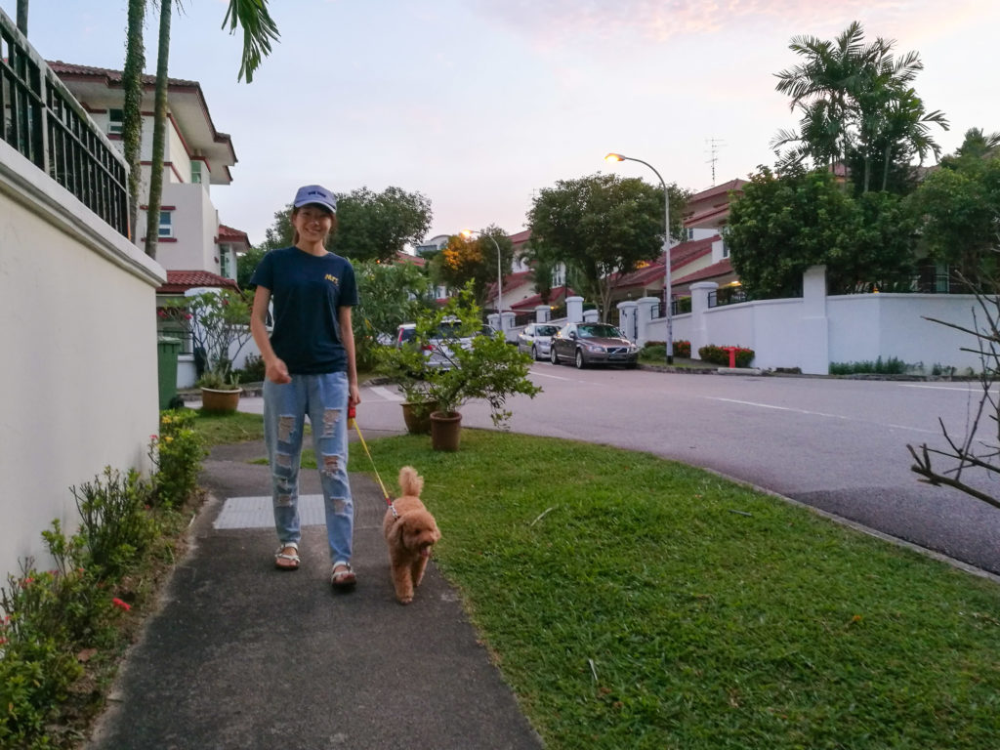

> God, please make me who my dog thinks I am!
> <cite>Eckhart Tolle, The Art of Presence (audio)</cite>

Over this week I’ve been listening to the recording of one of Eckhart Tolle’s retreats on mindfulness and the fullness of every moment. It’s been a real treat being a listener from a distance. I can only imagine what it was like to be in the room when it happened, to feel his calming, understated presence.

When someone is fully present in the now, not thinking about something in the past or dwelling in thoughts of the near or far future, it shows. It shows in the person’s body posture, his eyes, and, for me to sense it through the recording, his pace of speech. Eckhart Tolle spoke with deliberation and since his mind is not living on future time, so to speak, he didn’t try hard to impress the audience. I imagine this was his line of thought: Why should I care what others think of me when there is only the now that we live in? That is a problem that lives in the fuzzy concept of “the future”, and it does not apply here.

He brings us through many ideas that we would typically classify as “spirituality” but which I consider to be ideas of life. So I see it as philosophy, maybe. Perhaps with a dash of sociology and psychology.

I’ve heard of the name Eckhart Tolle before but don’t remember where, but when I browsed Audible and stumbled on his recording, I decided without hesitation to pay for it. I must have secretly trusted him even though I knew nothing about him. I didn’t even know that Tolle was pronounced “toll-leh”. How strange that this sequence of events played out to this point. (But I won’t dwell on that thought, unless I’m doing a deliberate study of my personal history, because it would mean living in the mind and in the past.)

The quote I started this post with is probably borrowed (by Eckhart) from somewhere but its profundity is not at all diluted here. He brought up the fascinating example of nature as being one and present and moved towards animals and the animals we keep as pets, and at some point, he brought the dog into the picture. Dogs! My senses heightened. I had for the longest time wondered whether my dog was the Buddha reincarnate. You should see the way he looks at you…

Alas, the joke waiting at the end of the road is that _dogs don't think_, they just be. It's all us...
