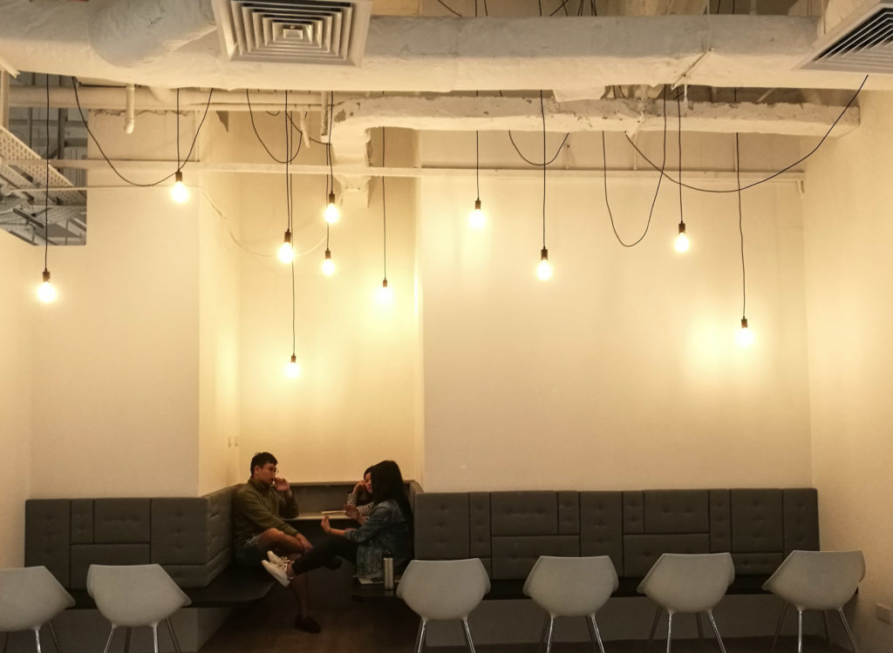

This is the order we learned about web development:

HTML —> CSS —> JavaScript —> jQuery —> Node.js/Express server —> Postgres SQL database —> Heroku deployment —> Ruby —> Test Driven Development —> Ruby on Rails server

By the time we started on Rails, most of us already had a good grasp of JavaScript client-side programming and Node.js plus Express server-side programming. In other words, we’ve experienced the modern version of bare-bones server coding before starting our exploration of Rails.

If you’re a developer you’d probably know where I’m going with this. Rails is like magic when put side by side with Node.js/Express. Seasoned developers also say that there’s almost no other server-side language and framework that works more intuitively than Rails.

Rails is magic.

But it is sometimes _too_ magical.

“How does that work?”

“Is that part magic too?”

“What the hell does this (line of code) do?”

These questions and more are the demons we have to grapple with when coding in Rails. So far though, I still like it more than coding in Node-Express. It handles most of the repetitive and complex things for me so I can focus on the business logic of my server and, with the saved time, work on improving the overall product.

This coming week is our third project week at General Assembly. It’s the first and only time we’ll be working in groups and I’m very excited about how it will turn out. The atmosphere on Friday was perceivably different from that of our previous projects. I think everyone is thrilled to be working as a group of developers for the first time. Many issues remain to be ironed out, like what Git flow to use (centralised or feature branching or gitflow or forking) and how to split work strategically to reduce time wasted on resolving merge conflicts. It’s going to be a fascinating week!

I’ll be working with two fantastic team mates Bright and Mikella to build an ad-hoc skilled-job portal to match service providers (eg. electricians, web developers, make-up artists) with those who seek these specific services. In 2005 this might have been a novel idea. While it would have been better to work on something useful and never been done before, we’re choosing this to prioritise our learning over an impressive portfolio. I believe if we get our Rails fundamentals right, we’ll be a lot more confident in building web applications in the future, and that is worth the investment in time now.

Expect a review of our project some time soon. In the meantime, keep your head up and live fully!
