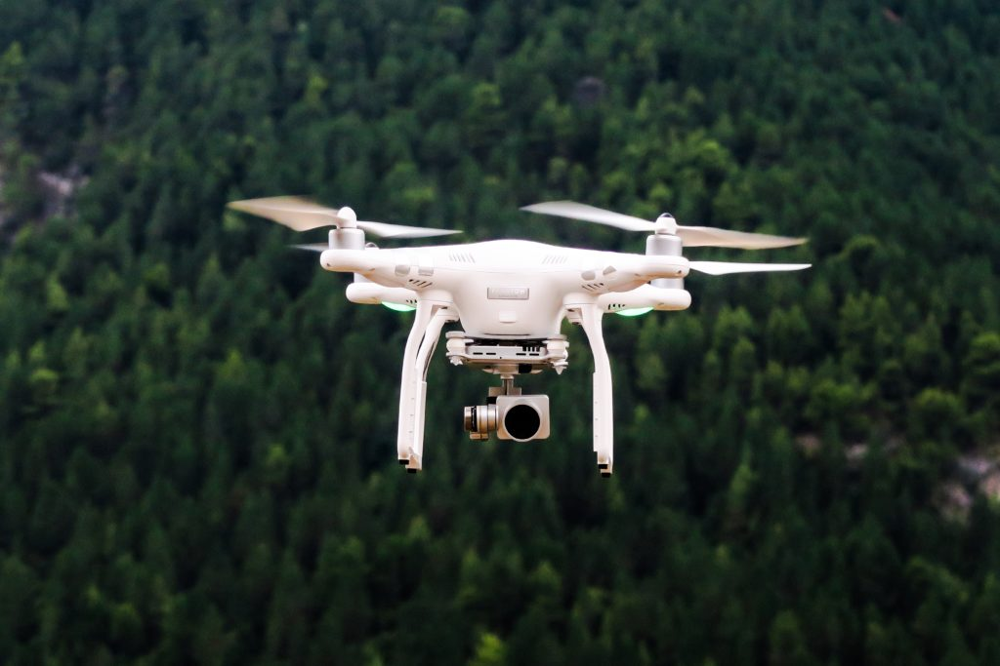

Worms (the game) is the first thing that comes to my mind when I think about drones and air-drops. “Special delivery!” and some cargo drops from the sky and lands softly with the aid of a parachute.

This being 2016, there is of course already a startup working on making that an actual thing. [Flirtey](http://flirtey.com/) is that company with a strategy that is surprisingly similar to the Worms air-drop. It flies its drones autonomously and dangles the cargo with a string until it reaches the ground, and then detaches and flies back to base. Looks cool but watching the video really got me asking “Why?” - why not just land the drone? A hovering drone with a cargo dangling and tugging on it is more precarious (to me) than a drone trying to do a landing in an urban area. Not sure why the people at Flirtey decided it was a good idea. They seem to be drumming to their own beat with strategy as much as they are with their name.

Drone delivery is a fascinating space. Heck, _drones_ are interesting to begin with, both in industry and recreationally. I wish I could say I’ve flown one but till this day I haven’t flown one. That day should come very soon when I can’t resist the temptation to get one “for the family”.

I think drones are currently on the cusp of explosion (figuratively) of adoption by many businesses. Amazon Prime Air was announced in 2013 with two cool videos about “delivering in 30 minutes.” They also have a [cool, geeky website](https://www.amazon.com/b?node=8037720011) to boot. Flirtey has already started to deliver Domino’s pizzas in New Zealand and medical supplies from 7 Eleven in the United States. The US military drones take out enemy targets without risking pilot casualties (this of course can be a whole discussion altogether). Casey Neistat has been using various drones with video cameras to [shoot beautiful videos](https://www.youtube.com/watch?v=iPG1Xa5Uqwo) of the places he visits, and mostly of New York City. Drones are being used in many ways and people are growing increasingly fascinated with them.

DJI is already a dominant manufacturer of consumer-grade drones. A few days ago, they released their best drone yet - the [DJI Mavic Pro](http://www.dji.com/mavic) which with a little squeezing, fits into a cargo pants and has collision detection and avoidance technology. GoPro also recently launched their first consumer drone called the [Karma](https://shop.gopro.com). Even without researching, I know there are probably 5-10 other startups around the world in the running to gain a piece of the rapidly growing consumer drone market.

So consumer drones are becoming mainstream, and the world’s largest e-retailer has begun development of drone-delivery technology since 2013. What’s next?

Things will probably start to look quite similar to the recent upheavals caused by Uber and Airbnb, perhaps with one additional obstacle that is the Aviation Authorities. If we’re truly going to enter a Jetson-esque era, we should expect resistance.

What I think will be the next big leap is the creation of sustainable businesses that subsist on managing drone deliveries, with the help of a few far-sighted governments, with [Singapore being a likely front-runner](http://www.smartnation.sg/). Pilot programmes would be risky at first, until a startup hits a home run in terms of execution and negate the risks. I feel like drone delivery is in limbo right now as companies are still trying to get their technologies right. As soon as one crosses the hill, we should witness an avalanche of businesses that do and use drones for delivery.

Are there hurdles? Of course! A drone might fly into something and fall to the ground and hit someone or something expensive. One might fly into a manned aircraft and cause a “drone-strike”, needing another Miracle on the Hudson. What about the possibility of a hijacked drone delivering a dangerous parcel? Or hackers that reroute a fleet of drones on a kamikaze mission? These are tricky issues that need to be ironed out. But like cars that are legally allowed to drive at 100 km/h, drones will zip around next to buildings and among people. I think it’s a matter of one or two decades before we see that. If not, I’m at least sure it will be in my lifetime.

I honestly hope that the flame of innovation in this area won’t put out by mega-corporation push-backs and government bureaucracy. The time for drones is now!

(Image: [Jason Blackeye](https://unsplash.com/@jeisblack))
