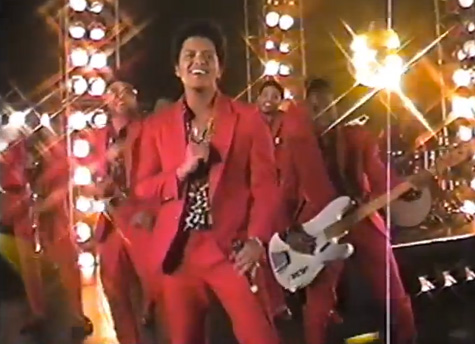

\[caption id="attachment\_709" align="aligncenter" width="475"\] That's Bruno Mars\[/caption\]

Today, for the third time since we moved in to our new apartment a year ago, we snagged a great deal. We found three pots of fake plants sitting by the garbage and took two of them home for free. I know an amazing deal when I take one (or two).

It’s a funny thing, knowingly taking what people no longer want. They _feel_ less valuable just for being put near the “real” trash. Some times the item being discarded is old or broken beyond repair, yes, but that’s actually rare. Most of the stuff being thrown away are just, to quote some famous architect, “matter in transition”. To that family, fake plants probably just aren’t the sort of matter they want around the house anymore, and so they trash it. I happen to be newly interested in gardening and greenery around the house and so picked those pots up. The right place, at the right time.

But it’s also a tragic thing, because we seem to be throwing out a lot of good, still-useful stuff. In an ideal world, matter out of place will just transit from a wrong place to a right place, not put completely out of use in the landfill. The interim solution in this reality is to put our items in a centralised place (like next to the rest of the trash) and give others who might have a use for them a small chance of picking them up.

As mentioned earlier, we’ve benefitted from other people’s “trash” three times in one year. First was a heavy-duty metal wireframe for kitchen use. It was almost exactly what we were looking for. Then came a white collapsible desk, which is now standing next to the single-seater sofa in our balcony for holding our coffee mugs. Today, we snagged two beautiful fake plants.

Matter in transition is a problem. Is there a business you can think of to turn this into an opportunity?
