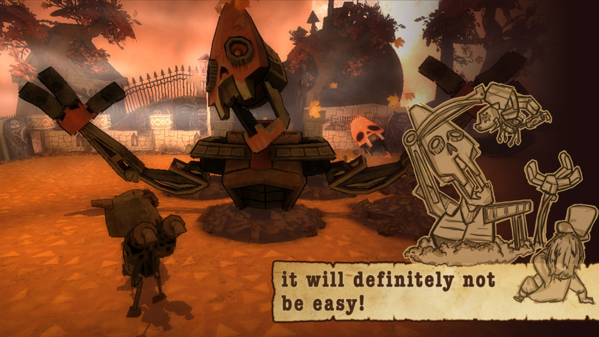

 Grave Matters, a game by our web development instructor and two friends

Our instructor at General Assembly is also a game developer, and he recently showed us his wares. It was my first glimpse into the world of game development and I found it magical.

“Oh, the moon is flat!” That was my first reaction when I witnessed Jeremiah rotate the ‘camera’ in Unity, the software on which he game (and many others) is built. “Yeah, always make things flat if you can, because it’s lighter to render.”

Game development is really cool, especially when you look beyond the surface. Games like The Sims force us to think about reality in a new way. When I saw that the moon in Jeremiah’s game is flat I couldn’t help but think about whether _our own moon_ is flat. It probably isn’t, otherwise the Apollo astronauts would have warned us, but the thought experiment obviously extends farther to interrogate other aspects of reality as we know it.

There’s an interesting documentary that I was just introduced to by my friend Mikella that explores this (and many more mind-boggling questions) called _[Through The Wormhole](https://en.wikipedia.org/wiki/Through_the_Wormhole)_, of course narrated by the god-liest voice of Morgan Freeman. (Take a look at the name of the episodes from season 1 to 6 - it's a ride in itself.) In the pilot episode (can you call the first of a documentary that?) titled “Is there a creator?”, the idea of our universe being a simulation is seriously entertained.

It’s particularly fascinating for me watching it now as I become more and more a programmer each day. Even simple web applications involve the creation of objects that appear on the screen that can be thought of as entities. Write enough code to govern their behaviour and interaction with one another and soon what looks like a new universe may be born. Rattyduck’s [nodeplay](http://rattyduck.com/nodeplay/), a project by a friend of a friend is an example of what that might look like. The Sims is the literal manifestation of the idea.

Listening and watching Jeremiah explain the way his game was made was a real treat. I’m not sure when I’ll ever get another glimpse into the life of a game developer, but I look forward to it because I know that in their minds, they would have entertained the thought of creation way more than I would, and that’s really interesting. While most of us toil away at our very humanly jobs, these folks create parallel universes that our minds (and soon, perhaps, with virtual reality tech, our physical bodies) can inhabit and explore. It’s a shame that the economics of game development happens to be the same as music. You either have a hit or a song that will live in obscurity. Good, passionate game developers like Jeremiah have to go against logic and forsake plenty to pursue their job, which is to say, they most likely won’t.

And even though I appreciate the idea of creating and entering another (game) world, I have to admit, I can’t muster the courage to squander time on it. The pragmatist in me is growing in strength as I enter my late twenties. This is the time to think about making an impact, earning a decent wage and living my last few years as an irresponsible adult. The only game I have time for is this one.
