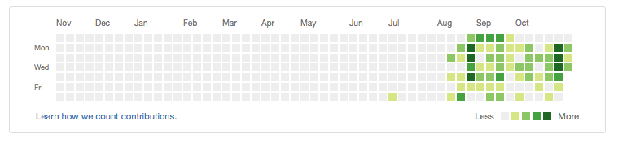

Coding feels like a chore today.

It took me a while to even entertain the idea that I might be experiencing coding fatigue. To be honest, this admission feels like defeat.

 My GitHub contribution grid is lighting green recently

I've been writing code every day--JavaScript and Ruby, I'm looking at you--for the past 3 months and I think it's time to take a short break. Actually, more like I feel the need to break away from the colourful text on black.

For the past three days I've been forcing myself to work on my past projects, to squash bugs and add a veneer of UX polish to them before our Meet and Greet day scheduled for the 17th. Looking at what I've managed to get done though, those days amounted to no more than half a day's work on any given day. What's the point?

So I'm going to take a day, maybe half a day, away from Atom (code editor). Since Donald Trump literally just became the President of the United States of America, I think being away from the computer altogether is somewhat a good idea.

What I've learned from this episode of fatigue is that the ability to recognise yourself reaching a point of saturation may not come naturally to some. For people like me who can get stupidly excited about things when it starts to get interesting (ie. when I start to be proficient at it), the indicator of fatigue is about as bright as a star in the city sky.

Let's face it. Feeling tired is a thing, and it's a thing that we must acknowledge, not brush aside. The outcome of ignoring it is a dip in productivity and general lethargy, as I'm experiencing just before I started writing this.

There's no shame in not wanting to do X just because you've done too much of it recently. I can imagine Obama echoing this sentiment right now. Without variety, life can be dull. And what goodness can come out of a dull person?

I'm bored of writing code today, so I'm closing my laptop and choosing to read a book instead. Maybe I'll watch Black Mirror. Perhaps at night we'll go out for a nice dinner.

Sounds good.

I don't doubt it - this will get boring soon. And when it does, I'll revisit my old friend Atom.
