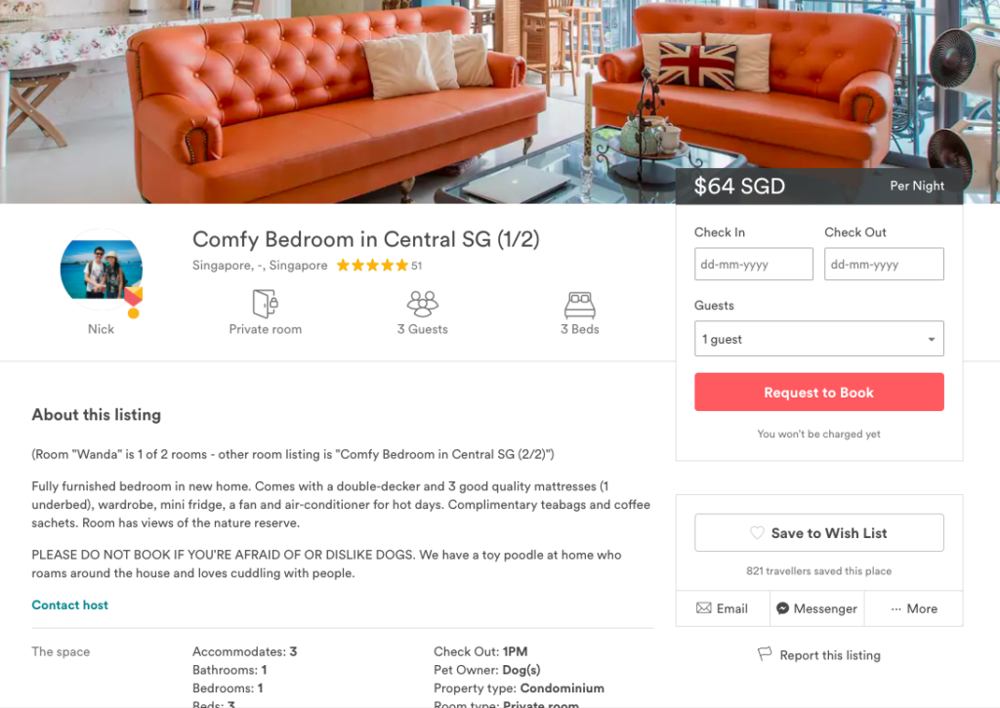

It's 9:50pm on an otherwise wonderful Sunday night, and two officers from Certis Cisco, under the appointment of URA stood outside my door. They are here to bring us back to square one.

We had a good thing going, my wife and I, renting out our spare bedroom to guests from all over the world. Airbnb represented an opportunity for us to have the world come to us (since we can't go to the world right now) while we worked at our otherwise normal jobs.

Guests gave us 5 star reviews almost all the time and said many good things when they didn't have to. Here's a secret - it wasn't that difficult becoming Superhosts. All you need to do is say hi and mean it, show your guests their room for the next couple of days and the facilities at home they can and shouldn't use, point out that you've prepared a purple folder that tells them all the things they need to know to understand what Singapore stands for and how to navigate the landscape. Most tourists haven't experienced such personalised hospitality before, especially not in Singapore, and I'd chalk our good reviews to that.

 Our listing on Airbnb - I think we were decent hosts 

The guests who hailed from USA, UK, Brazil, Denmark, Taiwan, Philippines, Hong Kong, Malaysia, Indonesia, China, Australia, New Zealand... they continued to surprise us as they were mostly gracious guests. Some were actually so nice that we remain friends till this day, like Sherry and Keng in New York, and Wan Ting and Kiki from Hong Kong. It was an amicable enterprise between us and the tourists here to have a good time while having an authentic Singaporean home to stay in. That is, while it lasted.

Things started to decline one day when our condo manager ordered the guardroom to bar some of our guests from entering the condo. Apparently some residents who happened to be on the management council saw a group of 3 white people at the entrance and decided there and then that this was illegal and they should be denied entry. I couldn't let my guests who came all the way from the Europe stay out there in the cold and I demanded that they be let in, and in exchange I promised to have a civil discussion about the matter with the manager and, should they be willing, the resident management council the next day.

That discussion only ever amounted to a monologue. Nobody on the management council wanted to see me to talk. And less than a week later, two officers stood at my door and asked to enter our home. Having read the Planning Act, I knew I had to let them in.

Two separate "investigations" at our home and a meeting with the URA coordinating officer later, here we are. Our enterprise was forcefully dismantled (with a cessation notice, Singapore style) and well, life goes on.

Today in their third and final 'surprise' visit to our home, which was meant to verify that we've adhered to the notice, I couldn't help but notice how pathetic things are. In my pyjamas I accompanied them around my home as they snapped pictures of every room and categorisable space, and as we walked from one empty room to another, two of which still holding vacant beds, I shook my head. What a waste.

Our government probably wants to collect taxes from us for renting activity, which I think is fair. Propose something and let us have a discussion. But nobody I've met from government has ever broached the topic until we addressed the elephant in the room at our meeting with the URA officer. Even then, he gave us textbook responses that he was expected to give as an executive of the agency - that they are merely responding to complains from the neighbours.

Our neighbours probably wanted us to pay more maintenance fees because we had more people living in our apartment. Either that or they are xenophobic, unapologetic elitists, or both. The argument that greater headcount means more fees doesn't hold water, since our household consisted only of me and my wife before Airbnb, while many other households in the estate had children. If the counter argument is "they are foreigners and thus, represent higher damage risk to facilities", then I think I'm already proven right. Oddly enough, most of the renting tenants here are not Singaporean.

I realise that I'm getting more sour with every sentence and so I will wrap up since I didn't intend for this to be a rant. I believe Airbnb is good for Singapore's economy because with it, accommodation becomes more affordable and quite possibly, a great deal more personal. Airbnb is of course not so good for the hospitality industry from what I can observe.

Also, if the government isn't collecting taxes from guests or hosts, then they are probably unhappy too. But if they are, it's good for them as it is good for us hosts. 'Host', by the way, really just refers to people with spare rooms _in the home they live in_ that they want to rent out to tourists.

As I said bye to the two officers tonight, I'm back to where we began a few months ago, with empty rooms just staring back at us, in a city spanning 27km by 50km (720 square km) with 5.4 million people. I hope the decision makers will wake up and make better decisions soon. Reactive policies do not bode well for us - this is hardly the image of a smart city.
