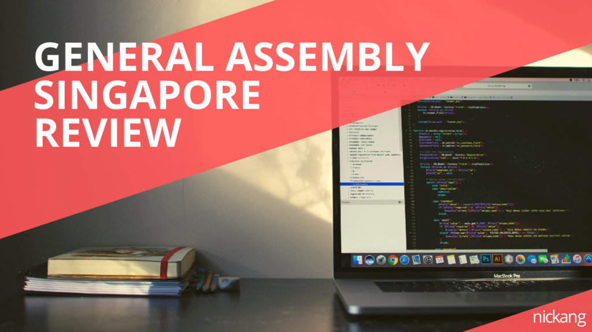
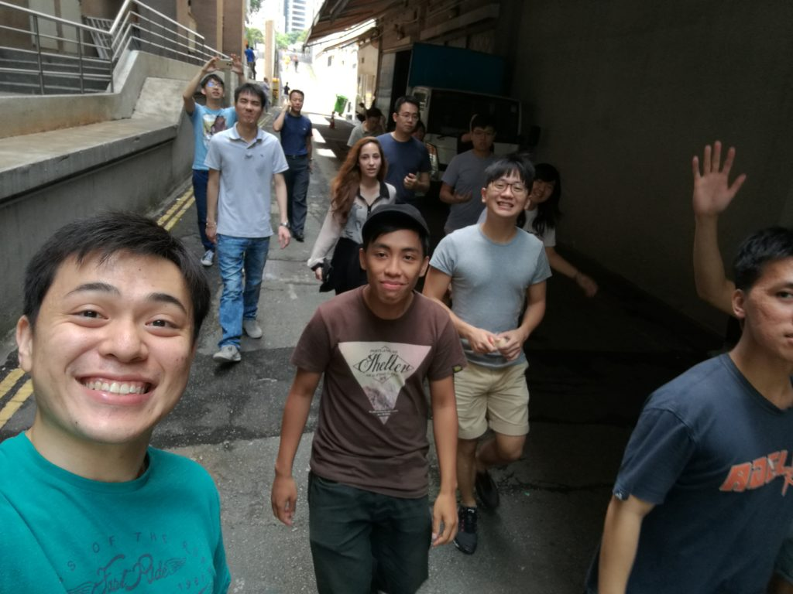
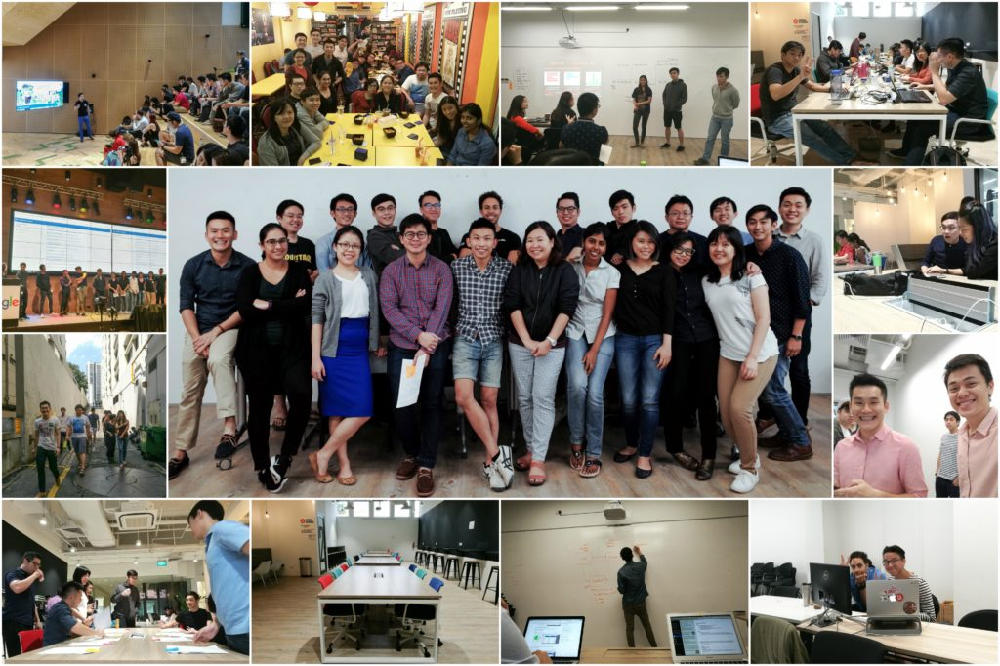

Hey there.

If you’re searching for an honest review of some of the programming courses currently available in Singapore, you’ve come to the right place. I will lay out in this post what I think about [General Assembly Singapore](https://generalassemb.ly/browse?&where=singapore), and specifically, its [Web Development Immersive](https://generalassemb.ly/education/web-development-immersive) (WDI) full-time course. You can say that this is my attempt to contribute to the community after what I’ve gained from it. Specifically, I want to thank Jared Tong for writing [his review](https://jaredtong.com/2015/11/15/general-assembly-singapore-front-end-web-development-immersive-review-week-1/) that helped me and several other people make a decision to enrol.

Before we go on, I want to make it clear that this is not a sponsored post. I don't even think anyone at General Assembly knows I’m writing this. Everything I've written here are my honest thoughts, designed to give you information to help you judge for yourself. You may disagree and frown, or you may nod in excitement; whichever it is, if something is burning inside, feel free to [tweet](https://twitter.com/nickang) at me. My goal is to help you know more about WDI, what it is like picking up programming and other little things that you might consider important to know about a career in tech.

Here’s the breakdown of this post:

- My story before General Assembly - to provide context
- What is WDI? What kinds of people typically enrol?
- Other courses available at General Assembly Singapore
- Day-to-day life as a WDI student
- Concluding thoughts - Is it worth the money? How to decide?

One last bit of preamble about course providers before I tell you my story. There are several companies now providing programming bootcamps (as they’re now being called), like [Alphacamp](https://www.alphacamp.co/sg), and you might want to shop around before making your final decision to join one. This post is mainly about [General Assembly](https://generalassemb.ly/)’s Web Development Immersive.

Okay, time for a short story to give some context.

## Before I joined General Assembly

I believe every review is biased, and one of the most effective ways to neutralise biases I know is a general serving of Context. So here’s mine. Feel free to skip to the next section if you just want the juice.

Before enrolling in WDI, I was running my own hardware startup, Flowriter. For a few reasons, it did not get very far. It’s a long story and I won’t bore you with the details, but I have one poignant memory to share that is relevant.

I was building a laptop for writers. Things progressed for 8 months as I made prototype after prototype that customers tried and gave feedback on. When I was finally ready for production, which included writing new software, I listed “Help Wanted” on job portals and got a few applications. But when a few internship applications finally streamed in, I froze.

### Trouble with being non-technical

As someone with zero coding skills, I could either accept interns and let them do their thing while I accepted whatever they produced (I’d have no idea whether any of it is good or bad because I just won’t be able to tell), or I could pick up programming myself and come back later to the idea.

You can probably guess my decision.

We’re going to talk about what kinds of people enrol in bootcamps soon, but it’s set to say, I was on the Business Side of Things™. I remember vividly the high-chinned software engineer who worked in the same co-working space where I worked. He would take every opportunity to make me feel stupid, often passive aggressively sneering at me for trying to build a technology product without understanding code. Even though he had a terrible way of putting the message across, he had a point.

I’m intrigued by technology and the endless permutations of its application, but not knowing how to code was inhibiting me from being able to create with technology. Besides, I’m done being the subject of many a software engineer’s condescension (a separate topic in itself).

So it was with that seed in my head that I enrolled in WDI to Become Technical (TM). It started in August 2016, and by the end of November, I was a junior software engineer. I did not go back to work on Flowriter, because I was in love with programming.

We’ll go into the juicy details about the course very soon. Right now, let’s talk briefly about the company that is making things happen.

## General Assembly Singapore

Me and my fun-loving classmates on the way to refuel our brains with food.

[General Assembly](https://generalassemb.ly/) is a US-based education company. I’m not sure why the founder chose to name it after that important congregation of people in the United Nations, but I’m guessing it shares similar reasoning with why JavaScript has “Java” in its name. Anyway, they set up the Singapore branch relatively recently, perhaps less than 2 years ago. The Web Development Immersive is one of their first running courses here.

On their global website, General Assembly touts themselves as a company that “fosters an elite professional community of individuals and companies through education and strategic career connections.” I know it sounds a little snobbier than what we’re used to, but don’t worry, the folks at General Assembly Singapore are not high-chinned elitists. I found them to be quite a fun loving bunch.

Who they _are_ are people who have spent significant time and effort in building relationships with government and industry. They have are great connections with the local tech industry (read: startups and big companies) and a solid curriculum for the Web Development Immersive, which is getting even better with each batch. There’s also a generous government subsidy for Singaporeans, which is covered in detail in a later section.

### Who signs up for the Web Development Immersive here?

As formally alluded to on their global website, the goal of the Web Development Immersive is to help people enter the tech industry. Specifically, it is a 12 weeks full-time programme designed to teach and guide you to become a web developer.

Based on my observations, in Singapore, the burgeoning web development course is popular among these 2 groups:

1. Fresh graduates/Disillusioned corporates looking to work in the tech industry
2. Entrepreneurs with a desire to Become Technical™

Age of students vary from 18 to 50+. That’s a big range, and I see it as a good thing. What ends up happening is that people with very different professional and personal histories come and learn together. A lot of projects that students choose to work on during the course are inspired by their experience before joining the course, which is really interesting to see.

### What web developers do

Just in case you’re not sure what a “web developer” does, here is a general definition:

> A web developer is someone who writes code mainly for web applications.

In 2017, the term “website” is overloaded, because websites are now way more sophisticated (and useful) than static blogs. Airbnb, Facebook, Google Maps and Evernote are/have web applications - the code with which these businesses are built is written by web developers. Put another way, web developers build many of the apps we now use everyday.

Here’s a bit more context about the course. At the time of writing, there are 2 WDI cohorts running concurrently at General Assembly Singapore. Each class has roughly 15-20 students, a lead instructor and one or two teaching assistants (depending on class size). When I was a student, my class had about 20 students. Our lead instructor was [Jeremiah Alexander](https://twitter.com/jeremiahalex?lang=en) (he’s brilliant) and [David Tan](https://twitter.com/davified) and [Rama Krishna](https://www.linkedin.com/in/undramatized/) were our teaching assistants. The quality of the instructional team exceeded my expectations.

## Technologies and Concepts I learned during the course

I hear many friends making passing remarks about wanting to learn to code, and I always encourage them to give it a shot. But I’d always highlight the difference between wanting to be code literate and wanting to write code to be used in an actual product - the former is possible in a matter of weeks, and the latter is a never-ending quest, as it is with any craft, and is impossible without consistent practice.

To be at least capable in developing simple websites and sophisticated web applications, you need to know several things.

### High level things

- how to read code, including that of others
- understand how the internet works at a fundamental level
- how to write code for the browser (HTML, CSS, JavaScript)
- how to write code for the server (nowadays JavaScript with NodeJS or Ruby on Rails)
- how to design and implement a SQL/NoSQL database
- how to control the flow of a programme
- how to go about debugging code that doesn’t work
- how to collaborate with other developers (Git, GitHub)
- how to deploy code to production

### Languages, frameworks, libraries, technologies

- HTML and CSS
- JavaScript, jQuery
- Ruby
- Postgres SQL (structured database querying language)
- MongoDB NoSQL (non-structured database querying language)
- Git (code versioning software, also used for collaborating with other developers)
- Bootstrap, Semantic UI, etc. (libraries that make CSS more manageable)
- Node and Express (server side framework using JavaScript)
- Ruby on Rails (server side framework using Ruby)
- Web sockets (socket.io and Rails ActionCable)
- AJAX, APIs
- ReactJS / VueJS / Angular 2 (front-end frameworks, game changers!)
- Many, many open source packages/gems

It's best to bear in mind that this list will change significantly in a matter of months, especially in the tech industry where a newfangled library gets adopted by the community _every few months_. Ultimately, what matters is that we learn how to learn. That way we can add or remove things to our tool belt.

## What it’s like being a WDI student

Super smart WDI batch 7, with whom I had the good fortune of being a teaching assistant.

WDI is not for the half hearted. I don't say this with glee but with concern. To be able to graduate as an employable full stack web developer, you will need to get your life in order before the course even begins, because it is going to be intense. And this probably shouldn’t come as a surprise, since 3 months of training is not exactly very long for the basis of a new career.

If you’re thinking of taking this course while running a business or even working part-time, consider making plans to extricate yourself for the duration of the course. The course runs from 9am to 5pm every weekday, and homework is likely to occupy on average 2 hours every evening, perhaps even more on weekends. It can also be physically draining because code, in its conceptual or applied form, drinks brain juice for breakfast (the brain consumes a disproportionate amount of energy to its size).

Now that I've told you that, let me tell you the good parts of joining a bootcamp like the Web Development Immersive. In one sentence, I experienced a transformation and I found my tribe. It was amazing. Here are 6 reasons why.

### 1\. Everyone in your class is self-selected

This is the first in the list for a reason. In my opinion, the fact that every person in your class has chosen to be enrolled in the course makes a world of difference. Unlike our poly/JC/university days, almost every person who has decided that $12,000 (more on that later) is a good investment in their own learning is at least _interested_ in giving programming a serious shot.

This is the basis of an important feature of this course: whenever you’re stumped by a complex idea or unable to debug your code, you know you can turn to your peers for help. I found the discussions with my curious counterparts to be helpful, enlightening and fun. These conversations also bring us closer as a friendly band of web developers. Of course, if we can’t grasp/solve a problem on our own, we always had the instructional team to turn to.

### 2\. An experienced and knowledgeable Instructional Team

My instructor was Jeremiah Alexander, who in my honest opinion is one of the best coding instructors you can ever ask for. He is methodical in his teaching, takes time to provide thoughtful answers to any question, and a really interesting person (he ran his own game production studio for almost a decade!).

Of course, the instructional team also consists of teaching assistants whom I’ve found to have had a significant impact in my learning. They are usually either graduates from a few batches before or graduates from university computer science programmes, and they bring with them valuable insights to becoming an effective web developer.

Most importantly, you reap what you sow (the following quote is shared with us by our instructor, Jeremiah):

> A teacher is never a giver of truth; he is a guide, a pointer to the truth that each student must find for himself.
> <cite>Bruce Lee</cite>

### 3\. Support outside of class hours

Many students stay back after class until we are told to go home. General Assembly welcomes you to do that.

Also, students use [Slack](https://slack.com/) as an internal communications tool. A lot of students stay up past class hours to complete assignments and do supplementary reading, and they usually keep Slack running in the background (often because they too sometimes seek help). What this means is that if you faced a problem you can’t solve, there’s a good chance that someone is available to at least hear you out.

That said, this depends on the unique dynamics of the class you end up in. Every group is different, but from what I’ve seen in my batch (WDI 5) and the batch I helped teach (WDI 7), there is a tendency for GA students to be collaborative rather than selfish. Maybe it’s something they spritz in the air.

### 4\. Lectures, labs, projects

Lecture, lab, lecture, lab, mini project, lecture, lab, … project. Repeat.

Lessons are deliberately formatted this way to make you think about concepts until you intellectually understand them, then force you to apply what you think you’ve just understood by immediately writing code.

During labs, you are given the time to write code to achieve predefined objectives and whenever you face a problem, the instructional team is on standby, ready to offer guidance. I cannot overstate how useful this set up has been in helping me learn so much so quickly.

There are 4 units in total, each taking 3 weeks. In that 3 weeks, the first 2 are used for lectures and labs and mini projects. The last week is always project week, where you get to build what you like, as long as it met the technical specifications. Project weeks are intense and potentially incredibly fulfilling.

Ultimately you will end up with at least 4 different projects that can be showcased as part of your web development portfolio. This will be the key to your entry into the tech scene.

### 5\. You have a dedicated career coach

[Bryant Tang](https://www.linkedin.com/in/bctang/) is the dedicated career coach at General Assembly when I was there as a student and teaching assistant. He does a good job preparing students to be employable first-time web developers, and he does it well because he genuinely cares.

Bryant’s connections (together with GA’s) to the local tech industry is also extensive, which helps in your post-grad job hunt. You need to have a good attitude though, otherwise as you might imagine, it may be difficult to recommend people with poor attitudes to potential employers.

### 6\. You will graduate with a group of technical friends

Here’s something that might not occur to you until you’re graduating - when you finish the course, you will have known 15-20 like-minded technical friends. I only really noticed it when I would bump into several classmates at the few tech events that I go to. Why is this great? I don’t know, but it sure is nice to see familiar faces everywhere you go.

Now that I’m done with the course and am reflecting, I realised that I now have many friends who are software engineers at tech companies, in both startups and well-funded companies. There are people working at software consultancies like Tinkerbox (link broken, removed), [Palo IT](http://sg.palo-it.com/) and [ThoughtWorks](https://www.thoughtworks.com/), product companies like [TradeGecko](https://www.tradegecko.com/), [Metisa](http://www.askmetisa.com), [2359 Media](http://2359media.com/), [Paula’s Choice](https://paulaschoice.sg/) and [Tech in Asia](https://www.techinasia.com/), and others who are working on their own companies. (Not an exhaustive list.) Some are working as product managers. Some have since been [featured](http://www.straitstimes.com/opinion/dad-feared-she-would-be-steve-job-less) on the news.

I’m tremendously excited to see where everybody goes on to work on. As I grow as a software engineer, I have no doubt that they will too. If nothing more comes out of it, it is at least just fun to watch people grow!

## Is it worth the money?

Time for some real talk. If you’ve read this far, you would probably have a rough idea of what the Web Development Immersive course is about, and you may be wondering whether it’s worth the $12,000 price tag.

My answer is an overwhelming “yes”. Even if you had to pay full price for it (but you most likely won’t have to if you are a Singaporean).

### IMDA’s TIPP subsidy programme

At the time of writing, Singaporeans get a heavy subsidy from the Infocomm Media Development Authority (IMDA) when enrolling in the Web Development Immersive, purportedly to encourage more people to take the leap into the technology industry. From their [website](https://portal.imda.gov.sg/Sub/Talent/Professional-Development/Tech-Immersion-and-Placement):

>  TIPP is an initiative by IMDA to convert non-ICT professionals, especially graduates from Science, Technology, Engineering and Math (STEM) background or other disciplines into industry ready ICT professionals and placed into tech roles, after undergoing a short, intensive and immersive training courses delivered by industry practitioners.

As a Singaporean, you will likely only need to pay somewhere around $5,500 instead of $12,000, and there’s almost no paper work required on your part. But nothing is free - so be prepared to work for the subsidy. There are post-graduation requirements that you will need to meet to fully qualify for the subsidy, like finding employment in the tech industry within a few months of graduation (it might be 3 months if I’m not mistaken). Great perk, but you have to work for it.

### Cost vs Benefits of investing in WDI

While Singaporeans have it _shiok_, I’d recommend foreign friends to still consider the course. One of the biggest pull factors for me to decide on WDI was my friend Rebecca’s recommendation. She’s Singaporean but attended school in New York. She enrolled in GA New York and paid full price, and one day when I asked her about her experience, she ended up strongly recommending me to give it a shot _despite not knowing about the local subsidy_. That gave me a confidence to take the leap. Consider me encouraging you to do the same.

That said, please also take time to ask yourself some basic questions before throwing your chips. Context is important, and I don’t know yours. Here are some questions I’d ask you if you were a friend and asking me how you should decide:

- Why do you want to be in tech?
- Are you, by any stretch, someone who romanticises programming?
- Hint: most of us don’t work remotely by the beach, because sand and Wi-Fi
- Does seeing/writing code intrigue or scare you?
- Do you think you will derive joy from making a working programme?
- Do you enjoy or dislike constant brain work?
- Can you afford the time and money in your current situation?
- 3 months of learning by applying, practically every single day (including weekends)
- $12k or $5k (depending on nationality), and having no income for the duration

Your answers to the above questions (and more) should provide a good indication as to whether you will find WDI worthwhile and worth the money.

### Concluding thoughts

I’m going to share briefly a few other things that might help you decide.

Firstly, GA Singapore may be young, but it _has_ by the time you read this trained almost 100 full stack web developers. This means two things: (1) you probably know someone who knows someone who has completed the programme whom you could ask; (2) the course must be, by inference, at least of an acceptable quality.

Secondly, while I don’t like to admit it, General Assembly is becoming a brand name education provider. With it comes a level of awareness among employers. I hope that we, the graduates of the programme in Singapore so far, do a decent job at bringing up the name further among employers here. (So far I think we’re doing okay.)

Finally, and I know this sounds obvious, remember that ultimately _you_ determine how much you get out of any course through the hours and energy you choose to put in. I’ve witnessed peers and my students ride different growth curves and ending up occupying different ends of the technical spectrum. A good attitude and earnestness to learn sets you up for success.

### Ping me if you need help/answers

I hope this was helpful for you. If you have any questions that was not covered here, or thoughts you’d like to express, feel free to [tweet](https://twitter.com/nickang) at me or message me on [LinkedIn](https://www.linkedin.com/in/nickangtc/). I get a lot of messages, so it will help if you are precise about what you want to know that was not answered here.

Also, read my other post on programming bootcamps and outcomes: [What I Learned About 7 Things I’ve Learned About Programming Bootcamps (After Attending One Twice)](/2017-03-19-7-things-i-learned-about-programming-bootcamps/)

Bon voyage!

---

For more resources, including my Instagram account where I doodle to teach technical ideas, check out the [Learn Tech](/learn-tech) page.
