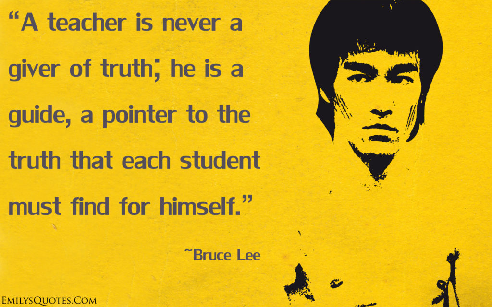

Between 2016 and 2017, I went from knowing nothing about code to becoming a software engineer at [Metisa](www.askmetisa.com), a startup that is building an end-to-end data science solution for e-commerce businesses. It went smoother than I could ask for, but that is not to say that I didn’t second guess my decisions at every turn. In this article, I’d like to share what I’ve learned from attending programming bootcamps - I attended the same one once as a student and once as a teaching assistant. My hope is that this would help you make an informed decision about entering tech via programming bootcamps, if you are interested.

Less than a year ago, I was a non-technical founder of a technology startup. That did not go well, and I was losing confidence in myself everyday for not understanding, at a fundamental level, what it takes to build a great tech product.

When the time was right to hire interns from the School of Computing at my alma mater (NUS!), I hit an impasse and stopped working on the product altogether. That was when I started to learn programming, first on my own using free online resources like [FreeCodeCamp](https://www.freecodecamp.com/) before eventually enrolling in General Assembly’s [Web Development Immersive](https://generalassemb.ly/education/web-development-immersive) in Singapore.

I don’t want to dive into the specifics of the General Assembly course (I’ve written a [review](https://www.nickang.com/general-assembly-singapore-review/) for that) but instead, I’d like to reflect on programming bootcamps more generally. What are they and why are there so many of them now? Do they deliver results? Should I join one to make an entry into tech? I’ll indirectly take a stab at these questions with the bullets below.

## 1\. Programming bootcamps are sprouting in response to demand

I’ve noticed programming bootcamp providers like [General Assembly](https://generalassemb.ly/) and [Alphacamp](https://www.alphacamp.co/sg/) and many others setting up shop recently. It probably began much earlier in tech hotspots like San Francisco, but in Singapore I’d place the start of this trend to be around 3 years ago. Their boom is likely attributable to market economics: there are more companies currently trying to hire software engineers than there are software engineers to hire.

Consensus among the people I know who have gone through programming bootcamps as well as those who help teach them is that it is an exciting time to be a software engineer. Aside from the code literacy movement, it is exciting because many companies are hiring. If you are good enough (we’ll get into that later), you are likely to have some bargaining power.

The operative word here being “good”, of course. It’s difficult to justify having to pay upwards of SG$3,000 to employ a bootcamp graduate who needs handholding and constant guidance. This difficulty is exacerbated by the fact that the majority of tech companies are really tech _startups_. In other words, teams that consist of 3 to 10 people. Let’s just say that these small organisations will never be in the mood to hire people who can’t contribute almost immediately to their teams.

So while demand for software engineers is strong, you will still need to prove that you are capable of contributing to the team quickly. Which is perfectly possible if you are focused…

## 2\. Much to cover in little time

What is it like trying to become a professional software engineer just by going through a 12-week course? One word. Tough.

If you have a friend who is joining a course half-heartedly, or _you_ are thinking of doing that, please be careful. While it is not implausible that you will end up fine, it is highly unlikely that you will. There is a lot of ground to cover in a short amount of time.

Here’s a non-exhaustive sampling of things you will need to get used to or become good at in 12 weeks:

- Getting comfortable reading code (eg. if `x = 3` and `y = 4`, then `x = y` is not an error but a reassignment of the value of `x` to the value of `y` (`x` is now 4))
- Reading code written by others
- Remembering to some degree the syntax of HTML, CSS, JavaScript and Ruby
- Talking through your code (“This chunk should be abstracted to another function, which takes in 2 parameters…”)
- Debugging code that is not working
- Understanding the legacy of JavaScript, the difference between versions of the language (ES5, ES6) and their different implementations by Chrome, Firefox and Safari
- Designing database structures
- Understanding the performance of your code (nested `for` loops is almost never okay)
- Finding answers to multiple super specific questions simultaneously
- Memorising 30 keyboard shortcuts that make coding quantifiably faster
- Understanding the workflow that software engineers use to collaborate (“Git”)
- Learning new technologies, concepts, frameworks after you’ve just learned a dozen (Webpack, Babel, SCSS, LESS, ReactJS, Angular 2, VueJS, TypeScript…)

To become proficient in making web applications that people actually use, you will need to be conversant with all the above to some degree. If it seems like a lot, that’s because it is!

That said, when I was a student at the Web Development Immersive at General Assembly Singapore, I constantly reminded myself that _the level of intensity I was experiencing was a feature, not a bug_. I didn’t want it any other way, because it’s _supposed_ to be intense. If it isn’t, I would feel like I was getting a bad deal. And that would have probably been true.

So prepare for an intense few months. Go all in, or don’t go at all! This segues nicely into the next point…

## 3\. Programming bootcamps leverage the cohesive power of self-selection

They say that true friendships are forged through hardship.

Cheesy, I know… but then again, some of the friends I trust the most are those whom I rubbed shoulders with in the Army, digging fire trenches while everybody else were asleep. It’s _almost_ the same with programming bootcamps.

In fact, I think programming bootcamps might even be more conducive for nurturing lasting friendships. First, there’s the hardship. Across two batches of students I haven’t seen anyone breeze through the bootcamp. It is at least going to be a strain on the brain sometimes. Then throw in the mix the fact that everybody in class _actually wants to be there_, and you start to see why it’s one great playground for making lasting friends.

Since programming bootcamps are not like universities (almost nobody cares about which bootcamp you come out from if you cannot code well), it is safe to assume that nobody goes in purely for certification. In my opinion, collective affection towards an art (programming is definitely part art) is one of the strongest forces that coheres disparate people into lifelong friendships. I’m still good friends with my batch mates and the students that I helped teach, and I don’t see that changing any time soon because many of us remain interested in becoming better engineers.

To borrow from Neil Gaiman, most of us are moving towards the same “mountain”. Along the way, we inevitably meet at the same pit stops (read: events/meet ups), and at some point I have no doubt that some of us will hitch a ride together in a company van.

## 4\. Employability after a programming bootcamp

\[caption id="attachment\_934" align="alignleft" width="840"\] Me and my awesome classmates on the way to refuel our brains with food\[/caption\]

The question I’ve been asked most frequently is about employment. “How was your job search after the course?”, friends would ask with a mix of curiosity and apprehension. Curious because they want the answer to be “easy”, and apprehensive because they know that would mean having to take a leap of faith to start a career in a new industry from scratch.

Regardless, I always tell my friends that whether you are employable or not depends largely on the same few things:

- What kind of person you are
- Your background (gender, age, experience)
- The quality of the programming bootcamp you attended

### What kind of person you are

Do you embrace change, or prefer to avoid it? If it’s the latter, you are more likely to see every obstacle as insurmountable.

Do you believe programming is “for you”, or not? If at the end of the course you cannot convince yourself that you are a programmer, then it is near impossible to deceive an employer into believing it. The excitement of programming sits somewhere between drinking a cold beer and watching paint dry for most people, so unless it is at least on the cold beer end…

Do you have a compelling reason for choosing programming over the alternatives? If the answer is no, then you may not be happy at your new job anyway. (Most of us do not work remotely at cafes around the world.) The lack of intrinsic motivation can also affect how good you are at it.

### Your background

Do you have relevant experience to bring to the company? I’ve seen friends from a User Experience (UX) background emerge from the programming bootcamp to get snagged by established startups. Another friend with advertising background managed to use her experience to land a role as a Product Manager at a technology media startup. If you don’t have prior work experience (like me), that is okay, too. Adaptability and freshness certainly have their place in tech, and can be spun into something positive.

Are you going to be a woman in tech? In Singapore gender equality at the workplace is quite good (though the [ratio](https://data.gov.sg/dataset/infocomm-manpower?resource_id=ee96eb56-d310-4eaf-8094-d89469d37b92) is still 7 men to 3 women). But this is something to consider if you intend to work in Silicon Valley or other cities in the US. Unequal treatment and sexual harassment is still a thing there. What I’m trying to say is, it can be unfairly tough to be a woman in tech in the city you’re going to ultimately work at. While I hope you never have to experience [what Susan Fowler went through at Uber](https://www.susanjfowler.com/blog/2017/2/19/reflecting-on-one-very-strange-year-at-uber), just be prepared for chauvinistic assholes. A bunch of them are still out there…

<iframe width="600" height="400" src="https://data.gov.sg/dataset/infocomm-manpower/resource/d47f295f-16da-40b7-a9c6-220e785b202d/view/c5e7183e-4369-42c2-9ad3-0606c16372e7" frameborder="0"></iframe>

And here’s a big one that few people like to talk about for obvious reasons: Are you above 50? I don’t think people in tech try to be deliberately malicious towards people who are older, but I think very few companies are open to the idea of hiring older people. Many employers, I think, reason it this way: “if I can find someone younger, it would be easier for the rest of the (young-ish) team to communicate with him/her.” They also see _many_ young people everyday, and there is a good chance that most of their engineering team is aged between 30 to 39 years old (44 percent of the industry are, according to Singapore government [data](https://data.gov.sg/dataset/infocomm-manpower?resource_id=d47f295f-16da-40b7-a9c6-220e785b202d)). Alas, it is also harder in general for an older person to switch careers than it is for someone younger, regardless of the destination industry.

Finally, one last but important factor that determines post-graduation employability is quality. How well does a programming bootcamp prepare you for The Real World?

## 5\. Quality of a programming bootcamp depends on Instructor and Attitude

Quality to me is associated with two things that are intertwined:

1. Dedication and experience of the instructional team
2. Your attitude towards learning

Having something does not mean you will use it well. To get the most out of any situation, be it in a class or at a company, a positive attitude is paramount.

But let’s start this discussion by first evaluating the quality of bootcamp instructors.

### Quality of the instructional team

The programming bootcamp that I attended ([Web Development Immersive](https://generalassemb.ly/education/web-development-immersive) at General Assembly) had a terrific instructional team that comprised of a lead instructor and two teaching assistants. Our lead instructor, [Jeremiah](https://www.linkedin.com/in/jeremiahalexander/), had about 10 years of experience making games in his own studio. With that level of experience, he could teach himself web development and then teach it to us. He is also incredibly eloquent, adept at explaining complex ideas in a way that is easy to understand. The impact he has had on me as a programmer now is hard to overstate.

One of our teaching assistants, [David](https://www.linkedin.com/in/davified/), was a former graduate of the bootcamp, which I think added a nice touch of reality to us as programming wannabes. I used David as a benchmark of what I _could_ be upon completion of the bootcamp. Our second teaching assistant, [Rama](https://www.linkedin.com/in/undramatized/), was a fresh graduate from the Singapore University of Technology and Design’s (SUTD) Bachelor of Information Systems Technology and Design. He brought more theoretical knowledge into the class along with an appreciation of computer systems and advanced technologies like artificial intelligence and machine learning. Both of them taught me many things, among them how to debug in every situation.

That said, it’s not always possible to find blogs that cover a bootcamp in enough detail to help you make a judgement, so this may be, out of necessity, a leap of faith. The best alternative to suss out any bootcamp is by asking your friends who have been through it. LinkedIn makes this a trivial task. (If you have questions specifically about General Assembly in Singapore, check out my [detailed review](https://www.nickang.com/general-assembly-singapore-review/).)

### Quality of your attitude

Assuming you've found a bootcamp with great reviews, success is not yet guaranteed. A lot still depends on the student...

Here’s a short story to illustrate the point. I hate running. I’ve always disliked the idea of moving my legs faster than I care to, prancing about from destination A to B and then back to A again, all for the sake of calories and a healthier heart.

To me, getting ready to go for a run is just about the most dreadful thing possible. I would hesitate to put on my workout clothes, looking out the window to see if inclement weather could save me from doing it. Getting out of the house is hard, but the actual running would always be even harder. Only when it is over will I ever feel happy about running.

Recently I’ve had a conversation about this with my wife, and she made me realise that the problem was that I have a poor attitude towards running, and it’s been affecting how I view and perform during runs.

According to her, we live in a great neighbourhood, right next to the country’s largest nature reserve. In comparison with many others, we have it good! The air is fresh, the trees shelter our runs, and being back in nature is proven to help humans destress. My lousy attitude towards the very idea of running has robbed me of the opportunity to see and leverage what is available to me.

This is the same thing with a programming bootcamp. I’ve seen some students gripe about not having this cheat sheet or that remedial lesson, as though they are necessary if they paid attention in class and asked on-point questions!

So the point here is this: get into the learner’s mentality. Accept that practically everything is going to be new. But more importantly, understand that even though you are paying your instructors, they cannot do anything for you if you are not primed to receive it.

Sorry if I’m the one who breaks this to you, but there are no Game Sharks™ to becoming a programmer. You have to learn, apply, get stuck, get unstuck, and repeat… which brings me to my next point.

## 6\. Good programming bootcamps teach you how to learn

The reason why it is even feasible for programming bootcamps to consistently deliver results (ie. employable software engineers) is because it is focused. Hot, electron-kamikaze laser beam focused. Bootcamps are designed to train practitioners, not scientists. If a topic is covered in class, 90 percent of the time it is because the content is _necessary_ to help you build web/mobile applications. The other 10 percent are nice-to-haves.

I heard an interesting anecdote recently at a panel discussion in a bootcamp class about the difference between bootcamp and computer science (CS) graduates. The person who spoke said that CS grads are typically stronger in a few areas:

- Writing complex algorithms that have good performance (running them takes less time and memory/space)
- Solving problems mathematically

And that most bootcamps grads are better at:

- Knowing what tools and libraries to use to get the job done
- Understanding the implications of choosing a group of technologies (“stack”) over others

I think there is a kernel of truth in there, but I also think this is a false dichotomy. Anyone can be good at any of these things. I believe that the real point of differentiation lies in your ability to learn.

Good programming bootcamps will emphasise the _importance of learning how to learn_: how to find answers to problems, how to research the best stack to use for a project, how to write code that is easy to understand and maintain and so on. The really good instructors will not let you in on the answer but instead, guide you to arrive at the answer yourself.

\[caption id="attachment\_961" align="alignleft" width="840"\] A quote Jeremiah shared with us at the end of the course.\[/caption\]

## 7\. Not all graduates pursue programming as a career

Here’s my final observation: not all people enrol in programming bootcamps because they want to become software engineers. A few do it to gain a complementary skill to their business. Even more do it to find out if they _can_ do it, or if they _like_ being one.

Most of the entrepreneurs that graduated from my batch and the one I taught continued to run their business after the course. Those who enrolled to understand themselves better, to see if they can or cannot be programmers, all achieved that goal. I guess 3 months of writing code every single day can reveal a lot of things you did not know about yourself.

Whichever is the case for you, I think these are perfectly legitimate reasons to enrol. Just take note that if you are receiving a subsidy or grant from the government, there is a good chance that you are bound to an agreement to find a job in the tech industry post-graduation.

That’s it. I hope this was useful with informing you about programming bootcamps. If you know someone who might benefit from reading this, do consider sharing it with them!
