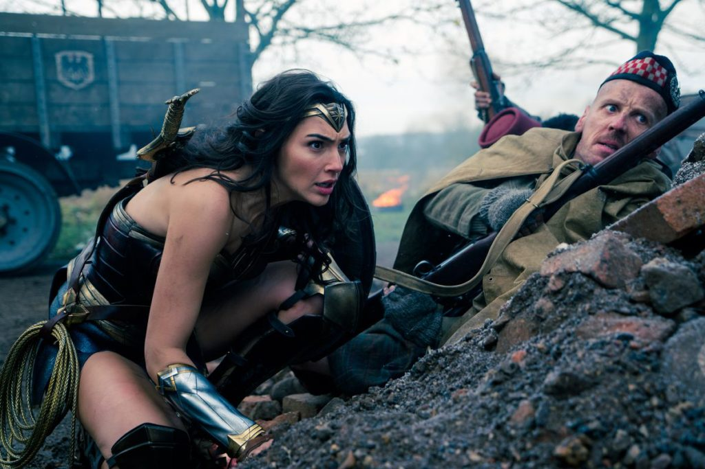

**Warning**, I'm going to be sharing my thoughts about Wonder Woman, so spoilers ahead. Please skip this post if you haven't watched the DC movie. (It is in my opinion worth your time, so please don't let me spoil it for you!)

_Whoa, she's so badass!_

_That theme song is the best..._

_Wait, why the hell is she called Wonder Woman again?_

Love the bravado of Wonder Woman walking into No Man's Land and orchestrating a breakthrough.

I savoured every nod that the screenwriters and directors made to women in this blockbuster. It sounds almost ridiculous to think that a blockbuster can encapsulate so much hat-tipping.

Case in point: when Wonder Woman walked in slow-motion into No Man's Land between the German and the Allied troops because literally no man had the naivety and trust in hope that she had in being able to resolve the conflict that way. Yes it was over the top, but to me it was also incredibly inspiring, not least because a woman had to step up to resolve the conflict roused mostly by men.

I found tender moments in every other scene. Like when she went "Aww, a baby!" in the streets of London. Something about that vulnerability reached deep within me and shook me up. Yes, it must have been the bubble in Paradise Island where she grew up that kept her an emotional open book, but it's also the fact that she's a woman that made the scene felt so heartwarming and believable.

Or like when she had her first taste of ice cream by the docks just before sailing to the battlefront, wearing her satisfaction--pleasure, actually--on her face and saying to the ice cream seller, "It's wonderful. You should be very proud." If we spoke out like this every time we enjoyed someone's work, we'd all be a little happier about ourselves and in turn, others. A virtuous circle of feeling happy and making others happy. And again, this seems like a privilege that women have over men - if a dude said that, I honestly think it would come off as patronising.

But what I adore most is her strength. I mean, here was a really good looking woman who didn't seem to know (or care) that she was beautiful, both in the film and, if video interviews are representative (they probably are not completely), in real-life too. Her focus was to be physically strong and to act on her principles. Combined, that is a portrayal of the pinnacle of human strength, to toss out the superficial and care about what truly matters (how we treat one another).

Of course, the movie isn't perfect. There are many aspects that aren't entirely believable (like sailing the sea and then strutting in to join a battalion at the frontline of World War II, or looking photoshoot-ready after fighting in a war), but for me, there are enough wonderfully real emotions to cover up these flaws.

As a whole though, it was a superhero cinematic experience like none I've had before, and I credit sex for it. It was because this was Wonder _Woman_, and because of her sex appeal, brought to life in no small part by her love interest, that the movie worked so well.

After the movie, I read a Redditor's comment saying "it's about time girls had a new superhero to rally behind", and part of me is really happy to know that Wonder Woman played by Gal Gadot and directed by Ms Jenkins is going to be that figure for a while.
