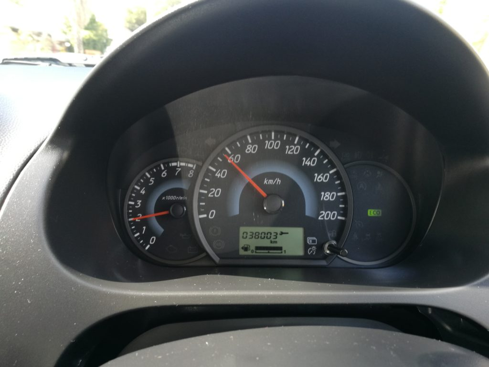

I was in Perth, Australia this weekend with Mei and we drove around in a small blue Mitsubishi Mirage hatchback. It had a manual transmission, which did take a day to get used to... but as we drove from cafe to restaurant (food was the one of the main reasons for the trip), I noticed the green eco indicator on the car dashboard. Food was on my mind, so I let that observation take a back seat. You know, in my blue Mitsubishi Mirage.

Anyway, in the first few hours of renting and driving the car around Perth, I thought the little green light was telling me that I had the car's Eco mode on and I didn't think much about it. But as we drove, I notice the light kept coming on and going away as we zipped past people from junction to junction. It would stay on for half a minute, disappear for a few seconds, and then come back on again.

It wasn't long before I realised that the green ECO light might be related to _how_ I am driving. The fact that it came on and off intermittently with no obvious rhythm, like every fixed number of seconds or when we were stationery or moving, suggested it could be something to do with the _way_ I am driving.

Turns out I was right. With a bit of experimenting, mainly with varying degrees of force against the accelerator pedal, I found out that the indicator was trying to tell me something about the way I am driving. It was telling me whether my driving at any moment in time during a drive was eco-friendly or not. Meaning, the light comes on whenever I drove within a reasonable RPM and gear.

My Mitsubishi was teaching me how to be drive without wasting fuel. And it did that by rewarding me with a green "ECO" badge every time I am behaving myself with my foot and hand on the pedal and gear shift.

Before you go "whoa, AI!", please knock yourself in the head. A car does not need artificial intelligence to compute whether a set of RPM and gear number fall within an acceptable range at any given travelling speed. It is easy to show that going at 60 km/h in gear 2 with 4000 RPM is not fuel efficient using simple arithmetic and some conditional statements in code. But I digress...

The really neat part about this feature is that it is very effective in training users to do the right thing - the right thing here being driving like a reasonable person and not unnecessarily wasting fuel, generating noise and accelerating wear and tear. Within the same day of my self-discovery of this feature, I started to consciously drive in a manner that teased out the pretty green light (the struggle with changing gears aside).

As practitioners of technology, we should always ask ourselves whether our product can benefit from a simple feature that makes our users do the right thing while feeling good about themselves. If there is and it only requires a reasonable amount of time to implement, we should do it. Small things like this can have a big cumulative impact if your product makes in the hands and feet of many users.
