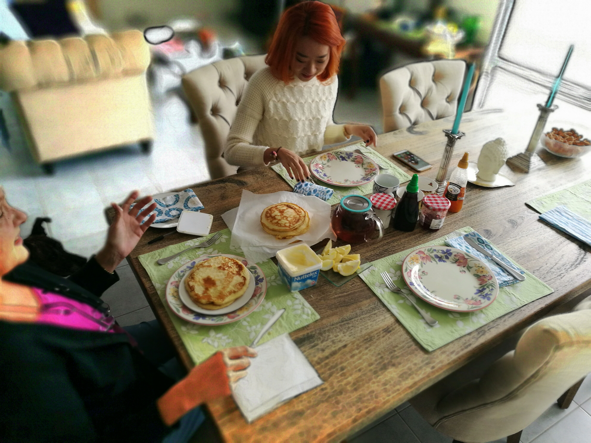

One of the things I find myself enjoying more about travelling is the accommodation. No it is not about being able to afford to live in nicer hotels now that Charlane and I are both working adults. Money has little to do with the joy we are getting from staying in people's homes through Airbnb!

Everybody who ends up being a host does it in their own way, powered by their own beliefs about what a host should do for their guests. That is what makes it so interesting.

I was recently in Perth for a few days with Charlane and we stayed in 3 different homes listed on Airbnb. Happy to report that they were all enjoyable stays. More than that, the experience of staying in the 3 homes were unique, even though 2 of them were in the same city.

Our first host, Crystell, had a home with beautiful white interiors bathed in light from the well positioned windows. Our room was minimalistic and cozy, but with all the essentials. Crystell preferred to give her guests the vital information about the house and leave them to do their own thing.

Kim Ahn, our other host during the trip was a lot like Crystell in terms of the little interaction with guests beyond what is necessary. Her home where she lives with her husband and sister is much bigger than Crystell's, and she had 2 Border Collies and a huge and typical English person's garden in the backyard. I found wooden shelves stacked with books on business along every wall, as well as frames with seemingly random photos of flowers. It was not minimal, but it was still cozy.

Donna, our host in Busselton 2 hours down south from Perth was a very hands-on host. You very quickly find out that she's like that because of her belief that Airbnb guests are like "guests in the house", the same kind of guests as your children's friends or your friends' friends. She made breakfast because otherwise "it wouldn't be called a bed and _breakfast_, would it?" The 2 nights we spent at Donna were amazing, but not just because we had true _local breakfasts_ on both days - it was a great experience because Charlane and I got to connect deeply with Donna, and we did it in her own home.

These stays remind me fondly of our time as Airbnb hosts in Singapore. We hosted many guests from all over the world. I think we were more like Crystell and Kim Ahn most of the time. Occasionally, if we feel a strong connection with a group of guests, we would be like Donna and sit on our couch and chat with them over wine we had at home.

Staying in Airbnb homes during this trip has reinforced a few observations I had made before: - everybody hosts on Airbnb for different reasons, but all hosts who live on the premises will always make sure their guests are well taken care of - being a "host" usually means very different things to people, which affects how much interaction you are likely to have with them as a guest - staying in people's homes is a unique experience every single time

I like to travel because it lets me see the world, but the world is nothing interesting if not for the people like you and me who roam it. This is why our Airbnb stays have increasingly become one of the consistent highlights of our travels. You know never who you are going to meet, how much they are going to open up to you and teach you and tell you about yourself. So fascinating!
