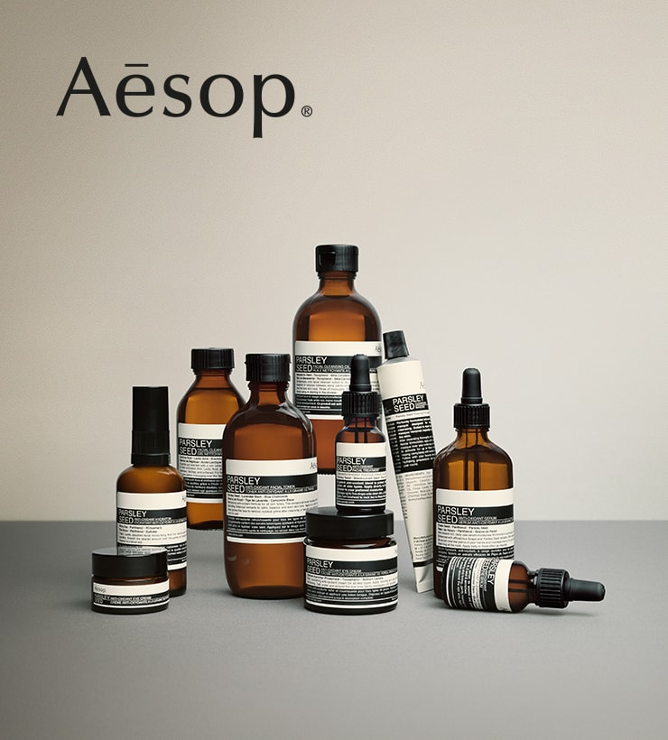

When the first few Aesop stores started appearing in Singapore, being a generally skeptical consumer, I thought they were another gimmicky company that is all about packaging.

Their products were all in brown bottles as though they were an iodine company, and products were all always neatly arranged on the shelves. For the few times I walked by one of their stores, I never saw an item out of place. It is as though they managed to attract all the most OCD people in the world to work for them.

As someone who does not spend much on "wellness" products, I was surprised to find myself buying a few Aesop items today when Charlane and I went to one of their stores in Perth. The only Aesop product I've used before is their facial cleanser, and only because Charlane had bought it and asked me to use it.

They don't seem to be all about packaging, even though it is obvious that they spend significant money and energy to get that aspect of their products right. I think the appeal of Aesop (to me) stems from a wholesome approach to product development and marketing.

Interesting marketing tactics Aesop uses: - Appeal through smell - Packaging product in brown medicine bottles to make it look medicinal and healthy - Plain uniforms with single colours and apron for store assistants to exude a "down to earth" vibe that makes you feel good - No price tags on the shelf, so customers must ask store assistant for it, giving the assistant a chance to talk about the product the customer is now obviously interested in - Idea that simple = good

As a result, I felt a number of things when browsing their products in store: - Calm, peace - from smell and the cup of tea they brewed and served on the spot - A quieter, better world - created by the dimly lit environment - Composure - from the neat and minimal packaging of all their products

I ended up buying one of their two fragrances (I bought the one called Tacit) because it smells just like what's in the air in the store, but also because it was one of only two products in the fragrance category. Couple this with the fact that Aesop is Australian and items are roughly 10 percent cheaper than in Singapore, the decision was really easy.

My experience at the Aesop store today is to me a testament to the power of a well designed and tightly executed marketing strategy, with a product that is not bad. In fact, I'm excited to go into work tomorrow with my new fragrance. I imagine walking around with an air of calmness and "down to earth"-ness. After all, I'm now a little more like one of those chic and mild-mannered store assistants I saw today, right?
