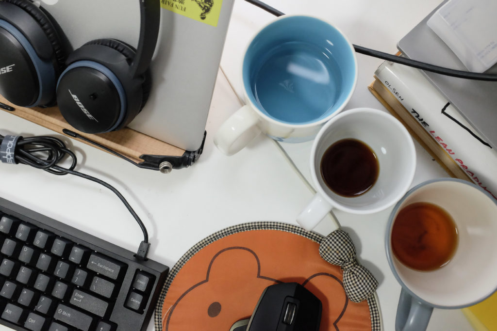

The idea of blogging has changed. In the past when people first started to use Blogger to publicly share stories about their lives, blogs were like a sort of public log - you know, like a b-log. I think that's actually the etymology of the word. Now, most of us have blogs because they aid us in our careers, and I'm starting to miss blogging the old way.

\[caption id="attachment\_1144" align="aligncenter" width="840"\] My work desk when I'd just finished a day of working from home\[/caption\]

If I were honest with myself, I know that publicity is a part of why I keep a blog. It sounds weird to admit it, but I often write posts because I think it makes me look like I have a life and that I actually think. My reasoning goes something like this:

- We get to know people increasingly through the internet, even with friends
- Without a presence on the internet, I have less of a presence overall in society
- Thoughts buzz in my head constantly and I have meaningful conversations and I work on semi-interesting projects, but only those that have a presence on the internet have a chance of being known
- Therefore, for the sake of being _somebody_, I must write (since I know I'm too camera-shy to vlog for now)

Not sure how much of that you can relate to, but the fear of not being _able_ to be heard, to not have at least the _chance_ of being known for my thoughts and work is a key driving force to my blogging. If you can call it blogging, anyway.

### The traditional format of blogging

This makes me want to go back to what would now be, I guess, the traditional format of blogging. Words and pictures about my (the blogger's) life.

I have a friend who vehemently disagrees with "stream of consciousness" writing, and just declaring my support for it conjures up his face with a condescending look on it. This is a friend who writes professionally on the side for a news site, an affable person in general whom I respect. He has a point. Stream of consciousness writing can easily delve into insufferable "it's all about me" territory, and bloggers must fight hard to stay in line.

Besides, blogging is not _just_ about bleeding your mind on the page.

It's about reflecting on the day or week that just passed. Reflection often drives me to try to make tomorrow's story better.

It also gives me space to play with my Fujifilm camera, to shoot and curate an image that creates the context of a blog post. Photos that I've taken and included in blog posts never fail to suck me back to the day when they were first captured. Paired with thoughtful writing, it is the closest thing I have to a time machine.

I also like that blogging is like the camera-shy friendly version of vlogging. Casey Neistat's vlogs provide us a glimpse into his personal life. When he was vlogging daily for more than a year, it affected the way he thought about each day, and from what he's said on some of his episodes (I'm not going through 400 plus videos to find which ones), vlogging made him a better person.

Lastly, what I miss about blogging-blogging is the luxury to mash up different pieces of information and happenings into a single post. In a blog post, I'm not quietly forced to think and write only about a specific topic in each post. Patches are weaved into unique, colourful cloths.

While I wax on about the pros of blogging The Old Way, concerns are pacing around me like a pack of hyenas preparing to hunt.

For one, blogging your life story makes for an overall less formal website. Less formal also means less professional. In a "first impression counts (too much)" society, this might be a bane on the career front.

Even more practical is a concern about search engine optimisation. Posts that cover many disparate subjects rank poorer for key words, if there is even any to rank for. SEO will most likely have to take a back seat.

### Writing is better than not

I could try to supplement both sides of the argument more exhaustively and come to a logical conclusion, but there is one last point to drive the nail in the coffin on this one for me.

You see, I've noticed myself posting less in recent months. And I put the blame solely on the stress I'd been experiencing that stemmed from wanting to write a "worthy" post. This notion that one should not publish an unpolished post is making me write a lot less, and making it feel more of a chore than a treat.

That brings me to my conclusion. Whichever approach compels you to think more, photograph more, and ultimately write more is the right approach.

If a blog post feels like crap by the time you're done writing, just don't publish it. Even authors like Stephen King have written novels that are so bad they don't bother editing and trying to get it published. At least they have done the thinking and have a draft to hold in their hands. The deed would at least be done.
