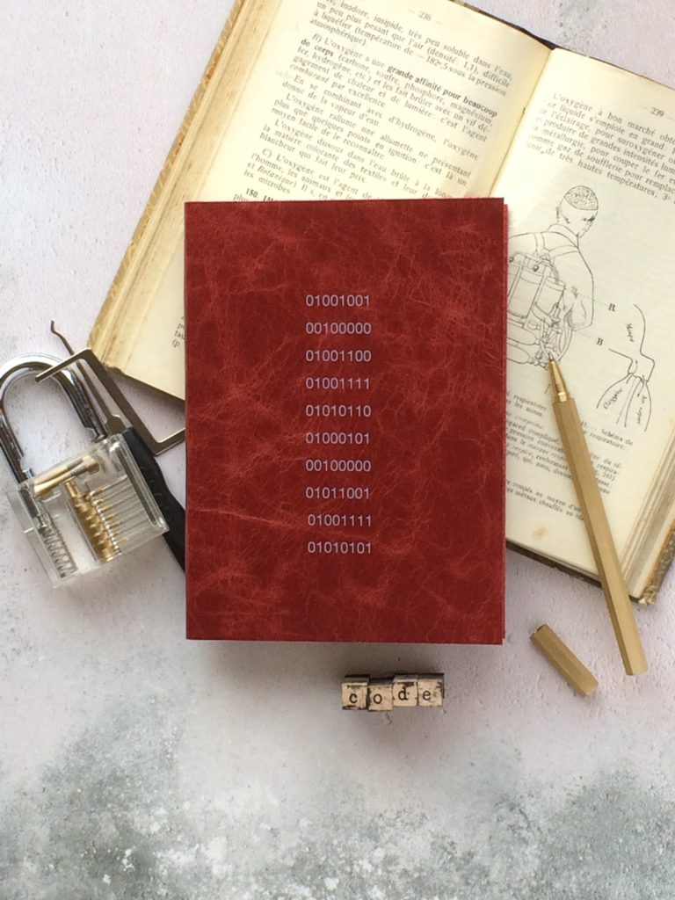

\[caption id="attachment\_1289" align="aligncenter" width="768"\] Photo by Hope House Press on Unsplash\[/caption\]

I've been running into Unicode and ASCII and related encoding/decoding issues recently at work. We had an email that didn't get sent out and all I got was an error message that said that some character could not be encoded in ASCII as "ordinal out of range". That set me back for many hours and I only _think_ I've managed to fix it (by wrapping u'' around every string in the affected module in Python).

Little did I know that a [guy](https://www.joelonsoftware.com/) wrote about this issue, which I supposed was more of a hot-button issue back then (programmers nowadays are supposed to know this by now). In his post, he called people like me (or just me?) a "naive programmer", a title I tentatively accepted as I read his just-detailed-enough post about character encoding.

I'm summarising the main ideas from his post. As such, this post heavily references Joel Spolsky's article [_The Absolute Minimum Every Software Developer Absolutely, Positively Must Know About Unicode and Character Sets (No Excuses!)_](https://www.joelonsoftware.com/2003/10/08/the-absolute-minimum-every-software-developer-absolutely-positively-must-know-about-unicode-and-character-sets-no-excuses/).

## ASCII in the very early days

ASCII was one of the earliest code that was used to represent every character in the English dictionary between the numbers 32 and 127.

Some characteristics (pun intended):

- all characters are assigned a number, and all numbers in ASCII can be stored in 7 bits
- numbers below 32 were used for control characters (like 7, which made the computer beep)
- most computers were 8-bit back then, so many programmers came up with different uses for the last free bit (numbers 128 to 255) to create characters _they_ frequently used and assign them a number

Non-English languages had a hard time being encoded in ASCII. If the language had less than 127 (255 - 128) extra characters on top of the English character set, it could still make use of that last bit and still use ASCII.

But your machine won't know which version of ASCII a document was using, and weird question mark characters might start popping up everywhere on the page unless you're lucky. There are apparently hundreds of different ways programmers used the 127 extra characters.

### ANSI and codifying the use of the 8th bit in ASCII

ANSI was invented and introduced "code pages" for codifying the numbers 128 to 255, which differed from language to language.

Up to this point, before the Internet, everything sort of worked because most people used only a single language on their computers and there was no need to pass around values to render the right characters in other people's computers.

## Unicode and the internet

Unicode came to the rescue. Unicode Consortium was made of some very smart people who made it such that:

- every alphabet in every language is represented as a code point, which is not exactly the same as bits
- for eg. English letter A is U+0041
- "U+" means Unicode, and the 0041 numbers are hexadecimal just like colour codes
- the first Unicode standard, UCS-2, turned Unicode code points (which, again, are not bits) into two bytes

But two bytes could be rearranged so that the start and end bytes could be swapped around and produce different results (I think). So UTF-8 was invented.

## UTF-8 standard

UTF-8 is a system that stored a string of Unicode code points in memory using 8-bit bytes. It also had a convenient side-effect that made it backwards compatible with ASCII because every code point from 0-127 is stored in a single byte, just like ASCII. This meant that for documents that used only English character sets that Unicode encoding would produce exactly the same results as ASCII encoding.

Here's a real glass shatterer: there is no such thing as "plain" text.

As much as we have been led to believe by programmes like Notepad that save documents in "plain text", there is actually no such thing. Every string that is stored in memory is done so using a specific encoding. Otherwise, we face the music, as Joel Spolsky eloquently puts it:

> Almost every stupid “my website looks like gibberish” or “she can’t read my emails when I use accents” problem comes down to one naive programmer who didn’t understand the simple fact that if you don’t tell me whether a particular string is encoded using UTF-8 or ASCII or ISO 8859-1 (Latin 1) or Windows 1252 (Western European), you simply cannot display it correctly or even figure out where it ends.

This means we have to specify the encoding as much as possible whenever we're dealing with strings.

Finally, to deal with any potential encoding issue in HTML pages, specify as the first line within the `<head>` tag what encoding should be used in the document, using a `<meta>` tag.

In any HTML page:

This needs to be high up on the page because the browser will re-interpret the entire document when it reads this meta tag. Earlier it is read the more needless processing time is saved. Also, this works because all characters in the code block above are in English characters, the one character set that is encoded correctly by more or less every encoding system out there.
